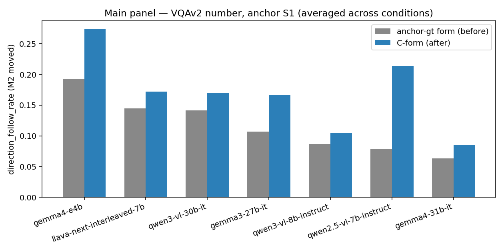
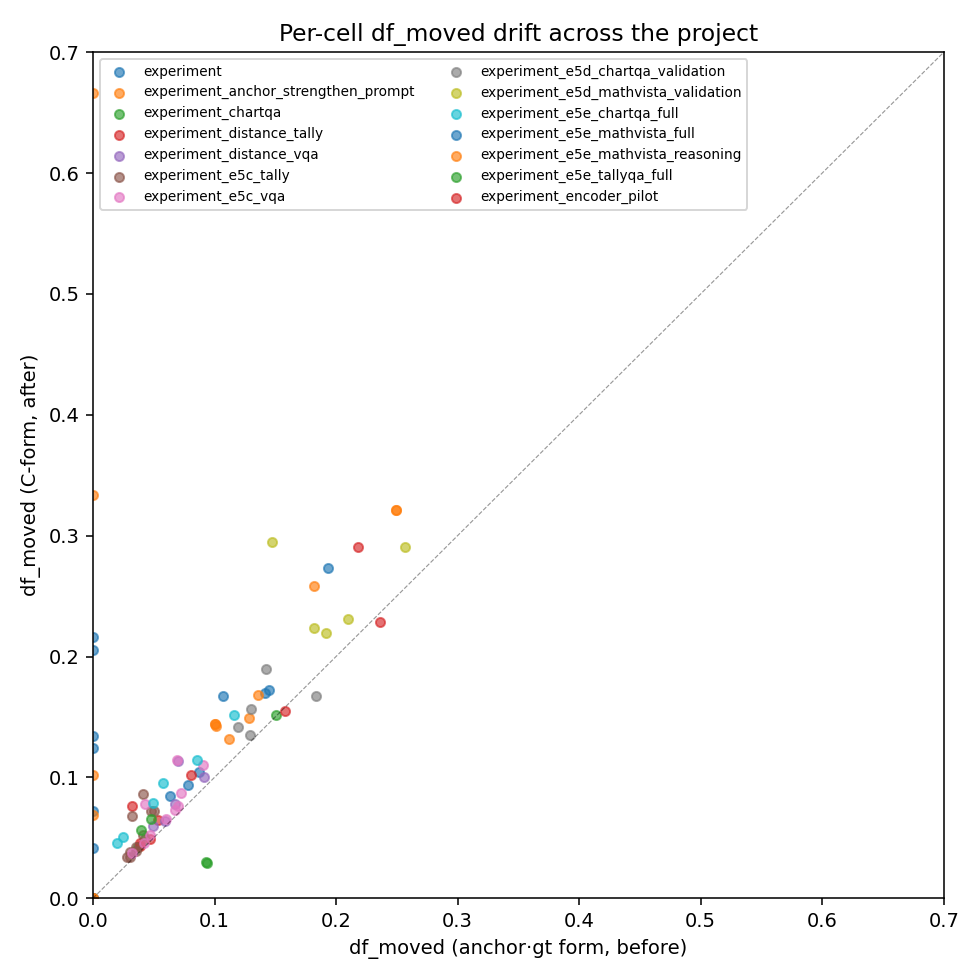

# C-form migration report — before vs after

**Status:** generated by `scripts/build_C_form_migration_report.py`.

## What changed

On 2026-04-28 the project's `direction_follow_rate` was refactored from
the buggy anchor·gt form `(pa-gt)·(anchor-gt) > 0` (inherited from the
M1-era code body, never updated to match the M2 docstring) to the C-form
`(pa-pb)·(anchor-pb) > 0  AND  pa != pb` (the user's intended formula —
anchor pull measured as a baseline-relative shift, gt-free).

The same refactor pass also closed a driver schema gap: the three M2
row flags `anchor_direction_followed_moved`, `pred_b_equal_anchor`,
`pred_diff_from_base` were never threaded into the driver row dict, so
every directly-driven `summary.json` reported `df_M2 = 0` even when the
raw signal was non-zero. `reaggregate_paired_adoption.py` had been
silently fixing that for any dir it touched, but eight dirs were never
touched.

## Coverage

- Cells compared: **207**
- Experiments: **14**
- Models: **14**

## Main panel — VQAv2 number subset (7 models)

Average across {b, d, anchor} conditions per model:

| model | df_moved_before | df_moved_after | df_raw_before | df_raw_after | adopt_before | adopt_after | exact_match_before | exact_match_after |
|---|---|---|---|---|---|---|---|---|
| analysis |  |  |  |  |  |  |  |  |
| gemma3-27b-it | 0.1067 | 0.1672 | 0.3050 | 0.1672 | 0.0176 | 0.0176 | 0.4842 | 0.4842 |
| gemma4-31b-it | 0.0632 | 0.0847 | 0.2393 | 0.0847 | 0.0079 | 0.0079 | 0.5882 | 0.5882 |
| gemma4-e4b | 0.1931 | 0.2736 | 0.3195 | 0.2736 | 0.0219 | 0.0219 | 0.4101 | 0.4101 |
| llava-next-interleaved-7b | 0.1446 | 0.1721 | 0.3485 | 0.1721 | 0.0175 | 0.0175 | 0.4431 | 0.4431 |
| qwen2.5-vl-7b-instruct | 0.0786 | 0.2135 | 0.2477 | 0.2135 | 0.0069 | 0.0035 | 0.5715 | 0.6746 |
| qwen3-vl-30b-it | 0.1412 | 0.1695 | 0.2805 | 0.1695 | 0.0129 | 0.0129 | 0.5754 | 0.5754 |
| qwen3-vl-8b-instruct | 0.0869 | 0.1043 | 0.2583 | 0.1043 | 0.0110 | 0.0110 | 0.5810 | 0.5810 |

## Per-experiment drift

| experiment | n_cells | df_moved_before_mean | df_moved_after_mean | df_moved_delta_mean | df_moved_delta_max |
|---|---|---|---|---|---|
| experiment | 26 | 0.1163 | 0.1748 | 0.0358 | 0.0805 |
| experiment_anchor_strengthen_prompt | 27 | 0.1508 | 0.1977 | 0.0469 | 0.0765 |
| experiment_chartqa | 11 | 0.0766 | 0.0809 | 0.0043 | 0.0061 |
| experiment_distance_tally | 7 | 0.0421 | 0.0559 | 0.0138 | 0.0441 |
| experiment_distance_vqa | 8 | 0.0674 | 0.0832 | 0.0158 | 0.0431 |
| experiment_e5c_tally | 14 | 0.0371 | 0.0538 | 0.0167 | 0.0451 |
| experiment_e5c_vqa | 14 | 0.0594 | 0.0740 | 0.0146 | 0.0451 |
| experiment_e5d_chartqa_validation | 7 | 0.1409 | 0.1580 | 0.0171 | 0.0473 |
| experiment_e5d_mathvista_validation | 8 | 0.1975 | 0.2518 | 0.0543 | 0.1473 |
| experiment_e5e_chartqa_full | 17 | 0.0588 | 0.0895 | 0.0307 | 0.0382 |
| experiment_e5e_mathvista_full | 18 | 0.0000 | 0.0992 | 0.0992 | 0.2164 |
| experiment_e5e_mathvista_reasoning | 26 | 0.1000 | 0.2124 | 0.1951 | 0.6667 |
| experiment_e5e_tallyqa_full | 11 | 0.0458 | 0.0452 | -0.0234 | 0.0652 |
| experiment_encoder_pilot | 13 | 0.1732 | 0.1940 | 0.0208 | 0.0729 |

## Qualitative status (per experiment × model)

| experiment | model | status | before_mean | after_mean |
|---|---|---|---|---|
| experiment | analysis | no data |  |  |
| experiment | gemma3-27b-it | stronger (after > before) | 0.1067 | 0.1672 |
| experiment | gemma4-31b-it | stronger (after > before) | 0.0632 | 0.0847 |
| experiment | gemma4-e4b | stronger (after > before) | 0.1931 | 0.2736 |
| experiment | llava-next-interleaved-7b | stronger (after > before) | 0.1446 | 0.1721 |
| experiment | qwen2.5-vl-7b-instruct | stronger (after > before) | 0.0786 | 0.0937 |
| experiment | qwen3-vl-30b-it | stronger (after > before) | 0.1412 | 0.1695 |
| experiment | qwen3-vl-8b-instruct | stronger (after > before) | 0.0869 | 0.1043 |
| experiment_anchor_strengthen_prompt | gemma3-27b-it | stronger (after > before) | 0.2490 | 0.3211 |
| experiment_anchor_strengthen_prompt | gemma4-31b-it | stronger (after > before) | 0.1010 | 0.1423 |
| experiment_anchor_strengthen_prompt | gemma4-e4b | stronger (after > before) | 0.1820 | 0.2585 |
| experiment_anchor_strengthen_prompt | llava-next-interleaved-7b | stronger (after > before) | 0.1287 | 0.1490 |
| experiment_anchor_strengthen_prompt | qwen2.5-vl-7b-instruct | stronger (after > before) | 0.1000 | 0.1441 |
| experiment_anchor_strengthen_prompt | qwen3-vl-30b-it | stronger (after > before) | 0.1120 | 0.1316 |
| experiment_anchor_strengthen_prompt | qwen3-vl-8b-instruct | stronger (after > before) | 0.1355 | 0.1677 |
| experiment_chartqa | analysis | no data |  |  |
| experiment_chartqa | llava-next-interleaved-7b | preserved (~ unchanged) | 0.1502 | 0.1514 |
| experiment_chartqa | qwen2.5-vl-7b-instruct | preserved (~ unchanged) | 0.0426 | 0.0487 |
| experiment_chartqa | qwen3-vl-8b-instruct | preserved (~ unchanged) | 0.0368 | 0.0425 |
| experiment_distance_tally | analysis | no data |  |  |
| experiment_distance_tally | llava-next-interleaved-7b | stronger (after > before) | 0.0421 | 0.0559 |
| experiment_distance_vqa | analysis | no data |  |  |
| experiment_distance_vqa | llava-next-interleaved-7b | stronger (after > before) | 0.0674 | 0.0832 |
| experiment_e5c_tally | analysis | no data |  |  |
| experiment_e5c_tally | llava-next-interleaved-7b | stronger (after > before) | 0.0371 | 0.0538 |
| experiment_e5c_vqa | analysis | no data |  |  |
| experiment_e5c_vqa | llava-next-interleaved-7b | stronger (after > before) | 0.0594 | 0.0740 |
| experiment_e5d_chartqa_validation | analysis | no data |  |  |
| experiment_e5d_chartqa_validation | llava-next-interleaved-7b | stronger (after > before) | 0.1409 | 0.1580 |
| experiment_e5d_mathvista_validation | analysis | no data |  |  |
| experiment_e5d_mathvista_validation | llava-next-interleaved-7b | stronger (after > before) | 0.1975 | 0.2518 |
| experiment_e5e_chartqa_full | analysis | no data |  |  |
| experiment_e5e_chartqa_full | gemma3-27b-it | stronger (after > before) | 0.0535 | 0.0870 |
| experiment_e5e_chartqa_full | llava-next-interleaved-7b | stronger (after > before) | 0.1008 | 0.1333 |
| experiment_e5e_chartqa_full | qwen2.5-vl-7b-instruct | stronger (after > before) | 0.0220 | 0.0482 |
| experiment_e5e_mathvista_full | analysis | no data |  |  |
| experiment_e5e_mathvista_full | gemma3-27b-it | REVEALED (was 0, now > 0) | 0.0000 | 0.1753 |
| experiment_e5e_mathvista_full | llava-next-interleaved-7b | REVEALED (was 0, now > 0) | 0.0000 | 0.0825 |
| experiment_e5e_mathvista_full | qwen2.5-vl-7b-instruct | REVEALED (was 0, now > 0) | 0.0000 | 0.0566 |
| experiment_e5e_mathvista_reasoning | analysis | no data |  |  |
| experiment_e5e_mathvista_reasoning | qwen3-vl-8b-instruct | REVEALED (was 0, now > 0) | 0.0000 | 0.0427 |
| experiment_e5e_mathvista_reasoning | qwen3-vl-8b-thinking | REVEALED (was 0, now > 0) | 0.0000 | 0.5000 |
| experiment_e5e_mathvista_reasoning | qwen3-vl-8b-thinking_postlanding | no data |  |  |
| experiment_e5e_tallyqa_full | analysis | no data |  |  |
| experiment_e5e_tallyqa_full | llava-next-interleaved-7b | stronger (after > before) | 0.0434 | 0.0610 |
| experiment_e5e_tallyqa_full | qwen2.5-vl-7b-instruct | weakened (after < before) | 0.0938 | 0.0295 |
| experiment_encoder_pilot | analysis | no data |  |  |
| experiment_encoder_pilot | convllava-7b | preserved (~ unchanged) | 0.2364 | 0.2284 |
| experiment_encoder_pilot | fastvlm-7b | preserved (~ unchanged) | 0.1577 | 0.1547 |
| experiment_encoder_pilot | internvl3-8b | stronger (after > before) | 0.0809 | 0.1023 |
| experiment_encoder_pilot | llava-1.5-7b | stronger (after > before) | 0.2178 | 0.2907 |

## Per-cell drift

## Methodology

1. Pre-refactor `summary.json` for every relevant dir was archived under
   `outputs/before_C_form/` *before* any code change.
2. `metrics.py:118` was rewritten to compute the C-form, with parallel
   updates in `reaggregate_paired_adoption.py`,
   `analyze_metric_variants.py`, the unit tests, and 7 doc surfaces.
3. `scripts/run_experiment.py` row dict gained the three missing M2 flags
   (`pred_b_equal_anchor`, `pred_diff_from_base`,
   `anchor_direction_followed_moved`); a regression test in
   `tests/test_metrics.py::DriverRowSchemaRegressionTest` enforces that.
4. `scripts/reaggregate_paired_adoption.py --apply --force` was run over
   every output sub-tree.
5. This script consumes the two trees and emits the comparison.

_Generated automatically — re-run via_
`uv run python scripts/build_C_form_migration_report.py`
