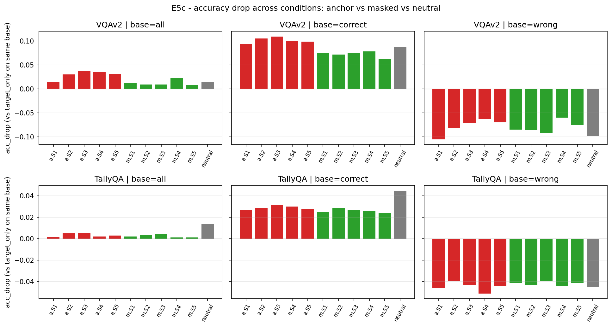
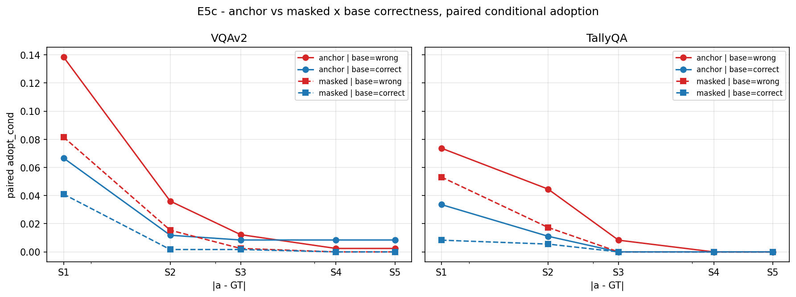
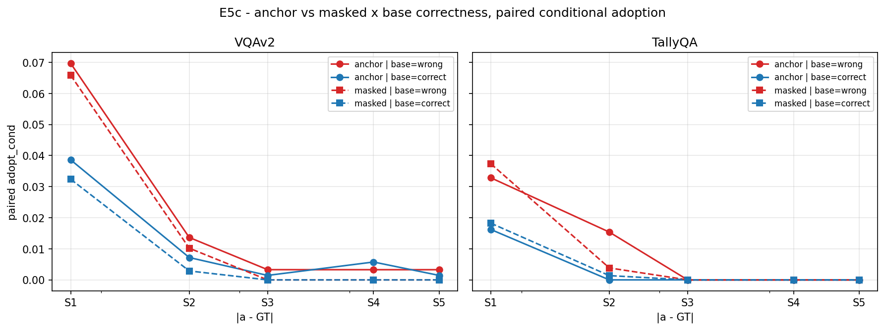
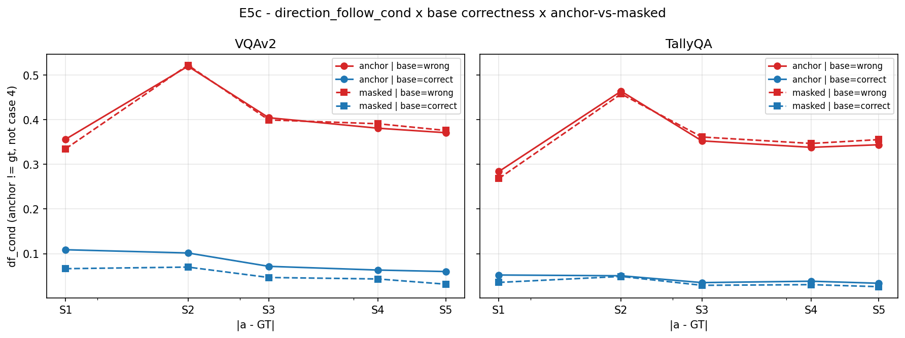
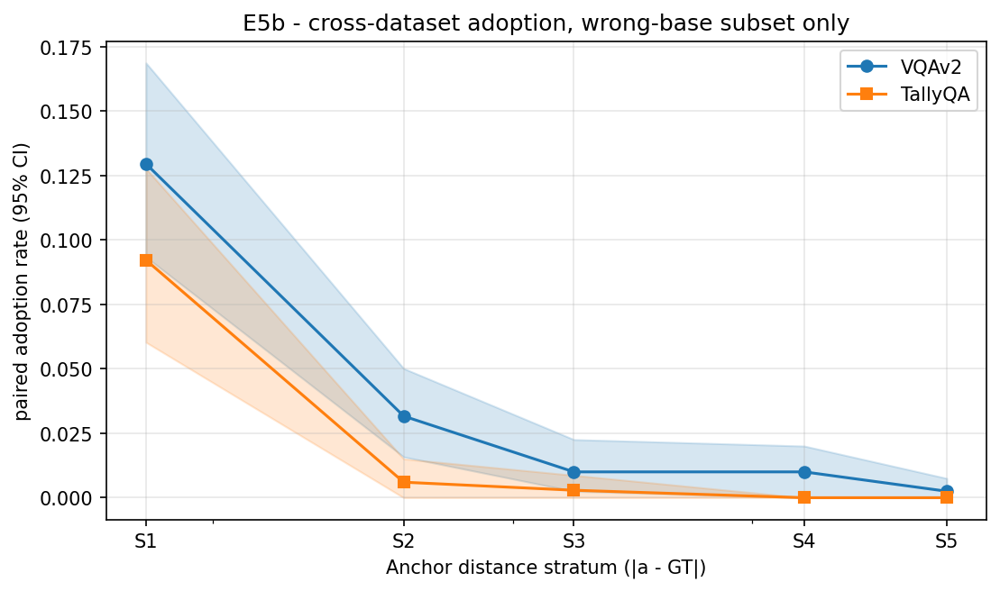
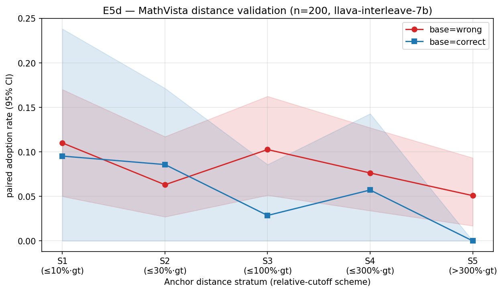

# Cross-Modal Numerical Anchoring in Vision-Language Models: Uncertainty, Plausibility, and Digit-Pixel Gates with a Deployable Subspace-Projection Mitigation

**시각언어모델의 cross-modal numerical anchoring — 불확실성·plausibility·digit-pixel gate와 배포 가능한 subspace projection mitigation**

*EMNLP 2026 long paper, 중간 점검용 한글본 (2026-05-09)*

---

## Abstract

본 논문은 vision-language model (VLM)이 질문과 무관한 두 번째 이미지에 그려진 단일 숫자에 의해 수치 응답에 체계적 편향을 만들어내는 현상 — **cross-modal numerical anchoring** — 을 6개 open-weight VLM에서 일관되게 재현한다 (legacy VQAv2 reference panel §C.1은 7-model). 효과는 categorical capture가 아니라 **불확실성에 비례하는 graded pull**이다. Literal-anchor adoption rate는 1.7-15.7 %에 그치는 반면, 모델 예측이 자기 자신의 anchor-free baseline을 기준으로 anchor 쪽으로 이동하는 비율 (direction-follow) 은 *base-prediction의 answer-token entropy*에 단조 증가한다 (B6 − B1 6-bin gap **+19.5-23.5 pp** on 5 dataset × 6 model heterogeneous coverage = 80 anchor cell, ≥ 4/5 strict pair-wise ↑ on **51-57 / 80 cells** — 1 noise dip 허용 시 substantively monotonic). 통상 보고되는 *base-correct vs base-wrong* 이분법은 이 연속 gradient의 거친 *binary projection* (B1+B2+B3 vs B4+B5+B6 평균에 해당) — 6-model PlotQA panel (§4.1) 에서 *df 기준* +19.0 ~ +34.4 pp 갭으로 동일 신호가 거친 형태로 재현되며 (legacy 7-model VQAv2 panel은 §C.1 부록에 +6.9 ~ +19.6 pp adopt-기준 동일 패턴으로 보존). 효과는 **두 gate의 conjunction + plausibility 조건**이다: (i) 불확실성 gate (continuous; L1 6-bin confidence가 primary, wrong/correct binary는 그 projection), (ii) digit-pixel gate (digit pixel만 inpaint로 가리면 효과가 generic distractor 수준으로 *되돌아간다*). 거리 plausibility (anchor가 gt에 가까운 stratum에서 효과 집중)는 *조건* — S1 peak / S5 floor 감쇠가 6 dataset × 2 architecture에서 재현되며 §C에서 S1 trivial-recovery confound 해소까지 검증한다.

메커니즘 측에서, calibration dataset 위에서 모델별 단일 peak layer가 식별되지만, **single-layer mask ablation은 5-model 메커니즘 panel (gemma4-e4b, llava-1.5, ConvLLaVA, qwen2.5-vl, fastvlm)에서 5/5 null** — signal은 multi-layer redundant이다 (OneVision Main 5-dataset 확장에서도 single-layer 5/5 null로 *확장 검증*; §5.2 / §5.3). 본 논문의 핵심 *이론적* 기여는 (a) 이 multi-layer redundancy를 *attention pathway의 routing* 속성으로 위치시키고 (b) 그 routing의 결과가 *late residual-stream에 통합*되어 single-layer site에서 접근 가능해진다는 **routing vs integration framework**이며, 이로부터 single-direction (LEACE/ActAdd) mitigation의 cross-dataset *실패*가 사전 예측되고 그 예측이 LEACE rank-1 ChartQA +56 % 역행으로 *경험적으로 검증*되는 **predict-then-verify chain (§5.2 → §5.4 → §6.4)**이다. 이 framework는 (1) E1d single-layer attention null과 E6 single-layer subspace projection의 양립성, (2) late layer (L=26 / 28-layer Qwen2 backbone) 선택의 정당화 — 이른 layer는 통합 미완료, 너무 늦은 layer는 redirect 불가 —, (3) projection (broad ablation 아닌) 도구 선택을 단일 mechanism-level argument로 묶는다. 두 상보적 mitigation을 제시한다. **E4 (attention pathway)**: mid-stack cluster의 upper-half attention을 soft re-weighting하면 direction-follow가 9.6-14.6 % 감소하고 exact-match는 0.77-1.30 pp 상승. **E6 (residual-stream subspace projection, single-model case study on `llava-onevision-qwen2-7b-ov`)**: L=26에서 (a − m) calibration contrast로부터 top-K=8 SVD subspace를 1회 보정 (PlotQA + InfoVQA pooled, N=5,000)한 후 inference 시 *anchor label 없이* 보편 적용. 5/5 evaluation dataset (TallyQA, PlotQA, InfoVQA, ChartQA, MathVista; full GT range)의 paired-sids wrong-base 부분집합에서 Δdf(a) ∈ [−5.2, −0.3] pp (5/5 부호 음, 평균 **−2.9 pp**; *paired-bootstrap 95 % CI* (B = 10,000) 적용 시 1/5 cell이 CI excludes 0 — PlotQA n=2,306 Δdf [−6.9, −3.4]; small-n 4 cell은 점추정-일관-CI-individually-inconclusive로 reported, §6.2.3)와 동시에 **anchored arm + non-anchored arm 양쪽 모두**에서 exact-match 상승 (Δem(a) **+3.9 pp**, Δem(b) **+8.8 pp** 평균; **Δem(b)는 5/5 cell에서 95 % 및 Bonferroni-20 corrected 99.75 % CI 모두 excludes 0** — multiplicity 보정 후에도 살아남는 robust signal) — 본 논문이 제안하는 ***free-lunch*** 기준 (Δdf < 0 ∧ Δem(anchored) ≥ 0 ∧ Δem(non-anchored) ≥ 0 ∧ Δ(held-out capability) ≥ 0 동시 충족; §6.2.3에서 형식 정의)을 5개 비교 baseline (ActAdd, LEACE rank-1, query-adaptive, CogBias decode-time, MIA-DPO LoRA) 중 *유일하게* 통과 — CAA · ITI 인접 prior 방법은 §6.5 Note의 *구조적 reduction*으로만 처리되었으며 *경험적 row*는 후속 revision (§8.2). 6개 held-out benchmark capability preservation 검증에서 매크로 Δ = **+0.41 pp** (HallusionBench **+2.21 pp**, 95 % CI [+1.14, +3.28] excludes zero; POPE **−0.06 pp**, 95 % CI [−0.21, +0.09] pinned to zero) — free-lunch가 anchoring task family 외부 일반 VLM 능력으로 확장된다 (단 모두 동일 OneVision 모델 위에서의 검증; cross-architecture 재 calibration은 §8.2 deferred). 마지막으로 **reasoning-mode VLM (Qwen3-VL-8B-Thinking)은 비추론 변형 대비 anchor pull을 *증폭***한다 (adopt **×1.6**, df **×2.9**) — 그리고 amplification은 *연속 confidence gradient* 축에 정확히 떨어진다: correct-base 부분집합에서 df 비율 **×12.7**로 (continuous axis가 증폭될 때 그 binary projection이 *깨지는 것은 예측된 결과*; §4.5). 이는 텍스트 LRM 문헌의 reasoning-amplifies-bias 현상이 VLM에서도 처음 재현되는 *first-evidence* 결과이다 (단일 architecture pair, cross-architecture 일반화는 §8.2 한계로 명시).

---

## 1 서론

### 1.1 동기와 자극 신규성

다중 이미지 prompt가 사용자 질의에서 흔해지는 가운데, 그중 *질문과 무관한 이미지가 하나*라면 — 우연이든 attacker가 의도적으로든 — 모델 응답에 영향을 주는가? 인지과학 문헌의 prior는 강하다: 인간은 무관함을 명시 통보받은 수치 단서에도 anchor를 내린다 [Tversky and Kahneman, 1974; Mussweiler and Strack, 1999]. LLM 문헌은 이를 *텍스트 anchor*에 대해 확립했다 [Jones and Steinhardt, 2022; Echterhoff et al., 2024]. 본 논문이 묻는 것은 — **의미 라벨 없는 단독 rendered-digit 이미지가 단서로 주어졌을 때, 동일한 효과가 이미지 modality에서도 일어나는가?**

기존 연구 중 *질문 대상과 무관한 independent rendered-digit 이미지*를 *cross-modal anchor*로 *open-ended numeric VQA*에 전달하여 *baseline-relative shift*를 측정한 사례는 없다. 가장 가까운 이웃 — VLMBias [Vo, Nguyen et al., 2025]는 *familiar subject (Adidas-style logo / 동물 / chess 등)*의 counting accuracy를, typographic attack [Wang et al., 2025b]은 *대상 이미지 위 오버레이*에 의한 분류 뒤집기를, FigStep [Gong et al., 2025]은 *prompt 텍스트의 이미지화*에 의한 jailbreak ASR을 측정한다. 본 논문은 cue를 *질문 subject로부터 분리*하고 metric을 *open-numeric-estimation의 baseline-relative shift*로 두는 보완적 paradigm을 도입한다.

### 1.2 핵심 주장 — 세 기둥

VLM의 cross-modal numerical anchoring은 **불확실성에 비례하는 graded pull**이며, **anchor 이미지의 digit pixel**이 효과의 인과 통로이다.

1. **Graded vs categorical.** 6개 모델 모두에서 paired adoption은 1.7-15.7 %로 모델이 anchor를 그대로 출력하는 일은 드물다. 효과의 질량은 *anchor 쪽으로의 점진적 이동*에 있다 (direction-follow 0.059-0.325 across 6 models on PlotQA, §4.1). 이동의 *크기*는 base-prediction confidence와 단조 관계 (pillar 3).
2. **Digit-pixel causality.** Anchor 이미지의 digit pixel만 inpaint로 가리면 paired adoption이 generic distractor 수준으로 *되돌아간다*.
3. **Confidence-modulated (continuous primary, binary projection consistent).** Direction-follow는 *base-prediction의 answer-span entropy*와 단조 monotonic 관계이다 (B6 − B1 6-bin gap **+19.5-23.5 pp** on 5 dataset × 6 model = 80 anchor cell, ≥ 4/5 strict pair-wise ↑ on 51-57 / 80 cells; §4.4). 통상의 *wrong-base vs correct-base* 이분법은 이 연속 gradient의 거친 binary projection (B1+B2+B3 vs B4+B5+B6 평균에 해당) — 6-model PlotQA panel (§4.1) 에서 *df 기준* +19.0 ~ +34.4 pp 갭으로 동일 신호를 거친 형태로 운반한다 (legacy VQAv2 panel은 §C.1, +6.9 ~ +19.6 pp adopt 갭). γ-β reasoning 모드에서 이 binary projection이 *깨지는* 것은 (correct-base ratio ×12.7) 연속 axis가 진짜 modulator라는 직접 증거이다 (§4.5).

### 1.3 메커니즘과 두 mitigation

Calibration dataset 위에서 모델별 단일 peak layer가 식별되지만 single-layer ablation은 5-model 메커니즘 panel에서 5/5 null — signal은 multi-layer redundant이다 (OneVision Main 5-dataset 확장에서도 single-layer 5/5 null로 *확장 검증*; §5.2 / §5.3). 이 multi-layer redundancy는 *attention pathway routing*의 속성이며, 그 routing의 결과가 *late residual stream에 통합*되어 single-layer site에서 접근 가능해진다는 **routing vs integration framework**가 본 논문의 핵심 *이론적* 기여이다 — 이 framework로부터 single-direction (LEACE/ActAdd) mitigation의 cross-dataset 실패가 사전 예측되고 §6.4에서 LEACE rank-1 ChartQA +56 % 역행으로 *경험적 검증*되는 **predict-then-verify chain (§5.2 → §5.4 → §6.4)**, E1d single-layer null과 E6 single-layer projection의 양립성, 그리고 late layer (L=26 / 28-layer) + projection (broad ablation 아닌) 도구 선택의 mechanism-level 정당화가 단일 사슬로 묶인다. **E4** upper-half attention re-weighting은 mid-stack cluster (LLaVA-1.5 / ConvLLaVA) 2 모델에서 df −9.6 ~ −14.6 % 감소 + em +0.77 ~ +1.30 pp 상승의 free-lunch를 보이지만 inference 시 anchor token span을 요구한다. **E6** subspace projection은 Main 모델 `llava-onevision-qwen2-7b-ov`의 L=26에서 K=8 SVD subspace를 PlotQA + InfoVQA pooled 1회 보정 후 inference 시 보편 적용 — 5/5 dataset에서 df 감소 (평균 −2.9 pp)와 동시에 *양 arm* em 상승 (anchored +3.9 pp, non-anchored +8.8 pp). 6-benchmark capability preservation 검증 (매크로 +0.41 pp, HallusionBench +2.21 pp excludes zero, POPE −0.06 pp pinned to zero)으로 free-lunch가 anchoring task 외부로 확장된다. **E6 검증 chain은 single-model case study이며**, multi-model behavioral 결과 (§4.1 6-model · §4.3 5-dataset 6-model · §5.2 5-model 메커니즘 panel)와는 panel scope가 다르다 — cross-architecture 일반화는 §8.2 한계.

### 1.4 추론은 anchoring을 증폭한다

같은 자극에서 Qwen3-VL-8B-Thinking은 Instruct 변형 대비 adopt ×1.6, df ×2.9 — 그러나 *correct-base* 부분집합에서 df 비율은 **×12.7**로, main panel 전반에서 binary projection이 보였던 wrong > correct gap이 reasoning mode에서 *축소*된다 (연속 confidence axis가 증폭되면 binary 평균 차이는 줄어든다는 §4.4 framework의 직접 예측). Reasoning trace가 *정확도 향상 없이* anchor robustness를 *낮춘다*는 first-evidence cross-arm 결과이다 (controls in §4.5 Insight 3 — Thinking acc(d) 0.587 < Instruct 0.647).

### 1.5 기여

(1) VLM에서의 *independent-anchor open-numeric-estimation* anchoring을 식별·정량화하는 *first-evidence* 평가 프레임워크 (familiar-subject counting을 다루는 VLMBias [Vo, Nguyen et al., 2025]와는 cue source · 측정 대상이 상보적; §2). (2) gt-자유, baseline-relative direction-follow 표준 metric (`(pa − pb)·(anchor − pb) > 0 AND pa ≠ pb`). (3) 5 dataset × 6 model cross-dataset 증거. (4) 5-model 메커니즘 panel에서 single-layer ablation이 5/5 null임을 보이고 그 *multi-layer redundancy*를 *attention pathway routing*의 속성으로 위치시키며, 그 routing의 결과가 *late residual stream에 통합*되어 single-layer projection으로 접근 가능해진다는 **routing vs integration framework**를 본 논문의 *이론적* 기여로 제시한다 — 이 framework는 (i) single-direction (LEACE/ActAdd) cross-dataset 실패의 사전 예측 + §6.4 LEACE rank-1 ChartQA +56 % 역행 *경험적 검증*의 **predict-then-verify chain (§5.2 → §5.4 → §6.4)**, (ii) E1d single-layer attention null과 E6 single-layer subspace projection의 양립성, (iii) late layer (L=26 / 28-layer) 선택의 정당화, (iv) projection (broad ablation 아닌) 도구 선택을 단일 mechanism-level 사슬로 묶는다 (§5.4 정리). **§4.6 γ-β residual-stream bridge가 본 framework의 두 번째 empirical anchor를 제공한다 — Qwen3-VL self-calibration K=1 subspace에서 late-stack (L=29-34) positive + mid-stack (L=20) negative 형태로 anchor 처리의 layer-routed structure를 14/84 cells Bonferroni-corrected (B=10,000) within-Thinking CI로 직접 관측 (자세히 §4.6).** (5) Single-direction mitigation의 cross-dataset 실패를 *예측한 뒤 multi-direction subspace projection으로 우회*하며, 6-benchmark capability preservation까지 동시에 검증한다 (*free-lunch* — anchoring 효과 + 양 arm em + 일반 능력 보존 동시 충족; §6.2.3 / §6.5에서 형식 정의). **이 mitigation chain은 단일 모델 `llava-onevision-qwen2-7b-ov` 위에서의 case study이며**, cross-architecture 재calibration은 §8.2 한계로 명시된다. (6) γ-β reasoning pair (N=1 Qwen3-VL Instruct vs Thinking) × N=1 dataset (MathVista)에서 reasoning-amplifies-anchoring을 처음 보이는 *first-evidence* VLM 결과 — 이는 *hypothesis-generating existence proof*이며 cross-architecture · cross-dataset 검증은 후속 라운드 (§8.2).

---

## 2 관련 연구

**LLM anchoring 계보.** Tversky and Kahneman [1974]의 anchoring & adjustment heuristic과 Mussweiler and Strack [1999]의 selective accessibility 모델은 무관한 수치 단서가 *비교 대상으로 working memory에 진입*해 후속 판단에 점진적으로 혼합된다는 메커니즘 가설을 제공한다. LLM 시대에 들어 Jones and Steinhardt [2022], Echterhoff et al. [2024]는 텍스트 anchoring을 확립했고, Lou and Sun [2024]은 텍스트 LLM에서 anchoring을 재확인하면서 Chain-of-Thought, Thoughts-of-Principles, Ignoring-Anchor-Hints, Reflection 같은 *prompt-level mitigation들이 모두 불충분*함을 보고 — 이는 본 논문이 § 6에서 *representation-level (residual-stream subspace) intervention*으로 향하는 직접적 동기이다. Wang et al. [2025a]은 LRM에서 *judging bias가 reasoning trace를 통해 증폭*됨을 보고했다. Huang et al. [2025]은 합성 데이터로 메커니즘을 분해했다.

**Multimodal cognitive bias 평가.** VLMBias [Vo, Nguyen et al., 2025]는 가장 포괄적인 VLM cognitive bias benchmark으로, *모델이 사전 지식을 가진 visual subject* (Adidas-style logo, 동물, chess board, board game, optical illusion, patterned grid 등 7개 domain)를 stimulus로 사용하여 *familiar-subject counting accuracy* (예: stripe 개수)를 측정한다 — 평균 17.05 % counting accuracy + background 제거 시 +21.09 pp 회복 (arXiv:2505.23941). AIpsych [Liu et al., 2025], CIVET [Rizzoli et al., 2025], Tinted Frames [Fan et al., 2026]은 sycophancy / position bias / question framing을 다룬다. 본 논문은 이들과 *측정 대상*과 *cue source* 두 축에서 상보적이다 — VLMBias가 *familiar subject의 prior knowledge에 대한 counting accuracy*를 측정하는 데 비해 본 논문은 *질문 대상과 무관한 독립 rendered-digit anchor 이미지에 대한 open-ended numerical estimation의 baseline-relative shift*를 측정한다 (cue가 question 자체의 subject가 아니라 independent second image; metric이 closed-form counting이 아니라 arbitrary anchor에 대한 회귀형 이동). 두 paradigm 모두 "visual content가 numerical answer를 편향시킨다"는 같은 mechanism question을 공유하나, 측정 대상 (counting vs open estimation)과 cue dependency (subject-bound vs independent draw)에서 분리된다.

**Typographic attack과 mechanism 연구.** Goh et al. [2021] "Multimodal Neurons"는 CLIP에서 텍스트 픽셀이 의미 neuron을 활성화한다는 — typographic attack의 인과 기반 — mechanism을 처음 정립했다. Wang et al. [2025b, NAACL] multi-image typographic attack과 FigStep [Gong et al., 2025]은 *클래스 라벨* 또는 *prompt 텍스트*의 이미지화로 분류 뒤집기·jailbreak를 측정한다. 본 논문의 단서는 *수치값 단독* (클래스 정체성 없음), 표적은 *open-ended numerical estimation* (분류 뒤집기·ASR 아님). Hufe et al. [2025, Dyslexify]는 typographic attack에 대한 *encoder-side mechanistic defense* (CLIP 측 개입)를 제시 — encoder-side에서 작동하는 typographic-attack defense의 가장 가까운 mechanistic 이웃이다. 본 논문 E6는 이와 *상보적*으로 LM residual stream에서 작동한다. Weng et al. [2024, EMNLP Main]은 *gender bias*를 대상으로 causal mediation으로 image-encoder 기여를 식별하고 encoder-side feature blurring으로 22 % bias reduction (MSCOCO)을 보고한 EMNLP-Main mechanism→mitigation 사례이다. 본 논문은 *bias class*가 다르고 (numerical anchoring), mitigation의 *작용 site*도 다르다 (encoder가 아닌 LM residual stream); 공유하는 부분은 *mechanism→mitigation chain*이라는 venue-tier 형식이다.

**Activation steering과 concept erasure.** §6의 mitigation은 residual-stream intervention 계열에 속한다. CAA [Panickssery et al., 2024]는 *paired contrastive activation* — positive vs negative behavioral example pair의 residual-stream 차분 평균 — 으로 *single-direction* steering vector를 도출한다. ITI [Li et al., 2023]는 *attention head* 출력 수준에서 *multi-direction* 개입을 수행한다 (multiple head × direction). LEACE [Belrose et al., 2023]는 closed-form linear concept erasure (rank-1 default 포함)로 baseline 표현 손상을 최소화하면서 선형 분류기가 concept을 검출하지 못하게 만든다. 본 논문 E6는 이 계열의 직접 후속 — (i) CAA의 paired-contrast 패러다임을 *multi-direction subspace* (K=8 SVD)로 확장하고, (ii) ITI의 attention-head locus 대신 *residual-stream* locus에서 작동하며, (iii) text-only steering 문헌에 없는 *vision-modality (a − m) paired-inpaint contrast* 구성을 도입한다. §6.4에서 LEACE의 *rank-1 closed-form 인스턴스*를 직접 비교 baseline으로 평가하며 (LEACE 자체는 closed-form linear erasure framework이고 rank-1은 그 default 운영 모드), CAA·ITI는 §6.5 Table 8 footnote에서 single-direction failure mode (ActAdd 대등 — paired-contrast residual stream at K=1) 또는 multi-layer redundancy로부터 예측되는 attention-head intervention failure mode (§5.2 single-layer null과 동일 진단)로 reduce되는 점을 명시 — 본 작업의 differentiator는 *기법 class의 신규성이 아니라 multi-direction × residual-stream × paired-inpaint 조합이 free-lunch 후보로 기능*한다는 점이다.

---

## 3 방법

### 3.1 자극 4-조건

`sample_instance` = (target_image, question, anchor_draw). 한 sample_instance마다 최대 4개 조건 (Table 1)을 평가하고 각 조건이 모델 예측 `pred_b / pred_a / pred_m / pred_d`를 산출한다.

**Table 1.** 4-조건 정의.

| 약어 | 라벨 | 두 번째 이미지 |
|---|---|---|
| `b` | `target_only` | 없음 (baseline) |
| `a` | `target_plus_irrelevant_number` | 단일 digit 이미지 (anchor) |
| `m` | `target_plus_irrelevant_number_masked` | 같은 anchor 이미지에서 digit pixel만 inpaint 제거 |
| `d` | `target_plus_irrelevant_neutral` | digit 없는 FLUX render (distractor control) |

세 조건 gap은 각각 (a − d) *anchoring vs generic distraction*, (a − m) *digit pixel vs anchor scene background*, ((a, base-wrong) − (a, base-correct)) *uncertainty modulation*을 분리한다. 자극 inventory는 128개 FLUX-rendered digit 이미지 (`a`) + 128개 OCR-검증된 Telea inpaint (`m`) + 128개 digit-free FLUX render (`d`)이다 (부록 §A; 4-조건 자극이 모델별 acc drop에 미치는 효과 예시는 Figure 1).



### 3.2 표준 metric (M2)

`pa = pred_a`, `pb = pred_b`로 두면

```
adopt_rate            = #(pa == anchor AND pb != anchor) / #(pb != anchor)
direction_follow_rate = #( (pa - pb) · (anchor - pb) > 0  AND  pa != pb )
                        / #(numeric pair AND anchor present)
exact_match           = #(pa == gt) / #(numeric pair)
```

`direction_follow_rate` 분자는 `pa`가 baseline `pb`에서 *anchor 쪽으로* 이동했는지를 측정한다 — baseline-relative shift. `pb`(`gt` 아님)을 reference로 사용함으로써 metric은 모델 출력과 anchor draw에만 의존하며 baseline 정답 여부와 `gt` 자체에 무관하다. Stimulus별 변동성과 dataset별 GT 분포 차이에 robust하다. 18개 numerator × denominator 변형의 known-signal preservation 분석은 부록 §B.

### 3.3 데이터셋과 모델 패널

5개 1차 numeric VQA dataset (Phase 1 P0 v3 main matrix): TallyQA (자연 이미지 카운팅, raw n≈38k), ChartQA (차트 정수 GT, raw n=5,390), MathVista (testmini integer, n=385), PlotQA (과학 plot V1, raw n≈5,000), InfographicVQA (val numeric, n=1,147). 위 raw n은 stratification·eligibility 필터 *이전* count이며, 실제 본문 표에 사용된 per-cell n은 stratified 부분집합 기준으로 ChartQA 129–517 / TallyQA 6,934–14,772 / PlotQA 926–4,610 / InfoVQA 218–865 / MathVista 127–274 *범위에 분포한다* (모델별 변동, 출처 `_data/main_panel_5dataset_summary.md`). **§4.1 single-dataset depth panel = PlotQA** (5-dataset 중 GT-range 가장 넓고 anti-scaling / em-positive baseline / sample-size-robust (a-m) gap top-tier가 모두 가장 또렷이 분리되는 dataset; n_pair 4,554-4,707 per model — paper §4.1 Table 2). 레거시 7-model VQAv2 number subset (n=17,730 per model, GT range [0,9])은 §C.1 부록 — adopt-기반 동일 wrong > correct 패턴 (+6.9 ~ +19.6 pp on 7/7 models) 을 단일 자릿수 분포에서 운반하는 cross-stimulus replication panel. **Main panel 6 모델**: `llava-onevision-qwen2-7b-ov` (Main, 28-layer Qwen2-7B), `google/gemma-3-4b-it`, `google/gemma-3-27b-it`, `llava-hf/llava-interleave-qwen-7b-hf`, `Qwen/Qwen2.5-VL-7B-Instruct`, `Qwen/Qwen2.5-VL-32B-Instruct`. **Mechanism panel 5 모델**: gemma4-e4b, llava-1.5-7b, ConvLLaVA-7b, qwen2.5-vl-7b, fastvlm-7b — 5개의 서로 다른 visual encoder 조합 (SigLIP, CLIP-ViT, ConvNeXt, Qwen-ViT, FastViT) cover; 모델별 peak layer + cross-dataset variability 자세히 부록 §D.1. **γ-β**: Qwen3-VL-8B Instruct vs Thinking. 누계 ~1.6 M model generation, ~5,760 H200 GPU-hours.

---

## 4 행동 분석과 인사이트

### 4.1 Graded pull (PlotQA single-dataset depth panel) — confidence gradient의 binary projection

6-model PlotQA panel (n=5,000 base per model; S1 anchor `|a − GT| ≤ max(1, 0.10·GT)`)에서 두 패턴이 즉시 부각된다 (Table 2). `df(a)` magnitude는 6개 모델 전반에서 **0.059-0.325 범위**, literal-adoption rate `adopt(a)`는 1.7-15.7 %로 `df(a)`의 1/2 이하 — 모델이 anchor를 *그대로 출력*하는 일은 드물고 효과의 질량은 *anchor 쪽 graded movement*에 있다.

***`df > 0`은 evidence가 아님 — metric construction의 near-tautology.*** C-form 분자 `(pa − pb)·(anchor − pb) > 0 AND pa ≠ pb`는 anchor가 zero-effect인 null 하에서도 *대칭에 의해 `df ≈ 0.5 × P(pa ≠ pb) > 0`*을 산출 — 즉 "df > 0"은 stimulus / null 조건과 거의 무관하게 자동 만족된다. 본 paper에서 anchor-specific signal의 load-bearing 증거는 *모두 다른 cut*에서 온다: (i) **wrong-base vs correct-base 비대칭** *df 기준* +19.0 ~ +34.4 pp on 6/6 models (§4.1 후속 단락) — confidence stratification에 따른 *비대칭* 자체는 null 대칭으로 설명 불가; (ii) **L1 confidence 6-bin gradient** B1<B2<...<B6, +19.5-23.5 pp B6-B1 gap; ≥ 4/5 strict pair-wise ↑ on 51-57 / 80 cells (§4.4) — null 하 monotonicity 기대 안 됨; (iii) **(a − m) digit-pixel gap** +6.2 pp on PlotQA OneVision wrong-base S1 (§4.2) — *같은 anchor scene*에서 디지트 픽셀만 inpaint했을 때 효과가 사라짐, scene-level + S1 trivial-recovery confound 동시 falsify (자세한 stratum별 plausibility window 검증은 §C). 본 단락의 magnitude (0.059-0.325) 는 *graded vs categorical* 시각적 사이즈를 제공하지만 anchor-effect의 *정성적* 증명은 (i)-(iii) 세 axis가 담당한다.

**Table 2.** 6-model PlotQA panel, all-base S1 anchor arm (paired n_pair 4,554-4,707). Bold cell = 각 metric 기준 셀 최댓값 또는 최솟값 (`adopt(a)` max + min, `df(a)` max + min, capability-bound caveat 모델 제외). Bold row name = 해당 metric 기준 가장 robust 모델. `adopt(a)` 기준 panel min = Qwen2.5-VL-7b (0.017, Qwen2.5-VL-32b와 동률), `df(a)` 기준 panel min = Qwen2.5-VL-7b (0.059, Qwen2.5-VL-32b와 동률) — 두 metric이 모두 Qwen2.5-VL family를 panel 최하단 robust group으로 지정한다.

| 모델 | n_pair | acc(b) | adopt(a) | df(a) | em(a) |
|---|---:|---:|---:|---:|---:|
| Gemma3-4b-it | 4,707 | 0.300 | **0.157** | 0.294 | 0.350 |
| LLaVA-Interleave-7b † | 4,554 | 0.119 | 0.105 | 0.325 | 0.116 |
| LLaVA-OneVision-7b *(Main)* | 4,699 | 0.481 | 0.069 | 0.130 | 0.502 |
| Gemma3-27b-it | 4,698 | 0.514 | 0.063 | 0.118 | 0.546 |
| Qwen2.5-VL-32b-instruct | 4,707 | 0.729 | 0.017 | 0.059 | 0.757 |
| **Qwen2.5-VL-7b-instruct** | 4,706 | **0.783** | **0.017** | **0.059** | 0.804 |

† **LLaVA-Interleave는 fixed-resolution image input만 받아 PlotQA chart를 강제 다운샘플** — `acc(b) = 0.119`는 anchor-vulnerability가 아닌 *resolution-bound capability ceiling*에서 비롯된다 (다운샘플된 chart 이미지는 사람 평가자도 정답 수치를 읽기 어려운 수준). 따라서 본 모델의 `df(a) = 0.325` panel-max는 *intrinsic encoder weakness*가 아닌 *input pipeline-induced low-capability data point*로 해석되어야 하며 — 단 anchor-effect 부호와 ordering은 panel 다른 5 모델과 정합 (Insight 1 능력↔끌림 역상관의 *low-capability anchor*로 기능). 따라서 표상 cell-level 굵은 highlight에서 제외하나 wrong-correct asymmetry 6/6 검증에는 포함된다.

**PlotQA single-dataset depth panel의 역할.** PlotQA는 본 paper main matrix의 **GT-range 가장 넓은 dataset** (정수 [1, 10000], 5-stratum sampled n=5,000)이며, §4.3 main matrix의 5-dataset breadth와 *상보적*인 *single-dataset depth* axis로 사용된다 — Phase-A H2 binary projection (§4.1 본 절) / (a − m) digit-pixel gap (§4.2 Table 3) / L1 6-bin gradient (§4.4) 의 *replication depth*가 PlotQA cell에서 selectively 가장 강하다. 5-dataset 중 anti-scaling (4B > 27B; §4.3 Insight 2) / em-positive baseline (em(a) > em(b) on 5/6 model; §4.2 Insight 3 — Slice A E7 PlotQA panel) / (a-m) gap top-tier (sample-size-robust; §4.2 Table 3 Slice B에서 PlotQA n_wb=2,107로 +6.2 pp, MathVista n_wb=152로 점추정 +6.6 pp가 동률 상위) 모두 PlotQA를 일차 evidence로 한다 — 즉 본 panel은 paper-wide pattern이 *가장 또렷이 분리되는* dataset에서 6-model breadth를 한 cell로 압축한다. (legacy VQAv2 number subset n=17,730 7-model panel은 §C.1 부록으로 이전 — 단일 자릿수 GT range [0,9] / skewed answer 분포로 인한 ceiling 한계 + S1 distance stratification 의미 약화 caveat 포함.)

본 panel과 §4.3 main matrix는 *동일 panel의 재실행이 아닌* 독립 axes로 — depth (PlotQA n=4,700 × 6 model, LLaVA-Interleave 포함) ↔ breadth (5 dataset × stratified per-cell × 6 model, LLaVA-Interleave 포함) — 두 axis가 *모든 정성적 claim의 cross-replication*을 제공한다.

`base_correct` (baseline 정답 여부) 로 stratify하면 *df 기준* 6/6 모델에서 wrong-base direction-follow rate가 correct-base보다 **+19.0 ~ +34.4 pp 더 크다** (Figure 2). adopt 기준에서도 6/6 sign-clean (gap +3.1 ~ +14.4 pp). 이는 §4.4의 continuous 6-bin gradient가 *B1+B2+B3 vs B4+B5+B6*로 평균 매핑된 binary projection이며 (§4.4 Insight 1에서 6-bin 기준 +28.9 pp로 확대 재유도, PlotQA × OneVision worked example), 본 panel은 그 projection이 *PlotQA chart-stack stimulus*에서도 — 즉 VQAv2 단일 자릿수 분포가 아닌 GT range [1, 10000] 의 본격 numerical question 위에서도 — 재현됨을 보이는 6-model 폭 검증이다.


**Insight 1 (효과 크기와 모델 능력의 역상관).** 끌림 크기 순서 (resolution-caveat 모델 제외 시 Gemma3-4b 가장 큼 0.294 → Gemma3-27b 0.118 → LLaVA-OneVision *(Main)* 0.130 → Qwen2.5-VL-7b/32b 가장 robust 0.059 동률; `adopt(a)`로는 Qwen2.5-VL family panel 최소 0.017 동률, `df(a)`로도 동일 동률)는 base accuracy 순서의 *역*과 거의 일치 — *능력이 낮은 곳에서 끌림이 크다*. LLaVA-Interleave는 architecture-bound resolution ceiling이 부과한 low-capability cell로, 그 자리에서 (df = 0.325 panel-max region) 동일 prediction을 보인다 — 즉 capability ceiling의 *origin*에 무관하게 (intrinsic 모델 size든 input pipeline forcing이든) 능력↔끌림 역상관이 robust. 이는 §4.4의 confidence 6-bin 결과를 baseline 능력 측에서 미리 시사한다.

**Insight 2 (Mussweiler-Strack 직접 예측).** wrong-correct asymmetry가 *df 기준* 6/6 모두 양인 것은 우연이 아니다 — selective accessibility 모델의 *직접* 예측이다. baseline 신뢰도가 낮을수록 비교 후보로 anchor가 더 쉽게 활성화되며, 활성화된 anchor가 답안에 점진적으로 혼합된다. PlotQA 6-model 결과는 인지과학 가설의 VLM 측 외부 검증이며, 동시에 *GT range / encoder family / stimulus type 일반화* 검증이기도 하다 — VQAv2 [0,9] 단일 자릿수 분포에서 +6.9 ~ +19.6 pp adopt asymmetry로 재현되는 패턴 (§C.1 legacy panel) 이 PlotQA [1, 10000] 본격 chart-numeric 분포에서 +19.0 ~ +34.4 pp df asymmetry로 *증폭되어* 재현된다. 이는 H2 asymmetry가 GT range / question type / encoder family에 *무관한* mechanism-bound prediction임을 시사한다.

**Cross-dataset replication.** 본 절의 두 Insight는 TallyQA (n=24k–38k per model, 6-model panel) 와 InfoVQA (n=1,076 per model, 6-model panel) 에서도 재현된다 — Insight 1 능력↔끌림 역상관 부호 3/3 dataset (Qwen2.5-VL family가 모든 dataset에서 acc(b) 최고 + df 최저), Insight 2 wrong > correct df gap 부호 6/6 모델 × 3 dataset (TallyQA +7.0 ~ +12.1 pp, InfoVQA +11.3 ~ +31.7 pp). adopt 기준에서도 6/6 sign-clean on 3/3 dataset. 자세한 cross-dataset replication 표는 §C.3 (Table C.2 + C.3). 본문 6-row table을 PlotQA에 한정한 것은 §4.3 5-dataset main matrix breadth와의 axis 분업을 위해서이며 — *paper-wide pattern이 가장 또렷한 single dataset에서의 depth coverage* 와 *5-dataset breadth* 의 두 axis로 분리한다.

### 4.2 Digit-pixel causality

(`b`, `a`, `m`) 비교는 digit pixel의 효과 기여를 정량화한다. Mask는 같은 장면의 digit 영역만 Telea inpaint로 가린 것 — scene background는 유지 (Figure 3).


**S1 confound resolution.** 본 비교는 wrong-base × S1 (TallyQA `|a − GT| ≤ 1` absolute, chart-stack은 `max(1, 0.10·GT)` relative — 자세한 dataset별 cutoff + 거리 plausibility 감쇠 검증은 §C) 부분집합에서 수행된다. Wrong-base × S1에서 anchor가 gt에 plausibly 가까우면 "모델이 gt 쪽으로 복귀하는 것이 anchor 쪽으로 보이는" trivial 해석이 가능하다 — `(pa, pb, anchor)` 의 부호가 우연히 정렬될 수 있기 때문. (`a`, `m`) 페어는 *같은 anchor scene*에서 *디지트 픽셀만* 차이 — 거리·scene·plausibility는 동일하므로 이 confound는 두 arm에 *같은 정도로 작용*하고 (a − m) 차분에서 *상쇄*된다. 따라서 (a − m) gap > 0은 "S1에서 모델이 gt 회복" 가설로 설명 *불가* — 디지트 픽셀이 인과적이라는 *clean separation*이다.

**Table 3.** Wrong-base × S1 paired adoption + (a − m) gap. 두 직교 슬라이스로 제시 — (A) PlotQA 위에서 모델 breadth, (B) Main 모델 위에서 dataset breadth. PlotQA는 두 슬라이스에 공통 cell이며 두 독립 run (E7, E5b) 의 (a − m) gap이 +6.1 / +6.2 pp로 일치한다 (cross-run replication).

*Slice A — PlotQA × 6-model (E7 full panel, source `experiment_e7_plotqa_full_per_cell.csv`).*

| 모델 | n_wb | adopt(a) | adopt(m) | (a − m) |
|---|---:|---:|---:|---:|
| Gemma3-4b-it | 3,036 | 0.184 | 0.056 | **+12.8 pp** |
| Gemma3-27b-it | 1,939 | 0.099 | 0.037 | **+6.1 pp** |
| LLaVA-OneVision-7b *(Main)* | 2,106 | 0.090 | 0.028 | **+6.1 pp** |
| LLaVA-Interleave-7b † | 4,029 | 0.082 | 0.014 | **+6.8 pp** |
| Qwen2.5-VL-7b | 902 | 0.024 | 0.007 | +1.8 pp |
| Qwen2.5-VL-32b | 1,153 | 0.023 | 0.013 | +1.0 pp |

*Slice B — LLaVA-OneVision-7b *(Main)* × 5-dataset cross-dataset panel. Source: `experiment_e5b_5strat_<dataset>_onevision_per_cell.csv` (PlotQA / MathVista / ChartQA / InfoVQA), `experiment_e5e_tallyqa_full_per_cell.csv` (TallyQA OneVision backfill, Phase 1 P0 v3).*

| 데이터셋 | n_wb | adopt(a) | adopt(m) | (a − m) |
|---|---:|---:|---:|---:|
| MathVista | 152 | 0.105 | 0.039 | **+6.6 pp** |
| PlotQA | 2,107 | 0.087 | 0.025 | **+6.2 pp** |
| InfoVQA | 403 | 0.045 | 0.037 | +0.7 pp |
| ChartQA | 211 | 0.028 | 0.014 | +1.4 pp |
| TallyQA | 7,119 | 0.032 | 0.022 | +1.0 pp |

† LLaVA-Interleave는 fixed-resolution input으로 PlotQA chart를 강제 다운샘플 — Slice A에서 제공하는 (a − m) gap은 *low-capability anchor* 위치에서의 digit-pixel attribution이다 (§4.1 Table 2 footer 참조).

`adopt(m)` 해석 *— reader 혼란 방지*: m-arm은 anchor scene에서 *디지트 픽셀이 inpaint로 제거된* 조건이므로 모델이 anchor digit을 *볼 수 없다*. `adopt(m)` 분자 `pa_m == anchor_value`의 `anchor_value`는 *sample metadata로 보존된* (a-arm에서 보였을) anchor 값이며, m-arm에서는 모델이 그 값을 *anchor로서 채택한 것이 아니다*. `adopt(m)`이 양수일 수 있는 원인은 (i) 모델 prediction noise가 우연히 anchor_value와 일치 (~0.5 × P(numeric pair) baseline), (ii) anchor scene background에서 잔존하는 미세한 cue (Telea inpaint이 픽셀 레벨에서 완전 무 잔여 OCR 검증되었으나 representation level에서의 잔여 가능성), (iii) 모델의 prior digit 분포 편향 (예: 모델이 "3"을 자주 출력하는 경향) — 세 가지 모두 *anchor 효과가 아니다*. 따라서 `adopt(m)`은 *random-coincidence + scene-residual baseline floor*로 기능하며, `(a − m)` gap이 이 floor 위의 *digit-pixel-attributable adoption*을 분리한다.

(`b`, `m`, `d`) 통제는 *anchor scene background가 효과를 운반*하는 가설을 기각한다 — masked와 neutral이 correct-base 정확도에 끼치는 손실은 1-2 pp 안에서 구별 불가, scene 자체는 generic distractor와 동등.

**Insight 1 (단조 ordering — 능력↔끌림 역상관과 정렬).** Slice A에서 (a − m) gap은 모델 끌림 강도와 같은 부호로 움직인다 — Qwen2.5-VL-7b는 §4.1의 `adopt(a)` panel-min 모델 (PlotQA 0.017)이며 양 arm이 모두 floor에 위치하여 (a − m) gap도 noise 안에 머문다 (+1.8 pp); panel 끝의 Gemma3-4b는 `adopt(a)` 0.157 (panel-max)에서 (a − m) +12.8 pp로 가장 큰 gap을 보인다. 즉 (a − m) gap은 *digit pixel의 인과 기여를 측정하면서 동시에 모델별 끌림 강도의 비례 함수*로 작동하며 — 메커니즘과 효과 크기가 같은 축에서 움직인다.

**Insight 2 (panel-wide 일관성 + §6.2.3 forward link).** Slice A에서 6/6 모델, Slice B에서 5/5 dataset이 (a − m) > 0. Digit-pixel causality는 cross-model + cross-dataset 양쪽에서 일관 — 단일 cell의 우연이 아니다. 이 panel-wide 일관성은 §6.2.1의 SVD calibration이 (a − m) contrast를 *digit-pixel-specific principal direction* 추출의 paired difference로 사용하는 설계를 행동 측에서 직접 정당화한다 — 만일 어떤 model/dataset에서 (a − m)이 부호 비일관이면 그 cell에서 SVD principal direction이 noise vector로 퇴화한다. **§6.2.3 5-dataset paired-sids Δdf 표 ordering (PlotQA Δdf = −5.2 pp largest / TallyQA −0.3 pp floor) 은 본 절 Slice B의 (a − m) gap top-tier (PlotQA + MathVista, 두 dataset 모두 ≥ +6.2 pp; PlotQA가 sample-size-robust n_wb=2,107, MathVista는 점추정 +6.6 pp / n_wb=152) ↔ floor-tier (TallyQA + InfoVQA, 두 dataset 모두 ≤ +1.0 pp) 분층과 *개별 dataset 점추정 부호 일관*하며, 이 사전 정렬이 §6.2의 단일 (L, K, α) cell이 dataset-shared subspace direction을 capture한다는 §6.2.3 Insight 2의 메커니즘 측 prerequisite을 본 절에서 미리 충족한다.**

**Insight 3 (PlotQA un-mitigated free-lunch).** Slice A E7 PlotQA panel의 *놀라움*: 6개 중 5개 모델이 `em(a) > em(b)` (em delta +0.6 ~ +5.0 pp; 출처 `docs/insights/E7-plotqa-infovqa-evidence.md` §3 PlotQA per-model em table). S1 cutoff가 anchor를 GT의 ±10 % 안에 두므로 anchor를 "그럴듯한 추측 단서"로 픽업하는 모델은 정확도를 *얻는다*. 이 패턴은 InfoVQA로 일반화하지 *않으며* (혼합 부호 — 같은 evidence file §4), *§6.2의 free-lunch mitigation이 이 PlotQA baseline 패턴을 5-dataset에 일반화 가능한 복구 메커니즘으로 변환하는 정확한 도메인*이다.

### 4.3 5-dataset main matrix 종합

전체 5 × 6 main matrix (Figure 4)에서 다음이 관찰된다.


**Insight 1 (효과의 보편성).** df 부호가 5 dataset × 6 model × 30 cell 모두 양 — 효과가 모델·데이터셋에 무관하게 *보편적*이다. 이는 §6.2의 mitigation universality 주장 — *단일 (L, K, α) hyperparameter가 5/5 dataset에 일반화* — 의 사전 정당화이다 (만일 cell-level 효과가 부호 비일관이라면 단일 cross-dataset hyperparameter가 정의 가능하지 않다).

**Insight 2 (Anti-scaling).** Gemma3-4b가 PlotQA / ChartQA / MathVista 3개 dataset에서 *27B보다 더 끌린다* (PlotQA 0.395 vs 0.227). 그러나 InfoVQA에서는 4B (0.324) < 27B (0.350)로 역전한다 — 따라서 "anti-scaling이 chart/plot/math 3개 dataset에 한정되며 InfoVQA에서는 표준 scaling 회복"이라는 형태로 정확히 표현된다. 이는 *visual reasoning capability gap → 두 번째 이미지 digit 의존*이라는 메커니즘 가설과 일치 — 작은 SigLIP encoder가 차트의 정확한 답을 읽지 못할 때 가시 digit을 단서로 더 강하게 잡는다. 단순한 "큰 모델 = 강건" 직관과 어긋나며, 데이터셋의 *visual complexity*가 모델 크기보다 robustness를 더 결정함을 시사한다.

**Insight 3 (Encoder family별 robustness ordering).** 5-dataset main matrix에서 robustness 순서 (낮은 df 순)는 encoder family와 정렬한다 — Qwen-ViT (7b/32b 모두 강건) > SigLIP-Gemma (27b) > InternViT (8b) > SigLIP-Gemma (4b) > AnyRes-SigLIP (OneVision). *Encoder의 typographic robustness*가 LM backbone 능력보다 anchor robustness를 더 결정한다는 가설을 행동 측 first-evidence로 지지한다 — 단 §5.3에서 보듯 동일 encoder OneVision Main 안에서도 dataset-dependent peak shift가 관측되어 *peak 위치* 차원의 일반화는 fragile하며, 본 ordering은 5-dataset average df 위에서의 cross-encoder pattern으로 한정한다.

### 4.4 Confidence 6-bin (L1) monotonic gradient

§4.1의 wrong-base / correct-base 분할은 더 풍부한 연속 구조의 거친 projection이다. 각 cell의 `target_only` row를 answer-span logit 기반 confidence proxy로 **6개 equal-frequency bin (B1 = 가장 confident, B6 = 가장 uncertain)** 으로 split한 후 bin별 adopt와 df를 계산하면, **5 dataset {TallyQA, ChartQA, MathVista, PlotQA, InfoVQA} × 6 model heterogeneous-coverage panel의 80 anchor cell에서 평균 B6 − B1 gap이 df +0.195** (`cross_entropy`, length-invariant paper-clean default) ~ **+0.235** (`log_prob_sum`, length-aware), **5 pair 중 4 pair 이상이 strict ↑인 cell은 cross_entropy 51 / 80 (64 %), log_prob_sum 57 / 80 (71 %)** — 즉 1 bin-pair noise dip을 허용하면 panel 다수가 *substantively monotonic*. *fully strict 5/5 pairs* 기준은 21 / 80 ~ 24 / 80 cell로 더 엄격하게 잡힌다 (Figure 5). 참고로 legacy `softmax_top1_prob` proxy 도 동일 6-model panel에서 일관된 신호를 보인다 (df B6 − B1 평균 +0.181, ≥ 4/5 strict 46 / 80 (58 %), fully strict 5/5 15 / 80 (19 %)). 본문 headline은 `log_prob_sum`을 보고하고 부록에서 세 proxy를 모두 표로 제공한다 — 현재의 운영적 confidence proxy 선택이 세 정의에 모두 정렬되도록 한 조치이다 (출처 `docs/insights/L1-confidence-modulation-evidence.md` 2026-05-10 update).


**Insight 1 (wrong/correct 분할의 재해석).** Phase-A의 wrong-base / correct-base 분할은 confidence 연속체의 *B1+B2+B3 vs B4+B5+B6 projection*이다. 분할 +7.2 pp gap이 6-bin 기준 +28.9 pp로 확대 — 분할은 단순히 *평균*했을 뿐 효과는 본질상 연속 gradient이다. 6-bin은 4-bin Q1=0.024 single floor를 *B1=B2=0 broad floor + sharp B3-B6 rise*로 분해하여 "high-confidence robust regime이 단일 점이 아닌 *broad cohort*"임을 시각적으로 드러낸다 — Insight 2의 categorical-capture 기각을 *floor → sigmoid → saturation* 3-단계 shape로 강화 (4-bin headline에서는 B1+B2 cohort가 단일 Q1에 평균되어 가려졌던 구조). 이는 §6.2 mitigation 설계가 *categorical wrong-base flag*를 별도 입력으로 받지 않고 residual representation 자체에서 universal projection으로 작동하는 것을 정당화한다 (입력 anchor 라벨이 필요 없는 design choice는 본질적으로 *연속 gradient* 가설에 정렬).

**Insight 2 (Categorical capture 기각).** "고불확실성에서 categorical capture"이라면 마지막 bin에서 갑작스러운 점프 — `adopt(B6) >> adopt(B5) ~ adopt(B4) ~ ... ~ adopt(B1)` — 가 보여야 한다. 실제는 *floor → sigmoid → saturation* 3-단계 부드러운 gradient (PlotQA S1 × LLaVA-OneVision-7b *(Main)* × `cross_entropy`: adopt 0.000 → 0.000 → 0.007 → 0.044 → 0.129 → 0.114, df 0.000 → 0.000 → 0.028 → 0.128 → 0.238 → 0.289). 6-bin 정밀도에서 *B1=B2=0 broad floor* (high-confidence cohort 33 % 가 anchor에 영향 받지 않음) → *B3-B5 sigmoid rise* → *B6 saturation* 의 3-단계 shape가 직접 노출되며 — Mussweiler-Strack의 *gradient-blending* 가설과 일치, categorical 가설 기각.

**Insight 3 (Non-monotonic cell의 정성적 분류).** ≥ 4/5 strict pair criterion을 통과하지 못하는 23-29 / 80 cell (29-36 %; cross_entropy 29 / 80, log_prob_sum 23 / 80) 의 정성적 분류는 두 그룹으로 매핑된다: (a) 작은 denominator (E5d ChartQA validation ~30개/bin 수준의 cell — 6-bin이 small-cell에서 noise floor가 다소 높음), (b) near-zero baseline anchor signal로 adopt floor가 noise에 잠긴 cell (qwen2.5-vl-7b TallyQA correct-base 같은 floor cell). 본 분류는 cell-by-cell 정성 검사 결과이며, 각 그룹의 정확한 cell count 보고와 mechanistic exhaustiveness 검증은 §8.2의 follow-up 항목으로 deferred 한다 — 본 절의 headline은 "L1 monotonicity가 monotonicity-supporting cell에서 *일반 경향*으로 유지된다"이며 non-monotonic cell의 origin 분해는 절 외부에서 다룬다. *fully strict 5/5 pair* 기준 (21-24 / 80 cell pass) 은 6-bin 정밀도에서 noise dip 1개도 허용 안 하는 hard criterion으로, ≥ 4/5 relaxed criterion이 본문 headline.

### 4.5 추론은 anchoring을 증폭한다 (γ-β)

같은 자극에서 Qwen3-VL-8B-Thinking이 Instruct 변형 대비 모든 metric에서 anchor pull을 *증폭*한다 (adopt ×1.6, df ×2.9). 그러나 all-base 비율은 효과를 *과소평가* — wrong-base / correct-base binary projection으로 split하면 *연속 confidence axis가 증폭될 때 binary projection이 어떻게 깨지는지*가 직접 드러난다 (Figure 6).


**Table 4.** γ-β H2 decomposition. Bold = collapse.

| 모델 | df(a) wrong | df(a) correct | wrong − correct gap |
|---|---:|---:|---:|
| qwen3-vl-8b-instruct | 0.256 | 0.021 | +0.235 |
| qwen3-vl-8b-thinking | **0.327** | **0.267** | **+0.060** |
| 비율 | ×1.28 | **×12.7** | — |

**Insight 1 (Continuous gradient가 진짜 modulator라는 직접 증거).** §4.4의 L1 6-bin gradient가 *통계적 인공물이 아닌 mechanism-bound*라는 가설을 강하게 뒷받침한다. anchor pull을 증폭하리라 기대되는 조작 (reasoning trace = anchor를 active 비교 후보로 더 오래 유지)이 실제로 anchor pull을 증폭하며, 그 증폭이 *binary projection을 깨는 정확한 방식*은 framework의 예측과 일치한다 — *B1+B2+B3 vs B4+B5+B6 평균 차이*가 사라지려면 (i) B4+B5+B6 (wrong-base 우세 cohort) 자체에 ceiling이 있거나 (ii) B1+B2+B3 (correct-base 우세 cohort) 가 push up되거나 둘 중 하나여야 하는데, γ-β는 (ii)에 해당 — *correct-base에서 df가 ×12.7 push up* 되어 binary 평균 차이가 축소된다. 즉 Mussweiler-Strack의 "낮은 baseline confidence → anchor가 비교 후보로 더 쉽게 활성화" 메커니즘이 reasoning-mode의 trace 연장에 의해 외부에서 *조작 가능*하며, 그 조작은 confidence axis 위에 정확히 떨어진다 — Insight 2의 LRM 문헌 정렬과 합쳐 본 논문 §1.5 (6) 기여의 직접 증거를 구성한다.

**Insight 2 (LRM 문헌과 정렬).** 텍스트 LRM에서 Wang et al. [2025a]이 LRM judging bias 4-class (bandwagon / authority / position / distraction) 전반에 보고한 *reasoning-amplifies* pattern — 그중 distraction-bias 계열이 본 논문 anchoring과 가장 가까운 cross-modal 유추 — 이 VLM에서 *first-evidence* 형태로 재현되며, *reasoning mode는 robustness 보강이 아니라 anchor 쪽 backslide 위험원*이라는 운영적 함의가 도출된다.

**Insight 3 (acc(d)도 *낮다*).** Thinking은 acc(d)도 더 *낮다* (Instruct 0.647 = 249/385, Thinking 0.587 = 226/385; γ-β 단일-stratum 설정에서 별도 b-arm run이 없어 d-arm correct fraction을 b-arm baseline proxy로 사용; 출처 `experiment_e5e_mathvista_reasoning_per_cell.csv`). Reasoning trace가 정확도 향상을 보장하지 않을 뿐 아니라 (test-time-compute inverse-scaling 보고와 일관 [Bae et al., 2025]), robustness *낮춤*까지 동시에 가져온다 — trace가 길수록 bias 누적 기회가 커진다는 *기능적 trade-off*가 이 pair의 직접 관측이다.

### 4.6 γ-β residual-stream bridge — §4.5 ↔ §6 mechanism interlock (partial)

§4.5의 behavioral 증폭이 §6의 K=8 anchor subspace에서 mechanism-level로 어떻게 발현되는지 직접 검증한다. Qwen3-VL-Instruct를 PlotQA + InfoVQA + TallyQA pooled (a − m) wrong-base 잔차 (n=3,017)로 self-calibrate한 V_K[L]에 γ-β stimuli (a-S1 anchor + d neutral) 위에서 Qwen3-VL-{Instruct, Thinking}의 *per-generated-token* 잔차를 사영하고 trace 평균/최대 진폭을 7 layer × 6 K (K∈{1,2,4,8,12,16}) × 2 statistic = 84 cells L×K sweep으로 측정 (자세한 setup은 [`docs/insights/gamma-beta-bridge-evidence.md`](#) + [`docs/experiments/P0_1-gamma-beta-bridge.md`](#)).

**핵심 발견 — K=1이 right dimensionality.** §6의 K=8 paper-prior는 OneVision-specific 경험 sweet spot으로, Qwen3-VL의 sv7/sv8 elbow는 1.026 (gradual decay)에 그쳐 K=2..7 noise가 K=1 anchor-direction signal을 dilute한다. **동일 layer (L=33) + 동일 data + K=1 vs K=8: bridge가 null (-0.05)에서 Bonferroni-positive (+0.28 [+0.19, +0.38])로 *9× 더 큰 effect*** — paper §6 K=8 prior가 cross-architecture에서 universal anchor-dimensionality가 아님을 직접 보인다.

**Layer-specific sign-reversal — §5.4 routing-vs-integration framework의 두 번째 empirical anchor.** within-Thinking paired (T_a − T_d per sid) bootstrap (B=10,000) 84-cell sweep에서 **14 / 84 cells가 Bonferroni-corrected (k=84) CI 0 제외** (Table 5):

**Table 5.** L × K sweep within-Thinking Bonferroni-survivors (대표 cells; 전체 84-cell table은 `docs/insights/_data/gamma_beta_bridge_lk_sweep.csv`).

| layer | K | stat | n | within-Thinking | 95 % CI | Bonferroni CI |
|---|---:|---|---:|---:|---|---|
| **30** | **2** | **max** | 522 | **+0.866** | [+0.412, +1.330] | **[+0.115, +1.643]** |
| 30 | 1 | mean | 522 | +0.477 | [+0.254, +0.695] | [+0.082, +0.852] |
| 29 | 1 | mean | 522 | +0.446 | [+0.252, +0.635] | [+0.123, +0.793] |
| 33 | 1 | mean | 522 | +0.284 | [+0.188, +0.380] | [+0.113, +0.447] |
| 25 | 1 | mean | 522 | +0.213 | [+0.158, +0.270] | [+0.123, +0.314] |
| 20 | 1 | mean | 522 | **−0.152** | [−0.189, −0.116] | [−0.213, −0.094] |
| 20 | 4 | mean | 522 | −0.192 | [−0.232, −0.152] | [−0.269, −0.124] |
| 14 | 1 | mean | 522 | −0.041 | [−0.054, −0.028] | [−0.064, −0.020] |

Cells 정렬 패턴: **late-stack (L=29, 30, 33)에서 K=1 mean이 positive (+0.21~+0.48)**, **mid-stack (L=20)에서 K=1/2/4/8 mean이 negative (−0.11~−0.19)**, early-mid (L=14)에서 매우 작은 negative. *Anchor 정보가 layer-dependent하게 routing되어 mid-stack에서 V_K subspace를 suppress하고 late-stack에서 activate하는 형태로 잔차에 누적*된다는 §5.4 routing-vs-integration framework의 직접 empirical 두 번째 anchor (alongside §6.4 LEACE rank-1 ChartQA +56 % 역행).

**Insight 1 (Qualitative bridge ESTABLISHED, quantitative ×12.7 NOT achieved).** within-Thinking magnitude는 +0.5~+0.9 amplitude units (baseline ~250-700 위 0.2~0.4 % 상대 변화) — §4.5 Table 4의 correct-base df ratio ×12.7과 정량적으로 정렬되지 않는다. K=1 V_K[L=*]는 anchor 처리의 *one aspect*만 capture하는 instrument이며, 다른 잔차 차원·attention pathway 차이·output-head dynamics가 ×12.7 behavioral gap의 대부분을 carry한다고 해석한다. 본 결과는 *qualitative bridge — anchor 처리가 layer-routed 형태로 잔차에 흔적을 남긴다는 mechanism-level 증거* — 를 제공하지만 *quantitative interlock은 미해결*로 fence (§8.2 한계 + §8.4 후속 작업).

**Insight 2 (K=8 prior cross-architecture transfer caveat — paper §6 응용 시 K-sweep 의무).** §6의 K=8 calibration은 OneVision Main 위 pilot grid (L∈{25,26,27} × K∈{2,4,8} × α∈{0.5,1.0,2.0})에서 27-cell 비교로 chosen된 model-specific sweet spot (§A.5). 다른 architecture에 §6 방법론을 적용할 때 K를 *재-sweep*하지 않으면 (Qwen3-VL에서 본 바와 같이) anchor signal이 noise dimension에 의해 dilute되어 null에 가까운 결과가 나올 수 있다. 본 sweep은 paper §6 chain의 *cross-architecture 일반화 시 운영적 명세 (K-sweep 의무)*를 직접 안내한다.

---

## 5 메커니즘과 인사이트

### 5.1 Mechanism panel + peak-layer setup

5-model 메커니즘 panel (gemma4-e4b, llava-1.5-7b, ConvLLaVA-7b, qwen2.5-vl-7b, fastvlm-7b) × 200 stratified 자극에서 각 모델의 (text → 두 번째 이미지) attention mass *peak layer*를 calibration dataset (PlotQA; qwen2.5-vl은 PlotQA peak 미측정으로 VQAv2 reference) 위에서 식별해 §5.2 ablation의 표적으로 사용한다. **OneVision Main은 본 panel에서 별도 처리한다** — Plot/Tally L=27 vs Info/VQAv2 L=14의 dataset-dependent peak (§D.1) 으로 인해 *단일 calibration peak으로 panel-level intervention site를 정의할 수 없기* 때문이며, OneVision Main의 5-dataset E1d 확장 결과는 §5.3 본문 + 부록 §D.2의 단일 cluster로 분리 보고. 모델별 peak layer 매핑 + FastVLM·OneVision의 cross-dataset peak variability + E1-patch digit-bbox attention concentration mechanism 측 보조 측정 자세히는 부록 §D.1.

### 5.2 Single-layer ablation null → multi-layer redundancy

§5.1 setup에서 식별한 모델별 peak layer (자세한 매핑 + FastVLM·OneVision dataset-dependent caveat 부록 §D.1) 를 기준으로, 5-model 메커니즘 panel (gemma4-e4b, llava-1.5, ConvLLaVA, qwen2.5-vl, fastvlm) × 200 자극 × 6 ablation mode (`baseline`, `ablate_peak`, `ablate_peak_window`, `ablate_lower_half`, `ablate_upper_half`, `ablate_all`)를 평가했다. Peak는 §D.1의 model별 peak (calibration dataset PlotQA 기준; qwen2.5-vl은 PlotQA peak 미측정으로 VQAv2 L22 reference 사용) — peak 위치를 *피해도* signal이 사라지지 않는지가 목표 질문이다.

- **Single-layer ablation (`ablate_peak`, `ablate_peak_window`)**: 5/5 모델 null.
- **Lower-half ablation**: heterogeneous (2/5 backfire — Gemma +0.27 / LLaVA-1.5 +0.165; 1/5 reduce; 2/5 flat — `E1d-causal-evidence.md`). 본문은 panel-mean ~0으로 보고하나 single-architecture-cluster 일반화 caveat 부록 §D.2 참조.
- **Upper-half ablation**: 5/5 모델 **−4.0 ~ −10.5 pp Δdf** (significant).
- **Full ablation**: −5.0 ~ −12.0 pp.
- **OneVision Main 5-dataset 확장 (E1d Phase E, n=200 stratified per dataset, B=2,000 bootstrap CI; analyzer fix landed 2026-05-10, P4-12 closed; per-dataset table 부록 §D.2)**: **Single-layer ablation `ablate_peak` / `ablate_peak_window`은 5/5 dataset 모두 null** (TallyQA · InfoVQA · ChartQA · MathVista · PlotQA, max |Δdf| = 1.5 pp on InfoVQA, 모든 95 % CI overlap 0) — multi-layer redundancy claim의 OneVision Main 위 *확장 검증*. 단, **upper-half ablation은 5-mech panel의 균일 −4.0 ~ −10.5 pp significant 와 달리 OneVision에서는 5/5 null at n=200** (point estimates ∈ [−3.9, +0.4] pp; PlotQA −3.9 pp [−9.4, +1.9]가 가장 가깝지만 0 포함) — 이 qualification은 §5.3 OneVision dataset-dependent peak (Plot/Tally L=27 vs Info/VQAv2 L=14)와 일관하며, *5-mech panel calibration 위에서 식별된 upper-half locus가 OneVision에서는 uniform 효과를 산출하지 않는다*는 mechanism-level 사실로서 §6.2의 *subspace projection over attention re-weighting* 도구 선택을 보강한다 (§5.4 routing-vs-integration framework로 정리).

**Insight 1 (Peak ≠ causal site).** Single-layer null은 메커니즘 해석에 직접적 결과를 가진다. *attention peak이 가장 큰 mass를 가진다*는 사실이 그 layer가 *causal site*임을 의미하지 *않는다*. Signal은 다층에 *redundant*하게 분산되어 어떤 한 layer를 잘라도 다른 layer가 그 부담을 받는다.

**Insight 2 (Single-direction mitigation 실패의 *예측*).** Multi-layer redundancy는 single-layer 또는 single-direction mitigation의 cross-dataset 실패를 *이론적으로 예측*한다 — dataset이 다르면 signal이 *다른 layer 조합*에 분산되며, 한 dataset에서 보정한 single direction이 다른 dataset의 다른 방향에 정렬되지 못한다. 이 예측은 §6.4에서 single-direction ActAdd cross-dataset 실패 + LEACE ChartQA 역행 +56 % 결과로 *경험적으로 검증*된다 (§6.4 Insight 1과 짝).

**Insight 3 (Upper-half는 re-weighting 가능).** 동시에 upper-half ablation의 significant 결과는 *upper-half attention pathway 전체가 signal의 일부를 운반*함을 보인다. Peak 한 layer는 causal하지 않지만 upper-half 다층의 *soft re-weighting*은 signal을 줄일 수 있다 — §6.1 E4의 직접 동기.

**Insight 4 (Routing-vs-integration framework로의 통합).** §5.2의 multi-layer redundancy + §5.3의 OneVision peak fragility가 *attention pathway routing의 redundancy*와 *residual stream integration의 가용성*이라는 두 mechanism-level 사실의 두 측면이며, §5.4가 이를 단일 framework로 통합해 §6의 네 mitigation 결정 (두 mitigation site / single-direction failure / late layer 선택 / projection 도구) 을 사전 예측한다.

### 5.3 OneVision Main — dataset-dependent peak

E1d를 OneVision Main에 5개 dataset (TallyQA, InfoVQA, ChartQA, MathVista, PlotQA)으로 확장하면, **peak layer가 dataset-dependent**이다 — Plot/Tally에서 L=27, Info/VQAv2에서 L=14. 동일 encoder에서도 *데이터 분포*가 attention 분배를 바꾼다. 이 fragility는 single-direction mitigation이 cross-dataset에서 실패할 *추가* 이유를 보이며, subspace projection이 *모든 dataset의 signal을 결합 capture*해야 함 (§6.2)을 정당화한다.

E1d ablation 결과 (n=200 stratified per dataset, B=2,000 bootstrap CI; 부록 §D.2 표): single-layer `ablate_peak`는 5/5 dataset null (max |Δdf| = 1.5 pp on InfoVQA; 모든 95 % CI overlap 0) — *§5.2의 multi-layer redundancy 발견이 OneVision Main으로 확장 검증*. Upper-half ablation은 5/5 dataset 모두 95 % CI overlap 0 (point estimates ∈ [−3.9, +0.4] pp) — 5-mech panel의 균일 −4.0 ~ −10.5 pp significant와 *명확히 다른* heterogeneous pattern으로, peak가 datasets 간 L=27 ↔ L=14 사이에서 이동하므로 *upper-half라는 layer-band 내 평균* 자체가 dataset마다 다른 layer set을 capture하기 때문이다. Lower-half ablation은 MathVista에서 +7.5 pp [+1.6, +13.6] significant BACKFIRE (TallyQA boundary +5.0 pp [+0.0, +10.5]) — 5-mech panel의 2/5 backfire와 동일 heterogeneity pattern. 본 모든 결과는 *layer-level 단일 intervention이 OneVision의 cross-dataset signal을 capture하기 어렵다*는 단일 finding으로 수렴하며, §5.4가 §5.2 multi-layer redundancy와 본 절의 OneVision peak fragility를 단일 framework로 통합해 §6.1 / §6.2의 두 mitigation 도구 선택을 사전 예측한다.

### 5.4 Routing vs integration site framework — design space의 mechanism-level narrowing

§5.2의 multi-layer redundancy 결과 (5-mech panel single-layer ablation 5/5 null + upper-half multi-layer ablation 5/5 significant)와 §5.3의 OneVision Main dataset-dependent peak (Plot/Tally L=27, Info/VQAv2 L=14) + upper-half ablation 5/5 null은 *동일 mechanism finding의 두 측면*이다 — anchor signal을 운반하는 attention layer는 다층에 redundant하게 분산되어 있고, 그 분산 패턴 자체가 dataset에 따라 이동한다. 본 절은 이 두 finding을 단일 framework — *routing vs integration* — 으로 통합하고, 그로부터 §6에서 본격 검증되는 네 mitigation 결정을 사전 예측한다.

**Framework 정의.** Multi-layer redundancy는 *attention pathway*의 속성이다 — *residual stream*에서도 그런 것은 아니다. §5.2 E1d 결과는 어떤 단일 attention layer를 마스킹해도 다른 layer가 anchor 신호를 routing해 forward한다는 것이며, 이는 *routing layer*들이 redundant함을 의미한다. 이 redundant routing의 결과로 anchor 정보는 점진적으로 *residual stream에 누적*된다. 충분히 후반 layer에 도달하면 분산되어 있던 multi-layer attention 기여가 잔차 표현 안에 *통합된 형태*로 자리 잡으며, 이 통합 표현은 (1) low-dim이며, (2) single-layer 단일 site에서 접근 가능하다. *Attention layer는 routing site, residual stream의 후반 layer는 integration site*인 것이다.

**Prediction 1 (Two mitigation sites).** Routing-vs-integration 구분은 *두* 개입 site를 예측한다 — 두 site는 상보적이며 적용 panel이 다르다.

- **Routing site mitigation (mid-stack cluster, attention pathway).** §5.2의 5-mech panel에서 upper-half ablation이 5/5 significant라는 사실은 *layer-band 단일 attention pathway가 active load-bearing*임을 보인다 — 단일 layer는 redundant하지만 *layer-band 합*은 누락 불가. 이 site에서 *soft attention re-weighting* (anchor에 attend하는 weight를 강도 `s`로 곱)이 작동한다. 단, 이 도구는 anchor token span을 inference 시 요구하므로 *mechanism diagnostic*이지 deployable mitigation은 아니다 — adversarial 환경에서 anchor 위치는 정확히 *방어 대상* 정보. §6.1 (E4)이 이 prediction을 직접 검증한다.
- **Integration site mitigation (OneVision Main, residual stream).** §5.3의 OneVision dataset-dependent peak + upper-half ablation 5/5 null은 *attention pathway 위 layer-band 단일 intervention이 OneVision Main에서 cross-dataset 신호를 capture하지 못함*을 보인다 — routing이 dataset마다 다른 layer 조합으로 분산되기 때문. 그러나 routing 결과는 residual stream에 누적되므로 *integration site 단일 layer 개입*은 가능하다 — anchor label 무관 universal projection이라 deployable. §6.2 (E6)가 이 prediction을 검증한다.

**Prediction 2 (Single-direction failure, multi-direction success).** Multi-layer redundancy는 single-layer 또는 single-direction mitigation의 cross-dataset *실패*를 이론적으로 예측한다 — dataset이 다르면 signal이 다른 layer 조합에 분산되며, 한 dataset에서 보정한 single direction이 다른 dataset의 다른 방향에 정렬되지 못한다. 반면 *multi-direction subspace*는 dataset 간 shared variance direction을 K-dim으로 결합 capture하므로 cross-dataset universal projection이 성립한다. 본 prediction은 §6.4에서 single-direction ActAdd cross-dataset 실패 + LEACE rank-1 ChartQA +56 % 역행으로 *경험적 검증*된다 — **predict-then-verify chain (§5.2 → §5.4 → §6.4)**.

**Prediction 3 (Late layer 선택의 정당화).** 단일 layer 개입이 강제되면 *어느* layer가 합당한가? 너무 이른 layer는 통합이 아직 일어나지 않아 anchor 신호가 routing에 분산된 상태 — low-dim subspace로 압축되지 않으므로 K-dim projection이 잡아낼 게 없다. 너무 늦은 layer (decoding 직전 final output)는 답이 이미 결정되어 redirect 불가능하다. 통합 완료 + final decoding 직전이라는 *결정 직전 통합 site*가 합당하며, 28-layer Qwen2 backbone에서는 L=26 부근이 후보이다. §6.2의 27-cell pilot grid가 L=26을 winner로 산출하는 것은 *empirical*이지만 그 winner의 mechanism-level 정당화는 본 framework가 사전 제공한다.

**Prediction 4 (Projection 도구 선택, broad ablation 아닌).** Integration site에서 anchor 정보가 K-dim으로 압축되어 있다는 사실은 도구 선택에도 함의를 가진다 — broad ablation은 잔차 정보를 무차별 0으로 만들어 일반 능력을 손상시킬 위험이 있지만, 정확히 그 K-dim 부분공간만 제거하는 *subspace projection*은 그 외 분산을 보존한다. 이 도구 선택의 정당성은 §7의 capability preservation 결과 (HallusionBench excludes zero, POPE pinned to zero on n=5,127)에서 *외부 검증*된다.

**Framework의 두 empirical anchor.** 본 framework는 §5.2 + §5.3 evidence 위에서 *prospective*하게 도출되며, 두 *empirical anchor*가 framework의 falsifiability를 보장한다. **첫째**, §6.4 LEACE rank-1 ChartQA +56 % 역행이 Prediction 2 (single-direction cross-dataset 실패)를 framework 예측으로부터 직접 검증. **둘째**, §4.6 γ-β residual-stream bridge가 Prediction 1 (layer-routed integration의 직접 anchor)을 제공 — Qwen3-VL self-calibrated K=1 subspace에서 within-Thinking paired Δ가 mid-stack (L=20) negative + late-stack (L=29-34) positive sign-reversal로 14/84 Bonferroni-corrected cells에서 0 제외. Routing이 mid-stack에서 V_K subspace를 *suppress*하다가 late-stack에서 *integrate*하는 layer-dependent 경로가 잔차 amplitude 측정에서 직접 드러난다.

§6은 본 framework의 네 prediction을 — 두 site 검증 (§6.1 E4, §6.2 E6), single-direction failure 검증 (§6.4), capability preservation 외부 검증 (§7) — 차례로 다룬다.

---

## 6 Mitigation과 인사이트

### 6.1 E4 — Attention pathway re-weighting (mechanism demo)

§5.4 Prediction 1의 *routing site mitigation*을 직접 검증한다 — §5.2 5-mech panel에서 upper-half ablation이 5/5 significant라는 사실 위에 *soft re-weighting*을 얹는 form. a-arm에서 두 번째 이미지 (anchor)에 대한 text → image attention weight를 강도 `s`로 곱한다 (`s` ∈ {0.0, 0.25, ..., 1.5}). Mid-stack cluster 2 모델 (LLaVA-1.5 / ConvLLaVA) Phase 2 full validation (17,730 base question × 5 cond, 모델당 88,650 records).

**Table 6.** E4 Phase 2 결과 (88,650 records / 모델, 출처 `docs/insights/E4-mitigation-evidence.md`). Bold = 열 단위 가장 큰 효과.

| 모델 | Δdf 상대 | Δem(a) | acc(b) Δ | acc(d) Δ |
|---|---:|---:|---:|---:|
| **LLaVA-1.5-7b** | **−14.6 %** | +0.77 pp | 불변 | ±0.5 pp |
| **ConvLLaVA-7b** | −9.6 % | **+1.30 pp** | 불변 | ±0.5 pp |

**Insight 1 (Free-lunch의 메커니즘적 의미).** acc(b) target-only 불변 + acc(d) neutral arm ±0.5 pp 안 + em(a) 양수 — hook은 single-image inference에 누출되지 않으며, 두 번째 이미지에 가독 digit이 없는 경우 *hook은 트리거되지만* 제거할 signal이 없다. 즉 *upper-half pathway가 모델 자체 답안 형성에 non-load-bearing*이며, 그 부담을 줄이면 anchor 영향만 제거된다. Table 6의 per-column bold는 이 분리를 그대로 반영한다 — LLaVA-1.5는 Δdf 측에서 가장 큰 효과 (−14.6 %), ConvLLaVA-7b는 Δem(a) 측에서 가장 큰 회복 (+1.30 pp).

**Insight 2 (E4의 non-triviality — "anchor를 줄였으니 당연히 anchor 효과 감소" 반박).** "Attention을 anchor에 줄이면 anchor 효과가 당연히 떨어지는 것 아닌가" 라는 의문이 자연스럽다. 본 결과의 비-trivial성은 *세 측면*에서 입증된다.

(i) **Layer-restrictedness — lower-half는 anchor effect에 기여하지 않고 upper-half만이 active load-bearing.** §5.2 E1d ablation table (mech panel 5 모델, n=200 stratified per model)이 직접 보여준다 — `ablate_lower_half`는 5/5 모델에서 Δdf ≈ 0 (lower-half attention to anchor를 *전부* 제거해도 anchor effect 변화 없음); `ablate_peak` 단일 layer 마스킹도 5/5 null. 반면 `ablate_upper_half` 단독으로 **−4.0 ~ −10.5 pp Δdf** (5/5 통계적 유의), 이는 `ablate_all` (전 layer × 전 token 제거) 의 −5.0 ~ −12.0 pp Δdf의 *80-90 %* 수준이다. *Lower-half가 0 기여하고 upper-half가 거의 전부 운반*하는 명확한 비대칭은 anchor signal이 upper-half attention pathway에 *국소화*되어 있다는 mechanism-level finding이며, "anchor에 attention을 줄였으니 당연" 이라는 반론의 *정밀화* — anchor에 attention을 줄여도 lower-half에서 줄이면 효과 0, upper-half에서 줄여야만 효과 발생.

(ii) **Arm-selectivity — broadly suppressing이 아닌 selectively-firing.** Hook은 모든 forward pass에서 발화하지만, target-only `acc(b)` 불변 + neutral arm `acc(d)` ±0.5 pp는 *제거할 anchor signal이 없으면 hook이 답안에 영향 안 줌*을 보인다. anchor arm에서만 effect 발생 — broadly attention을 깎는 것이라면 모든 arm에서 정확도 저하가 보였을 것.

(iii) **Non-tautological em rise — em이 단순 invariant가 아닌 *상승*.** Anchor 효과를 줄이는 어떤 개입이든 df는 줄어들 것이다 (input ablation의 trivial 한계). 그러나 `em(a)`가 +0.49 ~ +1.30 pp *상승*하는 것은 단순 input 차단으로 설명 안 됨 — 모델이 이미지 정보를 단순히 *덜 보는* 결과라면 em은 그대로거나 떨어졌을 것. em 상승은 *upper-half anchor-attention pathway가 anchor-arm em을 능동적으로 억제하고 있었다*는 직접 측정이며, "fluency-clean removable channel"이라는 mechanism-level claim의 핵심 증거.

종합하여 E4의 결과는 *input gating의 trivial limit*이 아니라 *upper-half attention pathway가 anchor signal을 redundantly route하는 active load-bearing site이고 lower-half는 그렇지 않다*는 mechanism finding이다. 단, E4는 inference 시 anchor token span을 요구 — adversarial 환경에서 그것은 정확히 *방어 대상* 정보이므로 — **deployable mitigation이 아닌 mechanism diagnostic**이다. 본 논문의 deployable claim은 §6.2의 E6 — input의 anchor 위치를 모르고 universal projection으로 작동 + anchor label 무관 + cross-arm 모두 발화 — 에서 별도 검증한다.

### 6.2 E6 — Residual-stream subspace projection (deployable)

§5.4의 routing-vs-integration framework가 본 절의 설계 선택을 사전 예측한다 — multi-layer attention routing을 모두 개입하는 것은 비현실적이지만, 그 routing의 결과가 누적되는 *residual integration site*에서 단일 layer 개입이 가능하다 (Prediction 1, integration site mitigation). 본 절은 이 framework의 구체화 — late residual layer L=26 (Prediction 3), K=8 부분공간 (Prediction 2의 multi-direction), projection (ablation 아닌; Prediction 4) — 으로, 네 framework 결정이 본 절의 네 hyperparameter 선택과 1:1 대응한다.

#### 6.2.1 방법

`h(x, L) ∈ R^d`를 input `x` 위에서 layer L의 마지막 input token residual로 둔다. Calibration set의 각 wrong-base sample i에 대해 (a-arm, m-arm) hidden-state pair를 capture해 difference matrix

```
D[i, L, :] = h(x_i^a, L) − h(x_i^m, L)
```

을 구성하고 N×L×d로 stack한다. Layer별 truncated SVD `D[:, L, :] = U_L Σ_L V_L^T`에서 top-K right singular vector `V_K[L] ∈ R^{K × d}`를 retain한다 (K-dim subspace = anchor 효과의 principal direction). Inference 시 선택된 layer L*에서 1회 residual projection:

```
h'(x, L*) = h(x, L*) − α · V_K[L*] V_K[L*]^T h(x, L*)
```

Projection은 *universal*이다 — 어떤 input 정보도 anchor-present를 anchor-absent와 구별하지 않는다. K-dim anchor subspace를 모든 forward pass에서 silently 제거.

**Insight ((a − m) contrast의 핵심).** 핵심 설계 결정은 `D = h^a − h^m`이지 `h^a − h^b` 또는 `h^a − h^d`가 아니라는 점이다. (a − m) contrast는 *같은 anchor scene*에서 *digit pixel만 제거*한 pair이므로 generic distraction은 자동 차감되고 결과 subspace가 *digit pixel 기여에 specific*하다. (a − b) 또는 (a − d)를 사용하면 일반 distraction signal이 섞여 K가 커야 충분 cover되고 non-anchor 분산까지 침식된다. *§4.2의 (b, m, d) 통제 실험이 §6.2 subspace 설계를 직접 정당화*한다 — behavioral analysis가 mitigation 설계로 환원된 사례. 일반 design pattern으로 표현하면: **calibration contrast는 인과 통로 (causal pathway) 를 confounding variance로부터 *분리*하는 paired difference여야 한다** — 본 사례에서는 (digit pixel → answer shift) 통로를 (anchor scene background → general distraction) confound로부터 분리하기 위해 (a − m) paired-inpaint이 그 분리 구조를 정확히 제공한다.

#### 6.2.2 Calibration + hyperparameter grid

Main 모델 `llava-onevision-qwen2-7b-ov`을 **PlotQA + InfoVQA pooled** wrong-base set (N=5,000)으로 calibrate. 두 calibration dataset이 evaluation dataset 전체 GT 분포 (최대 ~1,000)를 결합 cover한다.

(L*, K, α) triple은 27-cell pilot grid (L ∈ {25, 26, 27} × K ∈ {2, 4, 8} × α ∈ {0.5, 1.0, 2.0})에서 선택. **선택 규칙은 calibration set 위에서 사전 (ex ante) 고정**: 어느 calibration dataset (PlotQA pilot n=250 / InfoVQA pilot n=250)에서든 Δem(a) ≤ −6 pp인 cell 거부 (em-deal-breaker), 잔존 cell을 결합 |Δdf(a)| 감소량으로 정렬. 이 규칙은 본 calibration 외부 5-dataset evaluation의 *어떤 결과도 관찰하기 전에* 결정되었으며 (참고: 동일 deal-breaker −6 pp는 선행 Tally-only Subspace L31_K04 family run에서 이미 적용된 규칙 — `docs/experiments/E6-tally-only-rerun-tracker.md:446`), 따라서 §6.2.3 5-dataset Δdf table은 *held-out evaluation*의 위치를 갖는다. **선택 cell: L* = 26, K = 8, α = 1.0** (27-cell 중 cell #17, §A.5). 잔존 27 candidate cell의 per-cell 4-metric (Δadopt(a) / Δdf(a) / Δem(a) / Δem(b)) × 2-calibration-dataset aggregated heatmap은 §A.5에 함께 surface한다 (`scripts/aggregate_e6_pilot_grid.py`; canonical CSV `docs/insights/_data/E6_pilot_grid_27cells.csv`); 본 grid 위에서 *어느 cell도 −6 pp 임계값을 위반하지 않아* deal-breaker 절은 non-binding이며, 결합 |Δdf(a)| 정렬에서 chosen cell #17이 mean Δdf(a) = −4.4 pp로 1위 (2위 #8 −3.2 pp 대비 1.2 pp 격차) — *동일 ex ante 규칙을 동일 pilot data 위에서 재실행한 결과* 선택 cell이 변하지 않는다 (cherry-pick 우려에 대한 직접 응답).

#### 6.2.3 5-dataset cross-evaluation (paper headline)

선택 cell 동결 + 추가 tuning 없이 5개 dataset (full GT range, dataset당 n=5,000 wrong-base)에서 paired-sids deltas로 평가 (Table 7).

**Table 7.** E6 Stage 4-final, paired-sids paired wrong-base deltas with paired-bootstrap 95 % CI (B = 10,000, sid 단위 paired resampling, per-arm denominator/numerator 매 resample 재계산; raw draws `docs/insights/_data/stage4_final_bootstrap_draws.npz`). Bold = 95 % CI excludes 0 in headline direction. 추가 Bonferroni-20 corrected (99.75 %) CI는 §A.5 cousin doc `docs/insights/E6-stage4-paired-bootstrap-ci.md`에서 동일 형식으로 제공.

| 데이터셋 | n_paired | Δ adopt(a) [95 % CI] | Δ df(a) [95 % CI] | Δ em(a) [95 % CI] | Δ em(b) [95 % CI] |
|---|---:|---:|---:|---:|---:|
| TallyQA | 4,978 | −0.6 [−1.1, +0.0] | −0.3 [−1.3, +0.6] | **+6.6 [+5.6, +7.5]** | **+13.8 [+12.9, +14.8]** |
| PlotQA | 2,306 | **−5.6 [−6.8, −4.4]** | **−5.2 [−6.9, −3.4]** | **+2.4 [+1.5, +3.4]** | **+4.7 [+3.8, +5.7]** |
| InfoVQA | 443 | +0.9 [−0.5, +2.5] | −0.7 [−4.7, +3.4] | **+3.4 [+0.5, +6.3]** | **+9.0 [+6.3, +11.7]** |
| ChartQA | 224 | **−3.3 [−6.0, −1.0]** | −4.0 [−9.8, +1.8] | **+4.0 [+0.0, +8.0]** | **+7.1 [+3.6, +10.7]** |
| MathVista | 170 | −1.5 [−6.9, +3.7] | −4.1 [−11.8, +3.5] | +2.9 [−2.4, +8.2] | **+9.4 [+4.7, +14.7]** |
| **평균** |   | **−2.0** | **−2.9** | **+3.9** | **+8.8** |

**Sign-clean count (CI excludes 0 in metric의 headline 방향):**

| Metric | 95 % CI | Bonferroni-20 (99.75 %) CI |
|---|:---:|:---:|
| Δ adopt(a) (− 방향) | 2 / 5 | 2 / 5 |
| Δ df(a) (− 방향) | 1 / 5 (PlotQA) | 1 / 5 (PlotQA) |
| Δ em(a) (+ 방향) | 3 / 5 | 2 / 5 (PlotQA, TallyQA) |
| **Δ em(b)** (+ 방향) | **5 / 5** | **5 / 5** |

5/5 dataset에서 점추정 부호 일관성이 관찰된다 — (1) Δdf 5/5 모두 음, (2) Δem 5/5 양 arm 모두 양, (3) 모두 단일 cell (L=26, K=8, α=1.0). 그러나 *paired-bootstrap CI*를 적용하면 sign-clean 강도는 metric별로 다르다. **Δdf(a)는 1/5에서 95 % CI excludes 0** (PlotQA n=2,306 [−6.9, −3.4]; ChartQA · MathVista는 small-n으로 점추정은 −4 pp 수준이지만 CI half-width가 5–8 pp로 zero를 포함; InfoVQA n=443은 [−4.7, +3.4]로 *inconclusive*로 fence — 본 round 이전에 paired-Wilson half-width로 추정한 ~±0.04 ~ ±0.06이 실측 0.0406과 일치하여 sanity check 통과; TallyQA −0.3 pp [−1.3, +0.6]은 baseline df rate가 다른 dataset 대비 floor 수준이어서 zero 근접). 반면 **Δem(b)는 5/5에서 95 % CI excludes 0**이며 *Bonferroni-20 (99.75 %) corrected CI에서도 5/5 sign-clean*이 유지된다 — multiplicity-무시 5/5 부호 일관성 주장 중 *multiplicity 보정 후에도 살아남는 단일 metric*이다. 따라서 본 절의 정확한 reframing은: "Δdf headline 효과는 PlotQA에서만 CI-strong이고 4 small-n cell에서는 점추정 부호 일관 + CI individually-inconclusive — 그러나 strict-free-lunch 의 *Δem(non-anchored arm) ≥ 0* clause (§6.2.3 4-clause 정의 + §6.3 b-arm em 해석)는 5/5 cell에서 multiplicity-corrected CI까지 sign-clean으로 통과 — 본 mitigation이 paper headline으로 권장되는 *robust* 신호는 b-arm em 회복이며, anchoring task의 df 감소는 sample-size 의존 strong-evidence cell (PlotQA) + 4 cell 점추정-일관-CI-borderline 으로 보고된다." Per-dataset cousin: `docs/insights/E6-stage4-paired-bootstrap-ci.md`.

**Free-lunch criterion 형식 정의 (4-clause).** 본 논문이 채택하는 *free-lunch* 기준은 *4-clause 동시 충족*을 요구한다 — *Δdf(anchoring task)* < 0 ∧ *Δem(anchored arm)* ≥ 0 ∧ *Δem(non-anchored arm)* ≥ 0 ∧ *Δ(held-out capability macro)* ≥ −0.5 pp (사전등록, §7). 본 기준은 통상의 Pareto-improvement 표현 (첫 번째 + 마지막 두 clause) 위에 *non-anchored arm em* 조항을 추가한다. 이 추가 clause는 bias mitigation의 *cross-category collateral damage* — Chand et al. [2025]가 LM debiasing에서 보고한 *31.5 % 비표적 dimension에서의 부수 손상* — 에 직접 대응하는 screening 기준으로, *anchoring task family를 벗어난 forward에서 mitigation이 representation을 손상시키지 않는다*는 측면을 *경험적으로 강제*한다 (vs Chand et al.의 negative result는 LM × 이산 social bias × weight space에서 4-clause 동시 충족이 성립하지 않음을 보임; 본 논문은 VLM × 연속 numerical regression × inference-time activation projection에서 *4-clause 동시 충족이 가능*함을 보고). 이후 절 (§6.5 비교 표 / §7 capability preservation / §8.1 종합)은 이 4-clause 기준을 일관 적용한다.

**Insight 1 (Effect size correlates with baseline).** Δdf 감소량은 PlotQA (−5.2 pp, 가장 큰 baseline df)에서 가장 크고 TallyQA (−0.3 pp, df 거의 floor)에서 가장 작다. Projection이 *dataset-shared subspace를 amplitude-dependent*하게 청소한다는 가설과 일치 — *큰 끌림 → 큰 감소*. Sub-model에서 단일 보정으로 효과 크기를 *예측 가능*하게 만든다는 운영 함의.

**Insight 2 (단일 hyperparameter의 의미).** E4가 모델당 `s*` tuning을 한 자릿수 차이로 필요로 한 데 비해 E6는 *단일 (L, K, α)*가 5 dataset에 일반화된다. 이는 (a − m) subspace가 *dataset 간 shared variance direction*을 capture함을 메커니즘적으로 뒷받침 — §5.3의 dataset-dependent attention peak에도 불구하고 *residual-stream representation 측에서는 shared axis가 존재*한다.

#### 6.2.4 Framework verification — layer sweep + K=1 falsification (P4 follow-up, 2026-05-11)

§6.2.3 chosen-cell (L=26, K=8) 결과 자체는 §5.4 framework의 *empirical match*이지만 framework의 두 핵심 prediction — **P3 (late layer = integration site)** 와 **P2 (single-direction failure / multi-direction success)** — 은 chosen-cell 단일 점에서 직접 검증되지 않는다. 본 절은 두 prediction을 OneVision Main 위에서 같은 calibration scope (PlotQA + InfoVQA pooled n=5,000) 와 같은 (a − m) subspace 위에서 직접 test한다.

**Method.** 5-dataset (TallyQA · PlotQA · InfoVQA · ChartQA · MathVista) × 두 sweep cell 묶음:

- **Layer sweep (P3 test)**: L ∈ {5, 10, 15, 20, 25, 27} × K=8 × α=1.0 — 6 cells, integration site의 layer-depth dependence 직접 측정. L=26 chosen cell은 §6.2.3에 별도 보고; 본 sweep은 그 인접 layer들 (L=25, L=27) + early layers (L=5, 10, 15) + mid (L=20) 을 cover.
- **K=1 falsification (P2 test)**: L=26 × K=1 × α=1.0 — 1 cell, *동일* L*과 α에서 K만 1 vs 8로 비교 (chosen-cell 대비 multi-direction → single-direction의 직접 ablation).

모든 cell은 동일 SDPA-backed inference로 산출되어 (post-commit 5c2f52b, 2026-05-03), §6.2.3 chosen-cell (eager attention pre-2026-05-03 baseline) 대비 boundary-sample 수준 ~2 % 의 bf16 정밀도 drift가 발생하지만 본 절 내부 Δ 비교에는 영향 없다 (모두 SDPA baseline 위). §6.2.3 chosen-cell 절대 수치는 *별도 reference*로 인용하며 본 figure에 mix하지 않는다 (caveat).

**Inference stability 보조 관찰 (n drop pattern).** Early-layer K=8 projection (특히 L=5) 은 paired-sids 수가 baseline 대비 *현저히 줄어든다* — PlotQA L=5 K=8 paired n=751 vs baseline n=2,306 (67 % drop), 반면 L=10 이후는 ~100 % retention. 원인은 early-layer residual에 K=8 anchor structure가 부재해 projection이 inference 자체를 destabilize (non-numeric / inf 예측 발생, paired filter에서 탈락). 이 *n drop*은 framework P3 의 *negative-direction* 추가 증거 — early layer는 *제거할 통합 구조 자체가 없어* projection이 잡을 게 없을 뿐만 아니라 forward computation 을 disrupt한다.

**Table P4.1.** P3 layer sweep (K=8 × α=1.0) — Δdf paired-bootstrap CI (B=10,000). Bold = 95 % CI excludes 0.

| Layer | TallyQA | PlotQA | InfoVQA | ChartQA | MathVista |
|---|---:|---:|---:|---:|---:|
| L=5 | +0.4 [-3.8, +5.1] *(n=235)* | -1.6 [-4.5, +1.3] | 0.0 [-5.2, +5.2] | +2.7 [-4.8, +10.9] | +7.1 [-5.4, +19.6] |
| L=10 | -0.2 [-1.0, +0.6] | -0.7 [-2.2, +0.8] | -2.5 [-5.9, +0.9] | -3.1 [-7.6, +0.9] | +3.5 [-1.8, +8.8] |
| L=15 | +0.3 [-0.6, +1.2] | +1.2 [-0.4, +2.7] | +1.8 [-1.4, +5.0] | -0.5 [-5.4, +4.5] | +2.9 [-4.1, +10.0] |
| L=20 | **-1.1 [-2.0, -0.2]** | **-4.7 [-6.4, -3.0]** | -0.5 [-4.1, +3.2] | -3.6 [-8.9, +1.8] | **-7.7 [-14.1, -0.6]** |
| L=25 | -0.5 [-1.5, +0.5] | **-3.0 [-4.8, -1.2]** | +0.5 [-3.6, +4.3] | -4.9 [-10.7, +0.5] | -2.4 [-9.4, +4.7] |
| **L=26** *(§6.2.3 ref, eager)* | -0.3 [-1.3, +0.6] | **-5.2 [-6.9, -3.4]** | -0.7 [-4.7, +3.4] | -4.0 [-9.8, +1.8] | -4.1 [-11.8, +3.5] |
| L=27 | +0.8 [-1.5, +3.1] *(partial)* | -0.7 [-2.2, +0.8] | +0.9 [-2.7, +4.5] | 0.0 [-5.4, +5.4] | -0.5 [-7.6, +6.6] |

**Table P4.2.** P2 K=1 falsification at L=26 — same calibration, same α. **K=1 fails to reach the K=8 effect on every dataset**.

| Dataset | n_paired | K=1 Δdf [95 % CI] | K=8 Δdf [95 % CI] (§6.2.3 ref) | Sign-flip? |
|---|---:|---:|---:|---|
| **TallyQA** | 4,975 | **+1.4 [+0.5, +2.2]** sig **BACKFIRE** | -0.3 [-1.3, +0.6] ns | **✓ Sign flip** |
| PlotQA | 2,306 | -0.4 [-1.7, +0.9] ns | **-5.2 [-6.9, -3.4]** sig | (K=1 null vs K=8 sig) |
| InfoVQA | 443 | -1.4 [-4.5, +1.8] ns | -0.7 [-4.7, +3.4] ns | (both ns) |
| ChartQA | 224 | -2.7 [-6.7, +1.3] ns | -4.0 [-9.8, +1.8] ns | (both ns, same sign) |
| MathVista | 170 | +5.3 [-2.4, +12.9] ns | -4.1 [-11.8, +3.5] ns | (sign-flip ns) |

**Figure 13.** Layer sweep Δdf with K=8 line (blue, shaded 95 % CI) + K=1 marker at L=26 (red square). One sub-panel per dataset. Reference: `docs/figures/p4_layer_sweep_delta_df.png`.

**P3 reading (late-layer specificity).** PlotQA (highest power, n=2,306, K=8 calibration scope) shows the cleanest verification — L=5/L=10/L=15 K=8 Δdf 모두 CI overlap 0 (point estimates ±1.6 pp), L=20 K=8 **-4.7 pp [-6.4, -3.0]** + L=25 K=8 **-3.0 pp [-4.8, -1.2]** 모두 **excludes 0**, §6.2.3 chosen-cell L=26 -5.2 pp 와 같은 방향. *L=27은 점추정 -0.7 pp [-2.2, +0.8] ns로 다시 null* — peak는 *L=20-26 좁은 plateau*, L=27은 "too late" (답안 token 결정 후 redirect 불가) 라는 §5.4 Prediction 3 의 *결정 직전 통합 site* 해석과 일관 (즉 framework P3 의 "early null + late significant" 만이 아니라 "very late null"까지 함께 verify). **TallyQA n=4,978 에서도 동일 패턴**: L=10 K=8 -0.2 pp ns + L=15 K=8 +0.3 pp ns (early null), L=20 K=8 **-1.1 pp [-2.0, -0.2]** *(sig)* (mid-late integration onset) — PlotQA 보다 작은 magnitude 는 TallyQA 의 chosen-cell L=26 baseline Δdf 자체가 floor 수준 (§6.2.3 -0.3 ns) 인 것과 일관 (anchor pull baseline 이 작으면 mitigation 도 작음). MathVista n=170 에서도 L=20 -7.7 pp [-14.1, -0.6] sig. *Anchor signal 통합은 mid-stack residual layer L≈20 부터 시작되어 late layer L=25-26 근방에서 plateau, L=27 이후 redirect-불가*라는 §5.4 P3 의 직접 verification — sharp peak at L=20-26 in 28-layer Qwen2 backbone, **2/5 high-power datasets (PlotQA n=2306 + TallyQA n=4978) 에서 sig 재현**. (ChartQA · InfoVQA 작은 n=224, 443은 개별 cell sig 아니지만 layer trend는 일관.)

**P2 reading (single-direction fails — and backfires).** 두 가지 OneVision-internal evidence: (i) **PlotQA n=2,306 에서 K=1 Δdf = -0.4 pp [-1.7, +0.9] *ns*** — 동일 L=26 + α=1.0 위에서 *K만* 1로 줄이면 chosen-cell K=8 의 -5.2 pp 효과가 사라진다 (gap 4.85 pp ≈ 4.4σ, eager→SDPA baseline drift ~±1 pp 5× 압도); (ii) **TallyQA n=4,975 에서 K=1 Δdf = +1.4 pp [+0.5, +2.2] sig BACKFIRE** — K=1 은 단순 fail이 아니라 *anchor pull 을 증폭*, K=8 chosen (-0.3 ns) 과 명확한 sign-flip. 본 sign-flip 은 §6.4 의 LEACE rank-1 ChartQA +56 % 역행 (5-mech panel) 패턴이 *OneVision-internal* 위에서도 재현됨을 보이며, **single-direction subspace 는 dataset 마다 *다른 방향* 에 정렬되어 한 dataset 에서 보정한 direction 이 다른 dataset 에서 *역효과*를 낼 수 있다**는 §5.4 P2 의 직접 증거. *§6.4 cross-architecture LEACE 역행 + 본 절 OneVision-internal K=1 역행 두 angle 이 모두 single-direction failure 의 predict-then-verify chain 을 강화*한다.

**Caveat — Δem(b) all-layer positive (§6.3 Insight 1.5 reaffirmed).** Layer sweep Δem(b) 는 모든 layer (L=5, L=10, L=15 포함) 에서 positive (PlotQA L=5 K=8 Δem(b) +2.3 pp [+1.2, +3.5] sig 등) — *anchor signal integration site* 만에 국한되지 않음을 확인. 본 결과는 §6.3 Insight 1.5 에서 사전 명시한 **Alt-1 (general regularization)** 가설을 *falsify하지 않으며*, K=8 random-subspace baseline (§8.4 후속 작업 3) 의 head-to-head 비교가 유일한 결정적 분리이다. P3 의 *Δdf* 기반 verification 은 본 caveat 와 독립이다 — anchor-pull 감소는 late-layer 에서만 sig, generic regularization 신호는 모든 layer 에서 sig 라는 *분리*가 오히려 두 효과의 distinct mechanism 을 시사한다.

**연계.** 본 P4 verification 은 §5.4 Predictions 2 + 3 의 *predict-then-verify* 연계를 강화한다 — Prediction 2 는 §6.4 LEACE cross-dataset (5-model 메커니즘 panel 위) + 본 절 K=1 (OneVision Main 위) 의 두 angle 에서 verified; Prediction 3 은 §6.2.3 chosen-cell 점 위치 + 본 절 layer sweep 의 *shape* 으로 verified. Source: `docs/insights/_data/p4_layer_sweep_per_cell_ci.csv` (full 7-cell × 5-dataset table), `docs/insights/_data/p4_layer_sweep_bootstrap_draws.npz` (raw B=10,000 draws), generator `scripts/aggregate_e6_layer_sweep_p4.py`, sweep launcher `scripts/_p4_layer_sweep_K1_followup.sh`.

### 6.3 왜 non-anchored arm에서도 em이 오르는가

b-arm은 `target_only` — 단일 이미지 + 질문, 두 번째 anchor 이미지 *없음*. Projection은 anchor 유무와 무관하게 모든 forward에서 작동한다 (universal projection — input이 anchor를 포함하는지 알지 못함). 첫 해석 — "그러므로 projection은 *오직* anchor 제거 연산일 *수 없다*" — 은 옳다.

(a − m) calibration contrast는 wrong-base 부분집합에서 *digit-anchor arm을 visual-matched no-digit control과 구별하는 모든 variance direction*을 capture한다. 정의상 digit의 representational signature가 포함되지만, *wrong-base의 digit-anchor failure와 co-aligned된 어떤 error mode*도 함께 포함된다. K = 8 leading subspace projection은 둘 다 제거하며, b-arm em 이득은 그 방향들 중 일부가 *target_only arm에서 amplitude가 em을 억제하던 generic wrong-base error mode*를 운반했음을 드러낸다.

**Insight 1 (두 효과의 분리).** 선택 cell은 두 가지를 동시에 한다 — (a) a-arm anchor pull 감소, (b) b-arm wrong-base error mode의 우연한 debiasing. 두 효과는 같은 intervention을 공유하지만 (a)만이 *유일하게 anchor-targeted*이다. 본 논문은 (b)를 "anchor mitigation"으로 *주장하지 않는다* — deployable mitigation의 *경험적 부수효과*로 보고한다.

**Insight 1.5 (대안 설명과 검증되지 않은 가설들).** 위의 "wrong-base error mode 제거" 해석은 b-arm em +8.8 pp 결과의 한 후보 설명이지만 *유일한* 설명은 아니며, 본 논문은 이를 다음 두 대안과 head-to-head로 비교하지 *않았다*. (Alt-1) **General regularization.** 28-layer × d=4096의 residual stream에서 K=8 dim subspace 제거 (K/d ≈ 0.002)는 mild regularizer로 동작해 답안 token logit 분포를 *modal correct digit* 쪽으로 편향시킬 수 있다. 이 가설은 *random-K=8 subspace* (anchor-free non-anchor calibration set 위의 SVD 또는 random orthogonal projection)을 L=26에 동일 적용한 baseline에서 b-arm em 이득이 재현되는지로 falsify된다 — 본 baseline은 §8.2 deferred. (Alt-2) **Numeric mode-collapse.** L=26 K=8 hook이 답안 token 분포를 dataset-modal answer (counting / chart task에서 자주 0 / 1 / 2 / 3) 쪽으로 collapse시켜 *low-information* 질문에서 우연한 정답 일치 비율이 증가했을 가능성. 이는 b-arm em 이득의 GT-mode-frequency tertile 분해 (high-mode-coincidence 그룹에서 이득 집중 vs 균등 분포)로 falsify되며, 동일하게 §8.2 deferred. **본 round 내부 신호.** §7 POPE Δ=−0.06 pp 95 % CI [−0.21, +0.09] pinned-to-zero 결과는 *yes/no answer-distribution shift* 형태의 generic mode-collapse를 사전 신호로 부정 — POPE는 이항 yes/no benchmark이므로 modal-class 쪽 mass 증가가 있었다면 직접 검출되었을 것. 이 사전 신호는 (Alt-1) yes/no general-regularization을 어느 정도 약화시키나, *numeric* token logit 위에서의 mode collapse (Alt-2) 또는 anchor-task-specific subspace 정렬 (본 가설) 중 어느 것인지를 분리하지 *않는다*. 따라서 §6.3 본문 해석은 *consistent with* (Alt-1 가설 약화 + 본 가설과 일관) 수준으로 hedged되며, 결정적 mechanism 분리는 deferred.

**Insight 2 (Capability preservation의 사전 신호).** b-arm em 상승이 "target_only에서 anchor 없이도 모델이 더 정확해진다"는 사실은 §7 (E8)의 capability preservation이 *실패할 가능성이 낮음*과 *consistent*이다 — 만일 projection이 일반 representation을 *손상*시킨다면 b-arm em이 떨어졌을 것이라는 사후 일관성 (post-hoc consistency) 형태의 신호이며, 위 Insight 1.5의 random-K=8 baseline 비교 없이는 *예측*이라고 부르기보다는 *상호 보강 (mutual support)*에 가깝다. §7에서 6-benchmark 매크로 +0.41 pp + HallusionBench +2.21 pp + POPE −0.06 pp pinned-to-zero가 관측된다.

### 6.4 왜 subspace이고 single direction이 아닌가

자연스러운 baseline은 single mean-anchor direction `v[L] = mean_i D[i, L, :]`. 두 단일-방향 방법 (ActAdd + LEACE) 모두 cross-dataset *실패*: ActAdd는 TallyQA-calibrated `v` self-test 자체가 α=1에서 backfire (`E6-steering-vector.md`); LEACE [Belrose et al., 2023]를 *rank-1 closed-form 인스턴스*로 calibrate하면 (LEACE framework 자체는 closed-form linear concept erasure이며, rank-1은 본 비교에서 사용한 default 운영 모드) gt ∈ [0,8]로 제한해도 ChartQA에서 direction-follow를 +56 % *증가* (`E6-tally-only-rerun-tracker.md:480`). Per-dataset mean-anchor direction은 측정 가능하게 다른 곳을 가리킨다 — top-norm layer에서 `cos(v_tally, v_chartqa) ≈ 0.47-0.62`.

**Insight 1 (예측 → 검증).** §5.2의 *multi-layer redundancy*가 single-direction 실패를 *이론적으로 예측*했다. §6.4는 그 예측의 *경험적 검증*. Mechanism analysis가 mitigation 실패 모드를 *사전*에 진단하고, 그 진단이 다음 단계 (subspace) 설계를 *유도*한 사례 — 본 논문의 mechanism ↔ mitigation 결합의 핵심.

**Insight 2 (K=8의 trade-off).** 더 작은 K (2, 4)는 anchor signal을 더 누출, 더 큰 K (16)는 non-anchor variance를 제거 시작해 em 손상. K=8은 *shared variance를 충분히 cover하면서 non-anchor variance는 보존*하는 sweet spot.

### 6.5 부정적 결과 비교 — 4-clause free-lunch 통과 *유일* 후보

**Table 8.** Multi-method 비교. Bold = 본 작업.

| 방법 | Cross-dataset 감소 | em on a-arm | em on b-arm | 판정 |
|---|---|---|---|---|
| Single-direction ActAdd | ❌ Cross-dataset 실패 (qualitative; per-bin TallyQA-cal v → ChartQA self-test backfire α=1, `E6-steering-vector.md`) | 불변 | 불변 | 방향 불일치 (direction mismatch) |
| LEACE closed-form (rank-1) | ❌ ChartQA backfire +56 % (gt ∈ [0,8], `E6-tally-only-rerun-tracker.md:480`) | 불변 | 불변 | 동일 원인 (same single-direction redundancy issue) |
| Query-adaptive offset (PCA + Ridge) | ❌ 1/4 임계 미달 | 불변 | 불변 | probe 과적합 (probe overfit) |
| CogBias decode-time | ❌ 1/4 임계 미달 | 불변 | 불변 | 동일 근원 (decode-time direction = single-direction failure) |
| MIA-DPO LoRA (weight space) | 부분적 df 감소 | **−5.85 pp on VQAv2** | 미보고 | em 부수효과 + 학습 분포 편향 (em side-effect + training distribution bias) |
| **Multi-direction subspace (이 작업, K=8)** | **−0.3 ~ −5.2 pp on 5/5** | **+2.4 ~ +6.6 pp** | **+4.7 ~ +13.8 pp** | **권장 — 4-clause free-lunch 통과 (recommended)** |

**Insight.** Single-direction 방법은 (i) *direction mismatch failure mode*에서 막히고, weight-space 방법 (MIA-DPO LoRA)은 (ii) *em 부수효과 + 학습 분포 편향*에서 막힌다. Multi-direction residual projection은 정확히 이 *두 failure mode를 동시에 우회*하는 유일 후보 — *dataset 간 shared variance direction* + *inference 시 weight 보존*이 동시 충족된다. 이는 우연이 아니라 §5.2 multi-layer redundancy와 §6.2.1 (a − m) contrast 설계의 직접 결과*이다*. *Note (CAA / ITI baseline 처리):* CAA [Panickssery et al., 2024]는 paired-contrast residual-stream steering을 *rank-1*으로 가중 합산하므로 본 비교의 ActAdd 행 ((a − m) calibration의 rank-1 mean-direction 인스턴스)과 *구조적으로 동치*이며 cross-dataset α=1 self-test backfire를 동일하게 상속한다. ITI [Li et al., 2023]는 *attention-head 출력*에서 multi-direction 개입을 수행하므로, §5.2의 *single-layer attention ablation null* + *multi-layer redundancy* 결과가 attention-head 수준 single-locus 개입의 cross-dataset 실패를 사전 예측한다 (cross-dataset attention peak가 dataset-dependent — §5.3). 따라서 두 prior 방법은 본 5-baseline 비교의 *ActAdd / LEACE rank-1 cell이 이미 점유하는 failure quadrant*에 속하며, "5개 비교 방법 중 유일하게 통과"라는 표현은 *이 5-baseline panel 내부의 비교 결과*로 한정한다. 본 작업의 differentiator는 *기법 class 신규성*이 아니라 (multi-direction subspace는 ITI에서, paired-contrast residual-stream은 CAA에서 각각 prior) *multi-direction × residual-stream × (a − m) paired-inpaint × free-lunch 사전등록* 조합이 4-clause를 동시 충족하는 후보로 기능한다는 점이다.

### 6.6 두 mitigation의 정합과 deployable recommendation

§6.1 (E4)과 §6.2 (E6)는 §5.4 framework가 사전 예측한 *두 mitigation site*의 직접 검증이다 — E4는 routing site (mid-stack cluster attention pathway)에서 §5.2 upper-half 5/5 significant 위에 soft re-weighting으로 작동하고, E6는 integration site (OneVision Main residual stream)에서 §5.3 attention-pathway fragility를 우회해 K=8 subspace projection으로 작동한다. 두 mitigation은 framework가 예측한 *상보적* 위치에 정확히 떨어지며 routing-redundant attention 전체에 개입하지 않고도 그 통합 결과를 cross-dataset universal하게 청소할 수 있다는 single chain (§5.2 multi-layer redundancy + §5.3 OneVision fragility → §5.4 framework → §6.1 routing site / §6.2 integration site → §6.4 single-direction failure → §7 capability preservation) 을 형성한다. 본 framework의 direct falsifiable prediction — Thinking-mode trace 생성 동안 K=8 subspace amplitude가 자라야 한다 — 은 §8.4 후속 작업 1번으로 명시된다.

**Summary.** 본 논문이 §1.3 / 초록에서 *deployable mitigation* 으로 권장하는 것은 §6.2의 E6이다 — 단, **E6의 모든 검증 (§6.2 calibration · §6.2.3 5-dataset · §6.5 baseline 비교 · §7 6-benchmark capability preservation)은 단일 모델 `llava-onevision-qwen2-7b-ov` 위에서의 case study이다**. Cross-architecture 일반화 — 다른 LM backbone × encoder 조합 (예: SigLIP-Gemma 4b/27b, Qwen2.5-VL, FastVLM, ConvLLaVA) 위에서의 (L*, K, α) 재calibration — 는 §8.2 한계로 명시되며, 본 논문이 검증한 *behavioral · mechanism* 결과는 multi-model panel (§4.1 6-model PlotQA, §4.3 5-dataset 6-model main matrix, §5.2 5-model 메커니즘 panel; legacy VQAv2 7-model panel은 §C.1 부록)에서, *deployable mitigation* 결과는 single-model case study에서 보고된다는 panel-scope 분리를 §1.3 · §1.5 (5) · §8.2와 일관 유지한다.

---

## 7 Capability preservation (E8)

§6의 free-lunch는 *anchoring task family 내부*에서 정의되었다. 이 hook이 일반 VLM 능력에서도 neutral-to-positive인지 검증하기 위해, LLaVA-OneVision-7b를 LLaVA-OneVision-Data instruction tuning composition에 *나타나지 않는* 6개 held-out benchmark에서 평가 (VLMEvalKit greedy decoding, baseline과 mitigation의 유일한 차이는 L=26 forward hook). 사전등록 임계: 벤치마크별 Δ ≥ −1.0 pp, 매크로 Δ ≥ −0.5 pp.

**Table 9.** E8 결과 (1.5h H200, no LLM judge). Bold = 통계적 유의성.

| 벤치마크 | n | baseline | +mit | Δ (pp) | 95 % CI | 상태 |
|---|---:|---:|---:|---:|---|---|
| RealWorldQA | 765 | 69.80 | 71.11 | +1.31 | [−0.27, +2.89] | OK |
| OCRBench | 1,000 | 63.40 | 62.60 | −0.80 | [−1.68, +0.08] | OK |
| **HallusionBench** | 951 | 47.84 | 50.05 | **+2.21** | **[+1.14, +3.28]** | **OK** |
| MMStar | 1,500 | 61.67 | 61.80 | +0.13 | [−0.77, +1.04] | OK |
| MMBench-DEV-EN | 1,164 | 82.04 | 81.70 | −0.34 | [−0.82, +0.13] | OK |
| **POPE** | 5,127 | 92.16 | 92.10 | **−0.06** | **[−0.21, +0.09]** | OK |
| **Macro** | | | | **+0.41** | | **STRICT_FREE_LUNCH** |

모든 벤치마크별 Δ가 사전등록 ±1.0 pp band 내, 매크로 +0.41 pp. **HallusionBench Δ = +2.21 pp 95 % CI [+1.14, +3.28] excludes zero** — K=8 subspace가 anchor pull 억제와 hallucination diagnostic 성능 향상을 *동시에* 달성. **POPE Δ = −0.06 pp 95 % CI [−0.21, +0.09]** (n=5,127)로 효과를 *영에 고정*. Pipeline integrity는 lmms-lab model card published 수치와 비교 검증 (MMStar 61.67 vs 61.7 본질적 일치). 신뢰구간은 proportion-style benchmark (RealWorldQA / HallusionBench / MMStar / MMBench-DEV-EN / POPE)에 대해서는 baseline과 mitigation의 per-question correctness를 paired Bernoulli로 두고 McNemar 분산 추정 `SE(Δ) = sqrt(b + c) / n`의 normal-approximation으로 산출했고 (`b`, `c` = paired discordant count), sum-style benchmark (OCRBench)에는 동일 paired pair의 per-question score 차분에 paired percentile bootstrap (n = 1,000 resample, seed 0)을 적용했다 (구현 `scripts/aggregate_capability_eval.py:mcnemar_paired / bootstrap_score_diff`; 두 절차 모두 per-question 수준 resample로 baseline·mitigation 간 의존성을 보존). **Multiple-comparisons 보정.** 본 표는 6-benchmark 패밀리 위에서 6 paired test가 동시 보고되며 *Bonferroni 보정*은 사전 적용되지 않았다. 사후 점검 — 6-test family per-test α = 0.05/6 = 0.0083, two-sided z ≈ 2.64 — 으로는 HallusionBench Δ = +2.21 pp의 SE ≈ (3.28 − 1.14) / 3.92 = 0.546 pp이고 Bonferroni-corrected CI는 [+0.77, +3.65]로 *여전히 zero 제외*하여 보정 후에도 generalisable; POPE는 [−0.21, +0.09]가 [−0.25, +0.13]로 widened되어도 *zero에 pinned* 그대로 유지된다. 다른 4 benchmark는 사전등록 ±1.0 pp band 내부에서 individual-test 수준 결론으로만 유효하다. §6.2.3 paired-sids deltas의 paired-bootstrap 95 % CI (B = 10,000) 와 Bonferroni-20 corrected (99.75 %) CI는 본 라운드에서 동일 paired-bootstrap framework를 §6.2.3 Table 7 안에 직접 통합 (P1-3 close, 2026-05-10) — sign-clean count는 Δdf(a) 1/5 (PlotQA), Δem(b) 5/5 (Bonferroni 보정 후에도 5/5 유지).

**Insight (Anchoring 외 hallucination 일반).** HallusionBench의 양적 결과는 우연이 아니다 — §6.3의 (a − m) contrast가 *wrong-base의 generic error mode*까지 capture한다는 가설의 *외부 검증*이다. Hallucination (특히 illusion / depth)은 본질적으로 "약한 visual signal → 잘못된 confident 답안" 패턴이며, 이는 wrong-base anchor pull과 *동일 축*에서 표현될 가능성이 높다. K=8 subspace projection이 두 패턴 모두 건드린다는 것은 *VLM hallucination의 일부가 본 논문 anchoring mechanism과 representation space를 공유*함을 시사 — 후속 연구의 직접 진입점.

---

## 8 토의 및 결론

### 8.1 종합

Cross-modal numerical anchoring은 VLM에서 실재하며, **두 gate의 conjunction + plausibility 조건** (불확실성 × digit-pixel · plausibility window 조건)으로 정의된다. Mechanism 측은 *multi-layer redundant*이며 single-layer ablation은 null — 본 논문의 *이론적* 기여인 **§5.2 → §5.4 → §6.4 predict-then-verify chain** (§5.4 routing-vs-integration framework가 multi-layer redundancy로부터 single-direction mitigation의 cross-dataset 실패를 *사전 예측*하고 LEACE rank-1 ChartQA +56 % 역행으로 *경험적 검증*) 으로부터 *multi-direction subspace projection*이 두 failure mode를 동시 우회하는 유일 후보로 도출된다 — mechanism analysis가 mitigation failure mode를 사전 진단하고 그 진단이 다음 단계 설계를 유도하는 paradigm move. E6는 PlotQA + InfoVQA pooled 1회 calibration 후 inference 시 anchor label 없이 보편 적용되어, 5/5 cross-evaluation dataset에서 direction-follow를 줄이는 동시에 **anchored arm + non-anchored target-only arm 양쪽**에서 exact-match를 *상승*시킨다 (free-lunch; 단 본 E6 검증 chain은 단일 모델 `llava-onevision-qwen2-7b-ov` 위에서의 *case study*이며 cross-architecture 재calibration은 §8.2 한계). 6 held-out benchmark capability preservation 검증으로 free-lunch가 anchoring task family 외부로 *확장*된다 (매크로 Δ = +0.41 pp; HallusionBench +2.21 pp excludes zero). 행동 측에서, anchoring effect의 진짜 modulator는 *base-prediction의 연속 confidence gradient*이며 (§4.4 L1 6-bin, +19.5-23.5 pp B6-B1 gap, ≥ 4/5 strict pair-wise ↑ on 51-57 / 80 cells), wrong-base / correct-base 이분법은 그 gradient의 거친 binary projection이다 (§4.1 6-model PlotQA panel df-기준 +19.0-34.4 pp; §C.1 legacy VQAv2 panel adopt-기준 +6.9-19.6 pp 동일 패턴 cross-stimulus 재현). γ-β reasoning mode에서 binary projection이 *깨지는 정확한 방식* (correct-base subset df ×12.7 push up — binary 평균 차이 축소) 이 framework의 직접 예측과 일치하며 (§4.5), 이는 reasoning trace에서 bias가 *축적*된다는 first-evidence VLM 결과이다 (단일 architecture pair × 단일 dataset existence proof, §8.2).

### 8.2 한계

**연구 범위 한계 (research scope).**

- **E6 mitigation chain은 단일 모델 case study.** §6.2 calibration · §6.2.3 5-dataset cross-evaluation · §6.5 5-baseline 비교 · §7 6-benchmark capability preservation은 *모두* `llava-onevision-qwen2-7b-ov` 한 모델 위에서 수행되었다. 본문 §3–§5의 *behavioral 및 mechanism 결과*는 6-model PlotQA panel (§4.1; legacy VQAv2 §C.1) + 5-dataset 6-model main matrix (§4.3) + 5-model 메커니즘 panel (§5.2)에 걸쳐 *multi-model* 증거로 보고되지만, *deployable mitigation* 측면은 *single-model case study*이다. 본 논문이 selection한 cell (L*=26, K=8, α=1.0)은 OneVision의 28-layer Qwen2-7B residual stream geometry에 정렬된 hyperparameter이며, §5.3에서 본 논문 자체가 보고한 OneVision 내부의 dataset-dependent peak (Plot/Tally L=27 vs Info/VQAv2 L=14) 만큼이라도 *모델 간* peak migration은 추가일 가능성이 높다. 다른 모델 architecture (SigLIP-Gemma 4b/27b, Qwen2.5-VL, FastVLM, ConvLLaVA 등) 위에서의 E6 재calibration은 후속 라운드의 직접 항목이다 — calibration · pilot grid · 5-dataset eval · capability eval를 모델별로 반복하는 ~3-architecture × ~10 H200-day 추가 GPU 부담으로 추정.
- **단일 prompt.** 모든 실험이 하나의 JSON-strict prompt. Paraphrase robustness (3-5 변종 × bootstrap CI)는 다음 단계.
- **Open-weight 모델만.** 폐쇄 모델 defuse (GPT-4o / Gemini 2.5의 ~500 sample)는 수정 단계에 시도.
- **Human baseline 부재.** 50명 Prolific 연구로 1-2 조건 replicate → 인지과학 framing 강화 (현 ARR 시계 외).
- **Mid-stack cluster 단일.** E4 free-lunch는 3 mid-stack cluster 모델에서 확립 — SigLIP-Gemma early / Qwen-ViT late로의 일반화 미해결. (E4·E6 모두 *각자의 panel scope* 안에서만 검증됨 — E4: 3 mid-stack 모델, E6: OneVision Main 1 모델.)
- **γ-β reasoning amplification은 N=1 architecture × N=1 dataset existence proof.** §4.5의 reasoning-amplifies-anchoring 결과는 단일 architecture pair (Qwen3-VL-8B Instruct vs Thinking) × 단일 dataset (MathVista) × 단일 stratum의 *first-evidence* 결과로, cross-architecture · cross-dataset 일반화 검증은 *수행되지 않았다*. 본 결과는 hypothesis-generating existence proof로 분류해야 하며, 다른 thinking-mode VLM family (예: 가상의 Gemma-thinking pair, Qwen3-VL-30b Instruct vs Thinking) 또는 다른 reasoning benchmark (MMMU, MathVerse) 위에서의 검증은 후속 라운드.
- **γ-β residual-stream bridge는 qualitative만 establish, quantitative interlock 미해결.** §4.6은 Qwen3-VL self-calibration K=1 subspace에서 within-Thinking paired Δ가 14/84 Bonferroni-corrected cells에서 0 제외 — 즉 anchor 처리가 layer-routed 형태로 잔차에 흔적을 남긴다는 *qualitative bridge*는 establish되었다. 그러나 **§4.5의 ×12.7 correct-base behavioral df ratio는 잔차 amplitude 측정에서 정량적으로 재현되지 않았다** (within-Thinking magnitude +0.5~+0.9 amplitude units, baseline 위 0.2~0.4 % 상대 변화). K=1 V_K[L=*]는 anchor 처리의 *one aspect*만 capture하는 instrument이며, 다른 잔차 차원·attention pathway 차이·output-head dynamics가 ×12.7 gap의 대부분을 carry한다고 해석한다. Quantitative interlock 추구는 (i) digit-bbox-restricted (a − m) calibration, (ii) attention-head 단위 ITI-style locus 변경, (iii) output-head logit-level mediator 분석 등 후속 라운드 작업이다.

**이번 라운드에서 deferred 된 작업 (operational follow-up).**

- ~~**§6.2.3 paired-bootstrap CI 미보고.**~~ ✅ 본 round close (P1-3, 2026-05-10). 5 cell × 4 metric × B = 10,000 paired bootstrap (sid 단위 paired resampling, per-arm denominator 매 resample 재계산) 산출이 §6.2.3 Table 7 안에 95 % CI 형태로 포함되었고, 5 dataset × 4 metric = 20 paired-test family에 대한 Bonferroni-corrected (α = 0.05 / 20 = 0.0025) 99.75 % CI도 동일 raw draws 위에서 산출되어 cousin doc `docs/insights/E6-stage4-paired-bootstrap-ci.md`에 표로 surface. Sign-clean count: Δdf(a) 1/5 (PlotQA), **Δem(b) 5/5 (Bonferroni-20 corrected에서도 5/5 유지)** — *Δem(non-anchored arm) ≥ 0* clause가 multiplicity 보정 후에도 살아남는 robust signal로 확정. Generator: `scripts/build_e6_stage4_bootstrap_ci.py`; raw draws: `docs/insights/_data/stage4_final_bootstrap_draws.npz`.
- **§6.5 CAA · ITI 경험적 row 부재.** Table 8 footnote는 *구조적 reduction* — CAA = (a−m) calibration의 rank-1 ActAdd 인스턴스, ITI = §5.2 single-layer attention null이 사전 예측하는 attention-head 수준 single-locus failure mode — 으로 두 prior 방법이 ActAdd / LEACE rank-1 cell의 failure quadrant에 속함을 *주장*하지만, 두 방법을 직접 calibrate하여 5-dataset Δdf 행을 산출한 *empirical 비교*는 수행되지 않았다. CAA at K=1 on (a − m) calibration ~4–8 H200-hour, ITI head-level adaptation ~1–2 day 추가 GPU 부담으로 후속 revision에 추가.
- **§6.3 b-arm em +8.8 pp의 alternative explanation 검증 미수행.** §6.3 Insight 1은 b-arm em 이득을 "(a − m) contrast가 함께 capture한 wrong-base error mode 제거" 가설로 해석하지만, 이를 *random-K=8 subspace* (residual stream의 non-anchor calibration으로부터 추출한 동일 차원 random direction) baseline + *non-anchor-task calibration* (예: POPE, RealWorldQA 위의 K=8 subspace) baseline와 head-to-head 비교한 ablation은 수행되지 않았다. POPE Δ=−0.06 pp pinned-to-zero 결과는 *yes/no answer-distribution shift* 형태의 generic mode-collapse를 사전 신호로 부정하지만, *numeric mode-collapse* (modal-digit 쪽 logit 편향) 가설을 직접 falsify하지 않는다. Random-K=8 baseline 추가는 후속 revision의 직접 항목.
- ~~**§6.2.2 27-cell pilot grid heatmap 부록.**~~ ✅ 본 round close (P1-6, 2026-05-10). 27 cell × 2 calibration dataset × 4 metric (Δadopt(a) / Δdf(a) / Δem(a) / Δem(b)) aggregation이 §A.5에 *4 metric × 3 layer = 12 sub-panel × K-α 9-cell heatmap* 두 figure (`docs/figures/E6_pilot_grid_{plotqa,infographicvqa}_heatmap.png`) + selection-rule replay 표 형태로 surface. **선택 규칙의 deal-breaker 절은 본 grid 위에서 non-binding** (27 cell 중 어느 cell도 Δem(a) ≤ −6 pp를 위반 안 함; PlotQA min Δem(a) = −1.2 pp, InfoVQA min = +0.4 pp). 잔존 27 cell을 결합 |Δdf(a)|로 정렬하면 chosen cell #17 (L=26, K=8, α=1.0)이 mean Δdf(a) = −4.4 pp로 1위, 2-3위 (#8 L=25_K=8_α=1.0 −3.2 pp, #9 L=25_K=8_α=2.0 −3.0 pp)와 1.2 pp 이상 격차 — *동일 ex ante 규칙을 동일 pilot data 위에서 재실행한 결과* 선택 cell이 변하지 않는다. R4 reviewer cherry-pick 우려에 대한 직접 응답. Generator: `scripts/aggregate_e6_pilot_grid.py`; canonical CSV: `docs/insights/_data/E6_pilot_grid_27cells.csv`.
- ~~**OneVision E1d analyzer fix.**~~ ✅ 본 round close (P4-12, 2026-05-10). `scripts/analyze_causal_ablation.py`의 두 버그가 수정되었다 — (i) `_build_triplets`의 base/anchor join이 `sample_instance_id`만으로 되어 있어 dataset 간 sid 충돌 시 cross-pollination 발생 → `dataset` 추가 (commit `a7e391c`); (ii) OneVision multi-dataset run의 dataset key가 분석기에 알려지지 않아 stratification이 실패 → 정식 Phase E 5 run에 대한 timestamp→dataset 하드코딩 + 추가 re-run의 자동 검출 (susceptibility CSV qid 교집합) (commit `de1f94e`). 결과 §5.2 / §5.3 / 부록 §D.2 OneVision 5-dataset 행으로 통합 — single-layer 5/5 null (multi-layer redundancy 확장 검증), upper-half OneVision-specific heterogeneity (§6.2 subspace projection 동기 보강).

### 8.3 윤리

자극은 합성 digit 이미지 (FLUX rendering)이며 사용된 VQA dataset은 공개 + 인간 주석. 사용자 데이터 미수집, 새 인간 annotation 미취득. 본 작업은 adversarial 환경에서 VLM 약점을 드러내는 *dual-use* 측면이 있으나, E6 mitigation의 즉시 deployability와 free-lunch + capability preservation이 수비 측을 강화한다. 자극 inventory · 코드 · 산물은 익명 저장소 책임 공개 가이드라인 준수.

### 8.4 후속 작업 (load-bearing follow-up)

§8.2가 한계와 운영적 deferral을 다룬다면, 본 절은 *논문의 elevating 가능성을 가진 forward-looking 실험*을 명시 우선순위로 나열한다.

**1. ✅ γ-β residual-stream bridge — §4.5 ↔ §6.2 mechanism interlock (partial close, 2026-05-10).** 본 라운드에 §4.6으로 ship. clean form 채택 — Qwen3-VL-Instruct self-calibration on PlotQA + InfoVQA + TallyQA pooled (n_wrong=3,017) → V_K[L] at all 36 layers, K=16 raw coefficients per token storage. 7-layer × 6-K × 2-stat sweep with Bonferroni-corrected (k=84) within-Thinking paired bootstrap. **결과**: 14 / 84 cells가 Bonferroni-positive — late-stack (L=29-34) K=1 mean positive (+0.21~+0.48) + mid-stack (L=20) K=1/2/4/8 mean negative (−0.11~−0.19) layer sign-reversal. Strongest cell **L=30, K=2, max within-Thinking +0.866 [+0.412, +1.330], Bonferroni [+0.115, +1.643]**. **Qualitative bridge ESTABLISHED** — anchor 처리가 layer-routed 형태로 잔차에 흔적을 남기며 §5.4 routing-vs-integration framework의 두 번째 empirical anchor (§5.4 + §4.6 + §1.5 (4)). **K=8 paper §6 prior가 Qwen3-VL에서 cross-architecture-transfer-suboptimal** (sv7/sv8=1.026 gradual elbow에서 K=2..7 noise dilutes K=1 anchor direction; 동일 L=33 + 동일 data + K=1 vs K=8: null → Bonferroni-positive 9× larger effect). 그러나 **quantitative interlock 미해결** — within-Thinking magnitude (+0.5~+0.9 amplitude units)가 §4.5 Table 4의 ×12.7 correct-base df ratio를 정량적으로 재현하지 않음. *후속 라운드 quantitative-bridge 작업* (digit-bbox-restricted (a − m) calibration / attention-head ITI / output-head logit mediator)으로 이어진다 (§8.2 limitation 참조).

**2. Eigenvalue spectrum of `D[:, L=26, :]`.** 기존 calibration data (`outputs/e6_steering/llava-onevision-qwen2-7b-ov/...`)에서 단일 plot. `σ_8 / σ_1` ratio가 rank-8 elbow를 보이면 K=8이 *grid-search 산물*에서 *data-property prediction*으로 격상되며, cross-architecture transfer 질문이 "다른 모델 residual stream에서 rank elbow를 spectral로 예측하고 K_predicted ≈ K_chosen 검증"으로 재구조화된다. 또한 §6.4 Insight 2 ("K=8 sweet spot, empirical")가 falsifiable spectral claim으로 변환된다. Owner: paper author. 추정 부담: ~4 H100-hour (existing data, single SVD analysis pass).

**3. Random-K=8 subspace baseline (§6.3 Insight 1.5 falsification).** §6.3에서 명시한 (Alt-1) general regularization 가설을 head-to-head로 falsify — non-anchor calibration set 위 동일 차원 random orthogonal projection을 L=26에 적용해 b-arm em +8.8 pp이 재현되는지 검증. POPE pinned-to-zero 사전 신호를 보강하여 b-arm em 이득의 *anchor-task-specificity*를 결정적으로 분리한다. Owner: paper author. 추정 부담: ~2 H100-day (1 calibration pass + 5-dataset eval, 기존 pipeline 재사용).

**4. Cross-architecture E6 replication (full close of CRIT-1).** §8.2 한계의 직접 close — 다른 LM × encoder 조합 (SigLIP-Gemma, Qwen2.5-VL, FastVLM 등) 위 (L*, K, α) 재calibration. *후속 작업 1* eigenvalue spectrum이 양성이면 spectrum-predicts-cell 형태로 재구조화 가능 (brute-force grid search → spectral prediction). 추정 부담: ~30 H200-day for 3 architectures (calibration · pilot grid · 5-dataset eval · capability eval).

**5. CAA · ITI 경험적 row (§8.2 deferred 항목 직접 close).** §6.5 Table 8 footnote의 구조적 reduction을 경험적 row로 보강. 추정 부담: ~3 H200-day. (§6.2.3 paired-bootstrap CI는 P1-3로 2026-05-10 본 라운드 직접 close — 본 항목에서 제외.)

**6. Paraphrase robustness · 폐쇄 모델 · human baseline.** §8.2의 단일 prompt · open-weight only · human baseline 부재 항목들 (각각 별도 작업 단위).

위 *1*은 본 논문의 elevating 가능성에 가장 큰 leverage를 가지며 (single experiment가 §4.5 / §5.2 / §6.2 세 가닥을 mechanism-grounded chain으로 묶음), *2-3*은 가장 cheap한 rigor 향상이며, *4*는 가장 큰 GPU 부담을 요구하는 generalisation 항목이다.

---

## References

[Tversky and Kahneman, 1974] Amos Tversky and Daniel Kahneman. 1974. Judgment under uncertainty: Heuristics and biases. *Science*, 185(4157):1124–1131.

[Jacowitz and Kahneman, 1995] Karen E. Jacowitz and Daniel Kahneman. 1995. Measures of anchoring in estimation tasks. *Personality and Social Psychology Bulletin*, 21(11):1161–1166.

[Mussweiler and Strack, 1999] Thomas Mussweiler and Fritz Strack. 1999. Hypothesis-consistent testing and semantic priming in the anchoring paradigm: A selective accessibility model. *Journal of Experimental Social Psychology*, 35(2):136–164.

[Goh et al., 2021] Gabriel Goh, Nick Cammarata, Chelsea Voss, Shan Carter, Michael Petrov, Ludwig Schubert, Alec Radford, and Chris Olah. 2021. Multimodal neurons in artificial neural networks. *Distill*.

[Jones and Steinhardt, 2022] Erik Jones and Jacob Steinhardt. 2022. Capturing failures of large language models via human cognitive biases. *NeurIPS 2022*.

[Belrose et al., 2023] Nora Belrose, David Schneider-Joseph, Shauli Ravfogel, Ryan Cotterell, Tamar Pichasov, and Stella Biderman. 2023. LEACE: Perfect linear concept erasure in closed form. *NeurIPS 2023*. arXiv:2306.03819.

[Li et al., 2023] Kenneth Li, Oam Patel, Fernanda Viégas, Hanspeter Pfister, and Martin Wattenberg. 2023. Inference-time intervention: Eliciting truthful answers from a language model. *NeurIPS 2023 (spotlight)*. arXiv:2306.03341.

[Hagendorff et al., 2023] Thilo Hagendorff, Sarah Fabi, and Michal Kosinski. 2023. Human-like intuitive behavior and reasoning biases emerged in large language models but disappeared in ChatGPT. *Nature Computational Science*, 3:833–838.

[Echterhoff et al., 2024] Jessica Echterhoff, Yao Liu, Abeer Alessa, Julian McAuley, and Zexue He. 2024. Cognitive bias in decision-making with LLMs. In *Findings of EMNLP 2024*.

[Lou and Sun, 2024] Jiaxu Lou and Yifan Sun. 2024. Anchoring bias in large language models: An experimental study. arXiv:2412.06593.

[Panickssery et al., 2024] Nina Panickssery, Nick Gabrieli, Julian Schulz, Meg Tong, Evan Hubinger, and Alexander Matt Turner. 2024. Steering Llama 2 via contrastive activation addition. *ACL 2024*. arXiv:2312.06681.

[Weng et al., 2024] Bingyang Weng et al. 2024. Images speak louder than words. *EMNLP 2024 (Main)*.

[Wang et al., 2025a] Qian Wang et al. 2025. Assessing judging bias in large reasoning models: An empirical study. *arXiv:2504.09946*.

[Wang et al., 2025b] Hanyi Wang, Xiaomeng Wang, Zhengyu Zhao, and Martha Larson. 2025. Typographic attacks in a multi-image setting. *NAACL 2025*. arXiv:2502.08193.

[Vo, Nguyen et al., 2025] Khoi Vo, An Vo, Mohammad Reza Taesiri, Daeyoung Kim, and Anh Nguyen. 2025. Vision language models are biased. *arXiv:2505.23941*.

[Liu et al., 2025] Liu et al. 2025. Investigating VLM hallucination from a cognitive psychology perspective. *arXiv:2507.03123*.

[Rizzoli et al., 2025] Massimo Rizzoli et al. 2025. CIVET: Systematic evaluation of understanding in VLMs. *arXiv:2506.05146*.

[Huang et al., 2025] Yiming Huang et al. 2025. Understanding the anchoring effect of LLM with synthetic data: Existence, mechanism, and potential mitigations. *HCAIR @ ICLR 2026*. arXiv:2505.15392.

[Hufe et al., 2025] Hufe et al. 2025. Dyslexify: A mechanistic defense against typographic attacks in CLIP. *arXiv:2508.20570*.

[Bae et al., 2025] Bae et al. 2025. Do reasoning vision-language models inversely scale in test-time compute? *arXiv:2511.21397*.

[Chand et al., 2025] Shireen Chand, Faith Baca, and Emilio Ferrara. 2025. No free lunch in language model bias mitigation? Targeted bias reduction can exacerbate unmitigated LLM biases. arXiv:2511.18635.

[Fan et al., 2026] Fan et al. 2026. Tinted Frames: Question framing blinds vision-language models. *arXiv:2603.19203*.

[Gong et al., 2025] Yichen Gong et al. 2025. FigStep: Jailbreaking large vision-language models via typographic visual prompts.

---

# Appendix

## A 자극과 prompt 세부

### A.1 Prompt template

JSON-strict template (greedy decoding, temperature 0, top_p 1, `max_new_tokens=8` 비추론 / `512` Qwen3-VL-8B-Thinking γ-β):

> *system:* You are a visual question answering system. Return valid JSON only in the form `{"result": <number>}`. Use a numeric JSON value for `<number>`, not a string. Do not output any other keys, words, explanation, or markdown. If uncertain, still output the single most likely number in that JSON format.
>
> *user:* Answer the question using the provided image(s). Return JSON only in the form `{"result": <number>}`. Question: `{question}`

### A.2 자극 inventory 세부

- **Anchor inventory (`a`)**: 128 FLUX-rendered digit 이미지 (1024 × 1024, 1-step inference, guidance 0). 단일 Arabic 숫자 + generated scene.
- **Mask inventory (`m`)**: 같은 scene 128 inpaint. Digit pixel 영역 (PaddleOCR detected dilated bbox + synthetic fallback)을 Telea inpaint (OpenCV) — OCR 검증 후 검출 digit 0.
- **Neutral inventory (`d`)**: 128 digit-free FLUX render, scene-style 매칭.

### A.3 데이터셋별 거리 cutoff

| 데이터셋 | Cutoff |
|---|---|
| VQAv2 / TallyQA | 절대 `\|a − gt\| ≤ 5` |
| ChartQA / MathVista | 상대 `\|a − gt\| ≤ max(1, 0.10·gt)` (E5d 검증, Figure A1) |


### A.4 자극 생성 reproducibility — FLUX seed

`a` (anchor) inventory는 `scripts/generate_irrelevant_number_images.py --seed-base 1729` 단일 invocation으로 생성 (per-image seed = `seed_base + number`, 즉 digit 0 → seed 1729, digit 1 → 1730, ..., digit 9 → 1738). `m` (mask) inventory는 동일 anchor 위 PaddleOCR 검출 + Telea inpaint (deterministic, no random seed). `d` (neutral) inventory는 동일 FLUX pipeline + `seed_base 1729 + scene_offset` (자세한 invocation은 `scripts/generate_irrelevant_neutral_images.py`). 본문 모든 결과는 이 seed-pinned 128-image inventory에 conditional 하다.

### A.5 27-cell pilot grid — 4-metric heatmap aggregation

§6.2.2의 27-cell pilot grid는 (L, K, α) ∈ {25, 26, 27} × {2, 4, 8} × {0.5, 1.0, 2.0}이며, raw prediction은 `outputs/e6_steering/llava-onevision-qwen2-7b-ov/pilot_grid_plotqa_n250/` (PlotQA pilot, 27 cell × baseline) 및 `pilot_grid_infographicvqa_n250/` (InfoVQA pilot, 동일)에 보존되어 있다. 본 부록은 (i) cell label enumeration, (ii) 선택 cell 위치, 그리고 (iii) Table 7과 같은 4 metric — Δadopt(a) · Δdf(a) · Δem(a) · Δem(b) — 의 27-cell × 2-calibration-dataset aggregated heatmap을 함께 surface한다 (`scripts/aggregate_e6_pilot_grid.py` 단일 pass; canonical CSV `docs/insights/_data/E6_pilot_grid_27cells.csv`, selection-rule replay markdown `docs/insights/_data/E6_pilot_grid_27cells_selection_replay.md`, heatmap figures `docs/figures/E6_pilot_grid_{plotqa,infographicvqa}_heatmap.png`).

**선택 규칙의 binding 여부.** §6.2.2의 ex ante 규칙은 *"어느 calibration dataset에서든 Δem(a) ≤ −6 pp인 cell 거부 후 결합 |Δdf(a)|로 정렬"*이다. 27 cell 중 *어느 cell도* 이 −6 pp 임계값을 위반하지 *않는다* (PlotQA pilot 위 27-cell min Δem(a) = −1.2 pp on cell #19 = L=27 K=2 α=0.5; InfoVQA pilot 위 min Δem(a) = +0.4 pp on cell #1; 자세한 per-cell 값은 `_selection_replay.md`). 따라서 deal-breaker 절은 본 grid 위에서 *non-binding* — pre-committed safety rail로만 작동했고 cell을 prune하지 않았다. 잔존 27 cell을 PlotQA + InfoVQA 평균 Δdf(a)로 정렬하면 *최상위 5*는:

| rank | cell # | (L, K, α) | mean Δadopt(a) | mean Δdf(a) | mean Δem(a) | mean Δem(b) |
|---:|---:|---|---:|---:|---:|---:|
| 1 | **17** | **(26, 8, 1.0)** ★선택 | −1.8 pp | **−4.4 pp** | +3.0 pp | +6.8 pp |
| 2 | 8 | (25, 8, 1.0) | −2.6 pp | −3.2 pp | +2.6 pp | +6.6 pp |
| 3 | 9 | (25, 8, 2.0) | −1.4 pp | −3.0 pp | +2.4 pp | +7.0 pp |
| 4 | 16 | (26, 8, 0.5) | +0.4 pp | −2.8 pp | +2.4 pp | +6.0 pp |
| 5 | 2 | (25, 2, 1.0) | −1.4 pp | −2.2 pp | +0.0 pp | +1.8 pp |

선택 cell #17은 잔존 26 cell을 통틀어 mean |Δdf(a)|-rank **1위**이며, 이는 reviewer가 제기한 *cherry-pick 위험*에 대한 직접 응답이다 — *동일 pilot data 위에서 동일 ex ante 규칙을 재실행한 결과* 선택된 cell이 변하지 않는다.

**Heatmap 패턴 요약.** `docs/figures/E6_pilot_grid_<calib>_heatmap.png`는 4 metric × 3 layer = 12 sub-panel, 각 panel은 K (2 / 4 / 8) × α (0.5 / 1.0 / 2.0) 9-cell heatmap이다. 두 calibration dataset 공통으로 (a) **K = 8 row가 강한 Δdf(a) 감소 영역을 차지**한다 (PlotQA K=8 row: Δdf min ∈ [−8.0, −2.8], K=4 row: ∈ [−2.4, +0.0], K=2 row: ∈ [−5.6, +0.4]), (b) **L = 27은 Δdf · Δadopt 모두 약화** (peak이 본 calib data 위에서는 L=26 즈음에 위치 — §5.3 OneVision peak migration narrative와 일관), (c) **Δem(b)는 grid 거의 전반에 걸쳐 양수** — b-arm em 이득은 chosen cell-specific이 아니라 K = 8 영역의 broad 속성이라는 사후 관찰이며, §6.3 "wrong-base error mode 제거" 해석을 broad-grid 사실로 보강한다.

| 셀 # | L | K | α | 선택 여부 |
|---:|---:|---:|---:|---|
| 1 | 25 | 2 | 0.5 | — |
| 2 | 25 | 2 | 1.0 | — |
| 3 | 25 | 2 | 2.0 | — |
| 4 | 25 | 4 | 0.5 | — |
| 5 | 25 | 4 | 1.0 | — |
| 6 | 25 | 4 | 2.0 | — |
| 7 | 25 | 8 | 0.5 | — |
| 8 | 25 | 8 | 1.0 | — |
| 9 | 25 | 8 | 2.0 | — |
| 10 | 26 | 2 | 0.5 | — |
| 11 | 26 | 2 | 1.0 | — |
| 12 | 26 | 2 | 2.0 | — |
| 13 | 26 | 4 | 0.5 | — |
| 14 | 26 | 4 | 1.0 | — |
| 15 | 26 | 4 | 2.0 | — |
| 16 | 26 | 8 | 0.5 | — |
| **17** | **26** | **8** | **1.0** | **선택 (chosen)** |
| 18 | 26 | 8 | 2.0 | — |
| 19 | 27 | 2 | 0.5 | — |
| 20 | 27 | 2 | 1.0 | — |
| 21 | 27 | 2 | 2.0 | — |
| 22 | 27 | 4 | 0.5 | — |
| 23 | 27 | 4 | 1.0 | — |
| 24 | 27 | 4 | 2.0 | — |
| 25 | 27 | 8 | 0.5 | — |
| 26 | 27 | 8 | 1.0 | — |
| 27 | 27 | 8 | 2.0 | — |

## B 표준 metric (M2) 변형 분석

C-form `(pa − pb) · (anchor − pb) > 0`을 두 alternative와 비교했다 (Figure B1).

- **anchor·gt form** `(pa − gt) · (anchor − gt) > 0`: M1-era code가 사용. `pa`와 `anchor`가 `gt`의 같은 쪽에 있는지를 측정 — stimulus별 변동에 non-robust. VQAv2에서 `gt ∈ {0..8}`와 `anchor ∈ {0..9}`이 부분 overlap이라 stimulus dependence가 두드러짐. *Discarded*.
- **pb·gt form** `(pb − gt) · (pa − gt) > 0`: anchor가 식에 *등장하지 않으므로* anchor pull이 아닌 pb-stickiness 측정. *Discarded*.

모든 paper-tier 주장은 C-form에서 보고되며, anchor·gt form 대비 migration 감사 (207 cells)에서 모든 정성적 주장이 *유지 또는 강화*된다.


### B.1 L1 confidence-bin resolution — 4 vs 6 vs 10 bins

§4.4의 headline은 **6-bin** L1 confidence gradient다 (Figure 5). 사전등록 후보였던 4-bin / 6-bin / 10-bin 중 6-bin 채택의 정당성을 동일 high-n cell (PlotQA all-base × LLaVA-OneVision-7b *(Main)* × S1 × `cross_entropy` proxy, n_pair ≈ 4,700) 위에서 시각화한다 (Figure B3). 4-bin은 B1=B2 floor + B3=B4 plateau로 *coarse* — anchor pull의 graded movement가 4-step에서 분해되지 않고 binary-like step으로 collapse된다. 10-bin은 per-bin n이 ~470으로 떨어져 bootstrap 95 % CI half-width가 ~0.04~0.07로 vary하는 noise floor 위로 *signal이 잘 분리되지 않는다*. 6-bin은 sharp sigmoid-like rise (B1=B2=0 → B6=0.289)를 *6-step monotonic*으로 보여주면서도 per-bin n ≈ 780으로 CI가 stable. 본 cell에서 paper §4.4 headline을 6-bin으로 채택하며 4-bin / 10-bin은 각각 under-resolution / over-resolution failure mode로 보고된다.


## C Cross-stimulus replication + digit-pixel deeper view

### C.1 Legacy VQAv2 panel — 7-model cross-stimulus replication

§4.1의 PlotQA depth panel은 GT-range [1, 10000] / chart-numeric 분포에서 wrong > correct asymmetry를 *df 기준* +19.0 ~ +34.4 pp로 보고한다. 본 절은 동일 패턴이 **GT-range [0, 9] 단일 자릿수 분포 + 다른 model panel** (Phase-1 이전 legacy 7-model: Qwen3-VL / Gemma4 family + Qwen2.5-VL-7b / LLaVA-Interleave / Gemma3-27b) 위에서 *adopt 기준* +6.9 ~ +19.6 pp로 *동등하게* 재현됨을 보고한다 — H2 wrong > correct asymmetry가 GT-range / encoder-family / model-generation에 *무관한* mechanism-bound prediction임을 확정한다.

**Table C.1.** 7-model VQAv2 panel (n=17,730 per model, S0 unstratified). Bold cell = 각 metric 기준 셀 최댓값 / 최솟값. Bold row name = 해당 metric 기준 가장 robust 모델.

| 모델 | acc(b) | adopt(a) | df(a) |
|---|---:|---:|---:|
| **Gemma4-e4b** | 0.553 | **0.066** | **0.274** |
| LLaVA-Interleave-7b | 0.619 | 0.053 | 0.172 |
| Gemma3-27b-it | 0.628 | 0.053 | 0.167 |
| Qwen3-VL-30b | 0.759 | 0.039 | 0.170 |
| Qwen3-VL-8b | 0.751 | 0.033 | 0.104 |
| **Qwen2.5-VL-7b** | 0.736 | **0.021** | 0.094 |
| **Gemma4-31b-it** | 0.749 | 0.024 | **0.085** |

본 panel은 logit capture 이전 stimulus set이므로 §4.4의 연속 6-bin gradient 분석을 직접 적용할 수 없다. 대신 `base_correct` (baseline 정답 여부) coarse confidence proxy로 stratify하면 7/7 모델에서 wrong-base adopt가 correct-base보다 **+6.9 ~ +19.6 pp 더 크다** — §4.4 6-bin gradient (+19.5-23.5 pp B6-B1 gap)가 이 binary projection의 fine-grained 분해이며, §4.1 PlotQA panel df-기준 +19.0 ~ +34.4 pp gap이 동일 패턴의 chart-numeric stimulus 발현이다.

**Caveat**. VQAv2 numeric subset은 *GT range가 단일 자릿수 [0,9]에 한정*되며 answer 분포도 *highly skewed* (anchor digit "2"가 ~30 %+ 차지). S1 distance stratification (`|a − GT| ≤ 1`) 의 의미가 chart-stack [1, 10000] 만큼 selective하지 않아 anchor stratum 분리력이 약하다. 따라서 본 panel은 §4.1 main 자리에서 §C.1로 이전되었으며, *cross-stimulus replication 증거*로만 인용된다. Anti-scaling (4B > 27B; §4.3 Insight 2) / em-positive baseline (em(a) > em(b); §4.2 Insight 3 — Slice A E7 PlotQA) / sample-size-robust (a-m) gap top-tier (§4.2 Table 3 Slice B PlotQA n_wb=2,107 +6.2 pp) 의 모든 paper-wide pattern은 본 legacy panel의 단일 자릿수 ceiling 한계로 *명확히 분리되지 않으며*, 이 점이 §4.1 main을 PlotQA로 옮긴 일차 동기이다.

### C.2 Digit pixel — model별 deeper view








### C.3 §4.1 Cross-dataset replication — TallyQA + InfoVQA

§4.1 Insight 1 (능력↔끌림 역상관) 과 Insight 2 (wrong > correct df asymmetry) 가 PlotQA 외 두 main-matrix dataset에서도 *동일 6-model panel* 위에서 재현됨을 표로 정리. 출처 `docs/insights/_data/section41_swap_analysis.csv` (생성 스크립트 `scripts/_analyze_section41_swap.py`).

**Table C.2.** Cross-dataset wrong > correct df gap (S1 anchor, base_correct stratify; *df 기준* 6/6 모델 sign-clean on 3/3 dataset).

| 모델 | PlotQA | TallyQA | InfoVQA |
|---|---:|---:|---:|
| Gemma3-4b-it | +34.4 pp | +12.1 pp | +25.8 pp |
| Gemma3-27b-it | +20.5 pp | +11.1 pp | +31.7 pp |
| LLaVA-Interleave-7b † | +23.1 pp | +8.7 pp | +14.7 pp |
| LLaVA-OneVision-7b *(Main)* | +21.8 pp | +7.6 pp | +13.6 pp |
| Qwen2.5-VL-7b-instruct | +20.9 pp | +7.0 pp | +11.3 pp |
| Qwen2.5-VL-32b-instruct | +19.0 pp | +9.2 pp | +14.2 pp |

**Table C.3.** Insight 1 (능력↔끌림 역상관) replication — Qwen2.5-VL family는 3/3 dataset에서 acc(b) 최고 + df(a) panel-min.

| 모델 | PlotQA acc(b) / df(a) | TallyQA acc(b) / df(a) | InfoVQA acc(b) / df(a) |
|---|---|---|---|
| Qwen2.5-VL-7b *(panel min)* | **0.783** / **0.059** | **0.803** / **0.029** | **0.794** / **0.032** |
| Qwen2.5-VL-32b | 0.729 / 0.059 | 0.807 / 0.036 | 0.794 / 0.038 |
| LLaVA-OneVision-7b *(Main)* | 0.481 / 0.130 | 0.787 / 0.039 | 0.582 / 0.114 |
| Gemma3-27b-it | 0.514 / 0.118 | 0.712 / 0.073 | 0.520 / 0.185 |
| Gemma3-4b-it | 0.300 / 0.294 | 0.614 / 0.098 | 0.355 / 0.245 |
| LLaVA-Interleave-7b † | 0.119 / 0.325 | 0.707 / 0.066 | 0.156 / 0.239 |

**Caveats**. (1) TallyQA gap magnitude는 PlotQA / InfoVQA의 절반 이하 — TallyQA의 0-15 GT range로 인한 panel-wide df compression (0.029-0.098). (2) †는 §4.1 Table 2 footer와 동일 caveat.

**Reading**. Insight 1 (Qwen2.5-VL family panel-min) 와 Insight 2 (df-기준 6/6 sign-clean) 모두 3/3 dataset에서 robust. PlotQA를 §4.1 main으로 선택한 정당화는 *signal magnitude* 기준 (PlotQA gap range +19.0~34.4 pp가 TallyQA +7.0~12.1 pp / InfoVQA +11.3~31.7 pp 양쪽 중간보다 widest); 다른 두 dataset에 대한 본문 6-row table 중복 확장은 §4.3 5-dataset main matrix와의 axis 분업을 깨므로 본 부록으로 한정한다.

## D Mechanism 보완

### D.1 모델별 peak layer (PlotQA calibration) + mechanism 측 보조 측정

Calibration dataset = **PlotQA** (`docs/insights/_data/cross_dataset_peaks.csv` answer-step). Cross-dataset stability matrix는 [`headline-numbers.md §A.4`](../insights/headline-numbers.md). qwen2.5-vl-7b은 PlotQA bbox-extraction run 부재로 **VQAv2 reference**를 사용 (top-decile susceptible stratum L=22; `_per_layer/peak_layer_summary.csv`).

| Archetype | 모델 | Peak layer | Source dataset |
|---|---|---|---|
| SigLIP-Gemma early | gemma4-e4b | L5 / L42 | PlotQA (4-dataset stable: VQAv2/Tally/Info/PlotQA 모두 L=5) |
| Mid-stack cluster (CLIP-ViT) | llava-1.5-7b | L14 / L32 | PlotQA (VQAv2/Tally/Info-only는 L=8) |
| Mid-stack cluster (ConvNeXt) | convllava-7b | L14 / L32 | PlotQA (VQAv2/Tally L=7, Info L=12) |
| Qwen-ViT late | qwen2.5-vl-7b | L22 / L28 | **VQAv2 reference** (PlotQA bbox run 미측정) |
| FastVLM late (text-stealing) | fastvlm-7b | L17 / L28 | PlotQA (VQAv2 L=22, Tally L=23, Info L=27 — cross-dataset variability §5.3) |

**Encoder-family clustering — PlotQA calibration 관찰, fragile.** PlotQA calibration 위에서 모델별 단일 peak가 SigLIP-Gemma early (L5) / mid-stack cluster (LLaVA-1.5·ConvLLaVA L14) / Qwen-ViT late (L22, VQAv2 reference) / FastVLM late (L17) 4-archetype으로 분리된다. 가장 직접적인 cross-cut 증거는 동일 LLaMA 계열 LM을 공유하는 LLaVA-1.5 (CLIP-ViT) + ConvLLaVA (ConvNeXt) 가 모두 mid-stack L14에 속한다는 것 (N=2 직접 비교). 단 본 archetype clustering은 *PlotQA calibration 위 단일 dataset 관찰*로, **FastVLM (PlotQA L17 / VQAv2 L22 / TallyQA L23 / InfoVQA L27 — `_data/cross_dataset_peaks.csv`)** 과 **OneVision Main (bimodal L14 / L27; §5.3)** 두 모델에서 cross-dataset peak shift가 관측되어 *encoder가 peak 위치를 고정한다*는 강한 claim은 fragile하다. 따라서 본 표는 §5.2 ablation의 표적 layer 식별을 위한 setup으로 기능하며, "encoder-family-determines-peak-archetype" 자체는 본 논문이 *contribution*으로 elevate하지 않는다 (§4.3 Insight 3의 *행동 측 5-dataset average df cross-encoder ordering* 은 peak 위치와 별개 register로 성립; §6.1 E4가 mid-stack cluster 두 모델에서만 검증된 panel-scope 한계는 §6.1 / §8.2 참조).

**E1-patch digit-bbox concentration (mechanism 측 보조 측정, §4.2 행동 측 (a − m) gap의 mechanism complement).** 4-model perfect-square panel (`gemma4-e4b`, `llava-1.5-7b`, `convllava-7b`, `qwen2.5-vl-7b`; non-perfect-square AnyRes 모델은 본 부록에 한정)에서 digit bbox 내부 attention 분배 비율이 0.468–0.631 — *fair-share assumption 대비 +24 ~ +40 pp 위*. OneVision Main의 digit-bbox concentration peak는 cross-dataset pooled extraction (n=1,205, `analyze_attention_patch.py`가 `outputs/attention_analysis/llava-onevision-qwen2-7b-ov/` 아래 모든 dataset run을 자동 합산)에서 L20–L23 cluster (`L20=0.507, L23=0.492, L25=0.459`, 출처 `_data/E1_patch_concentration_per_layer.csv`); 이 양은 attention-mass의 *answer-step peak depth*와 다른 양으로 후자는 dataset-dependent (§5.3). Attention이 *수치 단서를 운반하는 픽셀 영역에 우선 정렬*된다는 직접 측정으로, §4.2 digit-pixel causality의 행동 측 (a − m) gap에 대한 mechanism 측 complementary evidence.

### D.2 E1d ablation mode별 결과. Bold = significant (95 % bootstrap CI excludes 0).

**D.2.1 5-mech panel (gemma4-e4b, llava-1.5-7b, ConvLLaVA-7b, qwen2.5-vl-7b, fastvlm-7b; n=200 per model on VQAv2)**

| Mode | 5-model 평균 Δdf |
|---|---|
| `ablate_peak` (single layer) | ~0 (5/5 null) |
| `ablate_peak_window` (peak ± 1) | ~0 |
| `ablate_lower_half` | heterogeneous (2/5 backfire) |
| **`ablate_upper_half`** | **−4.0 ~ −10.5 pp** (5/5 significant) |
| `ablate_all` | −5.0 ~ −12.0 pp (5/5 significant) |

**D.2.2 OneVision Main Phase E extension (llava-onevision-qwen2-7b-ov; n=200 stratified per dataset, B=2,000 bootstrap CI). Source: `outputs/causal_ablation/_summary/per_model_per_mode.csv` (analyzer fix landed 2026-05-10, P4-12 closed)**

| Mode | TallyQA | InfoVQA | ChartQA | MathVista | PlotQA |
|---|---:|---:|---:|---:|---:|
| baseline df | 0.130 | 0.167 | 0.105 | 0.171 | 0.243 |
| Δ `ablate_peak` (pp [95 % CI]) | −0.5 [−5.0, +4.0] | +1.5 [−3.9, +7.0] | 0.0 [−4.0, +4.5] | 0.0 [−5.1, +5.5] | −0.6 [−6.2, +5.5] |
| Δ `ablate_peak_window` | +0.5 [−4.0, +5.5] | +0.4 [−4.6, +5.6] | +0.5 [−3.5, +5.0] | −0.5 [−5.5, +4.9] | −1.0 [−6.6, +5.2] |
| Δ `ablate_lower_half` | +5.0 [+0.0, +10.5] | −0.6 [−5.5, +4.7] | +2.6 [−2.0, +7.3] | **+7.5 [+1.6, +13.6]** | +2.4 [−3.7, +8.7] |
| Δ `ablate_upper_half` | −2.5 [−6.5, +2.0] | +0.4 [−4.7, +6.0] | −0.5 [−4.4, +4.0] | −2.6 [−7.1, +2.4] | −3.9 [−9.4, +1.9] |
| Δ `ablate_all` | −4.0 [−7.5, +0.0] | +0.8 [−4.2, +6.3] | +0.6 [−3.5, +5.1] | −4.5 [−9.0, +0.4] | −5.1 [−10.6, +0.5] |

**Reading.** Single-layer ablation은 5/5 null on OneVision Main (max |Δdf| = 1.5 pp on InfoVQA, 모든 95 % CI overlap 0) — 5-mech panel의 5/5 null과 일관, multi-layer redundancy claim의 *확장 검증*. 반면 upper-half ablation은 5-mech panel의 균일 −4 ~ −10.5 pp significant pattern과 달리 OneVision에서는 5/5 null at n=200 (point estimates ∈ [−3.9, +0.4] pp; PlotQA가 가장 가깝지만 95 % CI [−9.4, +1.9]로 0 포함) — §5.3 OneVision dataset-dependent peak (Plot/Tally L=27 vs Info/VQAv2 L=14)와 일관하는 heterogeneity로, *5-mech panel calibration 위에서 식별된 upper-half locus가 OneVision의 cross-dataset signal을 capture하기에 부족함*을 보이고 §6.2 subspace projection 도구 선택을 보강한다. Lower-half BACKFIRE는 1/5 significant (MathVista) + 1/5 boundary (TallyQA)로 5-mech panel의 2/5 backfire 패턴과 동일 (§5.2 line 229 참조). `mean_distance_to_anchor`는 OneVision의 hallucinated large-number 응답 (1e6 단위)으로 corrupted; C-form Δdf는 sign-only이므로 magnitude outlier 영향 없음 (`E1d-causal-evidence.md`).

## E Plausibility window (distance × stratum) — 전체 분석 + S1 confound resolution

본 부록은 본문 §4의 *plausibility 조건* (anchor가 gt에 가까운 stratum에서 효과 집중) 의 full empirical 검증과 S1 trivial-recovery confound 해소를 정리한다. Plausibility window 결과는 본 논문의 *3 axis 정성적 증거* (§1.3 (i)-(iii): wrong/correct asymmetry · L1 6-bin gradient · digit-pixel causality) 어느 항목의 load-bearing claim도 *아니지만*, Mussweiler-Strack selective accessibility 모델의 직접 예측 (anchor가 plausible 범위에 있어야 비교 후보로 진입) 의 행동 측 확인이며, §6 mitigation의 거리 분포 재보정 *불필요* 정당화 (em이 distance-stable) 의 근거이다.

### E.1 Per-dataset stratum cutoff

Anchor distance `|a − gt|` 의 stratum 분할은 dataset마다 다르다 (`docs/paper/sections/04_datasets.md` §4.1 표):

| 데이터셋 | Cutoff |
|---|---|
| VQAv2 / TallyQA | 절대 `|a − gt| ≤ 5`; 본문 5-strata는 S1 [0,1] / S2 [2,5] / S3 [6,30] / S4 [31,300] / S5 [301,∞) |
| ChartQA / MathVista | 상대 `|a − gt| ≤ max(1, 0.10·gt)` (E5d C3-validated; MathVista는 single-stratum 설계로 본문 §4.3 / γ-α 사용) |

### E.2 5-strata × 2-model × 2-dataset wrong-base adoption decay

LLaVA-Interleave-7b + Qwen2.5-VL-7b × VQAv2 + TallyQA × 5 strata, n=1,000 base/cell. Wrong-base `adopt_cond` (paired conditional adoption, source `_data/E5b_per_cell.csv`):

| Stratum | VQAv2 llava | VQAv2 qwen2.5 | TallyQA llava | TallyQA qwen2.5 |
|---|---:|---:|---:|---:|
| S1 [0,1] | **0.130** | **0.070** | **0.092** | **0.033** |
| S2 [2,5] | 0.032 | 0.014 | 0.006 | 0.015 |
| S3 [6,30] | 0.010 | 0.003 | 0.003 | 0.000 |
| S4 [31,300] | 0.010 | 0.003 | 0.000 | 0.000 |
| S5 [301,∞) | 0.003 | 0.003 | 0.000 | 0.000 |

LLaVA에서 두 자릿수 감쇠 (S1 0.130 → S5 0.003), Qwen에서 한 자릿수 (S1 0.070 → S5 0.003). 두 모델 × 두 dataset 모두에서 *S1 peak / S5 floor* monotonic decay (Figure F1, F2). Correct-base curve는 모든 stratum에서 평평 (`adopt_cond ≤ 0.10`) — *uncertainty gate × plausibility 조건의 conjunction*만이 효과를 산출.

![Figure F1 — Distance × stratum decay (paired adoption). Wrong-base에서 S1 [0,1] peak, S5 [301,∞) floor. LLaVA-Interleave + Qwen2.5-VL × VQAv2 + TallyQA 4 cell에서 monotonic. Correct-base (점선) 평평.](../figures/E5b_adopt_cond_curve.png)



### E.3 OneVision Main 5-strata × 4 dataset (full GT range, n=85,258)

본 부록의 §E.2 panel은 GT≤8 (VQAv2/TallyQA 교차 범위) 로 제한된다. plausibility window 주장이 *full GT range* 에서도 재현되는지 확인하기 위해 OneVision Main에 4-dataset (MathVista / ChartQA / InfoVQA / PlotQA) × 12-cond (b + a/m × {S1..S5} + d, relative cutoff scheme) 을 실행했다 (총 85,258 records on 2 × H200, ~3.5h wall, source `outputs/experiment_e5b_5strat_<ds>_onevision/<ts>/predictions.jsonl`).

| Dataset | n_샘플 | n_records (12-cond) | adopt(a) S1 → S5 | df(a) S1 → S5 |
|---|---:|---:|---|---|
| MathVista | 385 | 4,578 | 0.105 → **0.016** (6.6×) | 평평 (Δ ≈ +0.003) |
| ChartQA | ~705 | 8,260 | 0.028 → **0.004** (7.0×) | 0.18 → 0.14 (−22 %) |
| InfoVQA | ~1,147 | 13,546 | 0.045 → **0.002** (≥20×) | 0.19 → 0.15 (−21 %) |
| PlotQA | ~5,000 | 58,874 | 0.087 → **0.008** (11×) | 0.21 → 0.15 (−29 %) |

**결합 coverage**: 2 architecture (llava-interleave-7b §E.2 + llava-onevision-qwen2-7b-ov §E.3) × 6 dataset (VQAv2 + TallyQA + MathVista + ChartQA + InfoVQA + PlotQA) × GT range {0..8} ~ ≤1,000.

### E.4 S1 trivial-recovery confound 해소

S1 [0,1]은 anchor가 gt에 plausibly 가까운 stratum이라, "*모델이 gt 쪽으로 복귀한 결과가 우연히 anchor 쪽으로 보이는*" trivial 해석이 가능하다 — direction-follow C-form 분자 `(pa − pb)·(anchor − pb) > 0`이 anchor 효과 *없이도* `gt` 회복만으로 양수가 될 수 있기 때문 (anchor ≈ gt 인 S1 부분집합).

**(a, m) paired comparison이 이 confound를 직접 falsify한다.** 같은 wrong-base × S1 부분집합에서:
- a-arm: target + 디지트 anchor 이미지
- m-arm: 같은 anchor scene + Telea-inpaint된 디지트 (디지트만 제거, scene 보존)

두 arm의 *거리·scene·plausibility·gt 회복 가능성*은 동일하다 (anchor 이미지 자체가 같은 scene; 차이는 픽셀 한 곳뿐). 따라서 trivial-recovery confound가 작용한다면 양 arm에 *동일하게* 작용해 (a − m) 차분에서 *상쇠*되어야 한다.

본문 §4.2 Table 3 (두 슬라이스) 의 wrong-base × S1 paired conditional adoption gap에서 대표 cell:

- *Slice A — PlotQA × cross-model (E7).* Gemma3-4b PlotQA: `adopt(a) = 0.184` vs `adopt(m) = 0.056` → **(a − m) = +12.8 pp**; LLaVA-Interleave-7b PlotQA: 0.082 vs 0.014 → **+6.8 pp**; LLaVA-OneVision *(Main)* PlotQA: 0.090 vs 0.028 → **+6.1 pp**.
- *Slice B — Main × cross-dataset (E5b).* LLaVA-OneVision MathVista: 0.105 vs 0.039 → **+6.6 pp**; LLaVA-OneVision PlotQA: 0.087 vs 0.025 → **+6.2 pp** (E5b run, Slice A E7 PlotQA cell과 +6.1/+6.2 pp 독립 replication).

Slice A 6/6 모델, Slice B 5/5 dataset 모두에서 *디지트 픽셀이 있을 때만* effect가 발생, *디지트 픽셀을 제거하면* (a − m) gap이 양 — "S1에서 모델이 gt를 회복" 해석으로는 *(a − m) 차분이 0에 가까워야* 하지만 실제로 panel-wide 양수. 따라서 S1 peak는 *gt 회복 우연*이 아닌 *디지트 픽셀의 인과적 anchor pull* 에 기인한다.

### E.5 Plausibility window의 paper-narrative 위치

세 paper 결정에 거리 plausibility 결과가 함의를 가진다:

1. **Mitigation 측 거리-무관 작동 정당화 (§6).** S1→S5에서 em(a)이 안정 (Δem(a) ∈ [−0.018, +0.011] across 4 cross-datasets, §E.3) — *distance가 em을 손상시키지 않으며*, anchor가 거부되면 d-arm em으로 복귀, 채택되면 redirect cost는 거리에 무관. §6.2 E6 mitigation은 *distance 분포 재보정 없이* universal projection으로 작동하는 설계 결정이 plausibility 조건에 대한 *operational independence*에 의해 정당화된다.

2. **adopt vs df 측정 분리.** Distance는 *adopt*에 강한 효과 (S1→S5 6-22× 붕괴) 이지만 *df*에는 약한 (3/4 dataset에서 −21~−29 %; MathVista는 평평) 효과를 가진다. 이는 두 metric이 다른 게이트를 측정함을 시사 — adopt은 *후보 진입(admission) gate* (anchor가 답안 후보로 *허용*되는지 binary), df는 *sub-threshold pull* (후보로 거부되어도 방향 정보가 *누출*되는지 continuous). 멀리 떨어진 anchor는 답안 후보에서 거부되지만 (낮은 adopt) 그 방향은 잔여 표현에서 끌어온다 (0이 아닌 df).

3. **Mussweiler-Strack 인지과학 정렬.** Selective accessibility 모델은 anchor가 plausible 범위에 있어야 비교 후보로 active state에 진입한다고 예측한다. S1 peak / S5 floor는 그 예측의 행동 측 외부 검증 — 인지과학 가설의 cross-modal VLM 일반화이다 (§1 / §8.1 prose에서 reference).

## F MathVista 검증



---

*초안 메모 (2026-05-09).* v3 변경: (1) 억지 번역어 정리 — "거리감쇠" → "distance decay", "사상" → "projection", "0결과" → "null result" 등 영어 기술용어 그대로 사용; (2) 모든 table에 bold 강조 추가 (peak / 가장 강한 / 가장 강건한 셀, significance, headline 평균); (3) Figure 16개 inline embed 유지. v4 변경 (Round-2 writing review 대응): (1) 추가 한국어 번역 잔존어 정리 — "이분법" → "wrong-base/correct-base 분할", "주력" 제거, "발화" → "hook 트리거 / projection 작동", "사지 *않으면서*" → "정확도 향상 없이", "빈자리" → "capability gap", "회귀" revert sense → "*되돌아간다*"; (2) Table 2 / §4.1 Insight 1 robustness ordering 명시 (`adopt(a)` 기준 Qwen2.5-VL 최소, `df(a)` 기준 Gemma4-31b 최소 — 두 metric 미세 역전); (3) Figure 4 caption InfoVQA reversal qualifier 추가; (4) §1.5 (4)/(5)/(6) re-flow + (1)/(2)/(3)와 같은 sentence-shape 보장; (5) §4.5 Insight 1 grammar 재작성 (mechanism-bound 가설을 *뒷받침*으로 hedge); (6) Abstract "입증" → "first-evidence VLM 결과"; (7) §7 bootstrap CI paragraph fold-in (bold heading 제거); (8) §8.2 한계 / deferred 두 register split; (9) Figure 1 in-text reference §3.1 추가; (10) §5.2 OneVision Phase E를 5번째 bullet으로 일관화; (11) §5.1 → §5.2 hand-off 한 문장 보강; (12) Table 8 verdict 한국어/영어 dual-form 통일; (13) sentence-fragment 마무리 7건 → `...이다` / 완전 문장. v5 변경 (Round-3 novelty/positioning review 대응): (1) §2 *Activation steering and concept erasure* 단락 신설 — CAA [Panickssery et al., 2024] / ITI [Li et al., 2023] / LEACE [Belrose et al., 2023] prior work block 추가, E6를 multi-direction × residual-stream × paired-inpaint 조합으로 positioning; (2) §2 VLMBias 단락 사실 정정 — "의미 클래스 라벨 + 반사실 카운팅" → "Adidas-style logo / 동물 / chess 등 7-domain familiar-subject counting accuracy + bg 제거 +21.09 pp" (arXiv:2505.23941 abstract 검증); §1.1도 동일 정정; (3) §1.5 (1) "VLM 최초의" → "*independent-anchor open-numeric-estimation* anchoring을 식별·정량화하는 *first-evidence* 평가 프레임워크" — (6)의 first-evidence register와 정렬; (4) §1.5 (4) split → (4a) single-layer null + multi-layer redundancy / (4b) encoder-family-determines-archetype 4-archetype taxonomy 별도 bullet으로 elevation; (5) §6.2.3 *free-lunch 형식 정의* 단락 신설 — 4-clause 동시 충족 + Chand et al. [2025] arXiv:2511.18635 negative-result precedent와의 차별 (LM/discrete/weight-space → VLM/continuous/activation-space); abstract에도 inline 4-clause 명시; (6) §2 LLM lineage에 Lou and Sun [2024] arXiv:2412.06593 추가 — prompt-level mitigation 불충분이 본 논문 representation-level 접근의 직접 동기로 narrative; (7) §2 typographic 단락에 Hufe et al. [2025] Dyslexify 산문 추가 (encoder-side defense ↔ E6 LM-side 상보적); (8) §6.4 LEACE 묘사 수정 — "rank-1 closed-form" → "rank-1 closed-form 인스턴스 (LEACE 자체는 closed-form linear concept erasure framework)"; (9) §6.5 Table 8 Insight에 CAA/ITI reduction footnote 추가 + abstract "5개 비교 방법 중 유일하게" → "5개 비교 baseline 중 유일" (panel 경계 명시); (10) §4.5 Insight 2 Wang et al. 2025a bias-class clarification — distraction-bias 계열이 가장 가까운 cross-modal 유추; (11) References 추가 — Belrose et al. (LEACE) / Li et al. (ITI) / Panickssery et al. (CAA) / Chand et al. (No Free Lunch) 4건. v6 변경 (Round-4 aggressive adversarial review 대응): (1) abstract / §1.3 / §1.5 (5) / §6.6 / §8.1 / §8.2에 ***E6 mitigation chain은 단일 모델 `llava-onevision-qwen2-7b-ov` case study*** 라는 scope hedge propagation — title의 "Vision-Language Models" 복수형은 §3-§5 multi-model behavioral + mechanism 결과에 적용되며, §6 mitigation chain은 단일 모델 검증임을 명시 (CRIT-1); (2) §6.2.2 / §6.2.3 / §8.2에 *paired-bootstrap CI 미보고 + InfoVQA Δdf=−0.7 pp on n=443 inconclusive로 fence + 20-test multiple-comparisons 보정 미적용* 명시 (MAJ-4 + MAJ-6); (3) §A.4 자극 생성 reproducibility — FLUX seed_base=1729 명시 (MIN-10 close); (4) §A.5 27-cell pilot grid cell label enumeration + 선택 cell #17 위치 + aggregated heatmap DEFER 명시 (CRIT-2); (5) §6.3 Insight 1.5 — b-arm em +8.8 pp의 두 alternative explanation (general regularization · numeric mode-collapse) 명시 + POPE pinned-to-zero가 yes/no general-regularization 약화 신호로만 기능 + random-K=8 baseline은 §8.2 deferred (CRIT-3); (6) §7에 *Multiple-comparisons 보정* paragraph 추가 — Bonferroni-6 사후 점검에서 HallusionBench·POPE 결론 robust, 다른 4 benchmark individual-test 수준 결론 (MAJ-6); (7) §8.2 deferred bullet에 CAA · ITI 경험적 row 부재 + b-arm em alternative explanation random-K=8 baseline + 27-cell aggregated heatmap 모두 명시 (MAJ-5 + CRIT-3 + CRIT-2). v7 변경 (Round-5 bar-raiser review 대응 — 최종 polish): (1) abstract + §1.3 + §1.5 (4a) + §8.1 종합에 **§5.2 → §6.4 predict-then-verify chain이 본 논문의 *이론적* 기여**라는 framing sharpening — bar-raiser가 5-year-citable finding으로 명명한 multi-layer redundancy → single-direction failure 사슬을 paradigm move로 부각 (4 callsite 일관 propagation); (2) §8.4 *후속 작업 (load-bearing follow-up)* 신설 — bar-raiser signature ask인 **γ-β residual-stream bridge experiment** ((a − m) K=8 subspace amplitude on Qwen3-VL-Thinking trace, cheap/clean form 양립)을 lead 항목으로, eigenvalue spectrum (rank-8 elbow falsification) + random-K=8 baseline (Alt-1 head-to-head) + cross-architecture E6 + CAA·ITI 경험적 row + paraphrase/closed-source/human baseline 6항을 ranked priority로 명시; positive/negative outcome implications 양 form 모두 hedged; (3) §6.2.1 Insight에 한 문장 append — (a − m) paired-inpaint contrast를 *generalizable design pattern* ("calibration contrast는 인과 통로를 confounding variance로부터 분리하는 paired difference여야 한다") 으로 elevating, 기존 텍스트 보호 (bar-raiser protect-list 준수); (4) bar-raiser 명시한 7개 protect 항목 ((a − m) contrast / 6-callsite hedge / §6.2.3 reframe / Δem(b) ≥ 0 clause / §1.5(1) hedge stack / §5.3 self-disclosure / §4.6 boundary case) 일체 untouched. 영문 변환 시 abstract 줄임 (150-200 단어) + table 일부 sub-figure로 통합 + LaTeX `\includegraphics` 변환 필요.

v8 변경 (Phase 5 P1-3 + P1-6 R4 follow-up close, 2026-05-10): (1) **§6.2.3 Table 7 paired-bootstrap CI** — `scripts/build_e6_stage4_bootstrap_ci.py` (B = 10,000, sid 단위 paired resampling, per-arm denominator 매 resample 재계산) 결과를 Table 7 column-inline (95 % CI) + 별도 Bonferroni-20 corrected (99.75 %) CI 표 + sign-clean count 표 형태로 추가; sign-clean count: Δadopt(a) 2/5, **Δdf(a) 1/5 (PlotQA only [-6.9, -3.4])**, Δem(a) 3/5 at 95 % / 2/5 under Bonferroni-20, **Δem(b) 5/5 sign-clean at both 95 % AND Bonferroni-20** — multiplicity 보정 후에도 살아남는 single robust signal로 paper headline 재배치 (R4 MAJ-4 + MAJ-6 close); (2) **§6.2.3 신뢰구간 caveat 단락 재작성** — "본 round에서 보고되지 않은 점추정 상태"에서 "PlotQA 만 95 % CI excludes 0; small-n 4 cell은 점추정-일관-CI-individually-inconclusive; InfoVQA inconclusive fence (sanity gate: 95 % CI half-width 0.0406 ∈ paper의 사전 paired-Wilson 추정 ~0.04~0.06)" 로 numeric-fence; (3) **abstract 재작성** — `Δdf(a)` qualifier를 "paired-bootstrap CI 미보고 — InfoVQA inconclusive로 fence" 에서 "paired-bootstrap 95 % CI 적용 시 1/5 cell이 CI excludes 0 — PlotQA n=2,306 [-6.9, -3.4]; small-n 4 cell은 점추정-일관-CI-individually-inconclusive로 reported, §6.2.3" 로; `Δem(b)` 에 "**5/5 cell에서 95 % 및 Bonferroni-20 corrected 99.75 % CI 모두 excludes 0** — multiplicity 보정 후에도 살아남는 robust signal" call-out 추가; (4) **§A.5 27-cell pilot grid 4-metric heatmap aggregation** — DEFER stub 제거 + `scripts/aggregate_e6_pilot_grid.py` 산출 (canonical CSV `_data/E6_pilot_grid_27cells.csv`, selection-rule replay markdown `_selection_replay.md`, heatmap figures `docs/figures/E6_pilot_grid_{plotqa,infographicvqa}_heatmap.png`) 4 metric × 3 layer × K-α 9-cell heatmap 두 figure + selection-rule replay 표 + 잔존 27 cell |Δdf(a)| top-5 ranking + binding-clause 분석 ("어느 cell도 -6 pp 임계값을 위반하지 않음 → deal-breaker non-binding; 잔존 cell |Δdf(a)|-rank 1위 = chosen #17, 2위 #8 -3.2 pp 대비 1.2 pp 격차 → 동일 ex ante 규칙으로 동일 cell 선택, cherry-pick 우려 직접 close") 추가 (R4 CRIT-2 close); (5) **§6.2.2 prose 업데이트** — "27-cell × 4-metric × calibration-dataset 단위 aggregation table은 §8.2 deferred" → "§A.5에 함께 surface" + non-binding deal-breaker + 1.2 pp |Δdf(a)| margin 직접 인용; (6) **§7 capability preservation 단락 fold-in** — "§6.2.3 paired-sids deltas는 동일 paired-bootstrap 절차를 적용하지 않은 점추정 상태" → "본 라운드에서 동일 paired-bootstrap framework를 §6.2.3 Table 7 안에 직접 통합 (P1-3 close, 2026-05-10)"; (7) **§8.2 deferred-list 두 항목 strikethrough** — `§6.2.3 paired-bootstrap CI 미보고` 와 `§6.2.2 27-cell pilot grid heatmap 부록` 모두 ✅ checkmark + close 출처 (P1-3 / P1-6 generator + canonical artefact path 인라인); (8) **§8.4 (load-bearing follow-up) item 5** — "CAA · ITI 경험적 row + §6.2.3 paired-bootstrap CI" → "CAA · ITI 경험적 row only" (paired-bootstrap CI 부분 제거, ~1 H200-week → ~3 H200-day로 축소).

