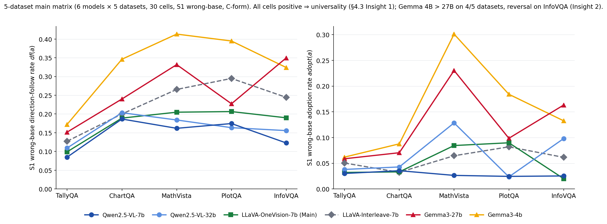
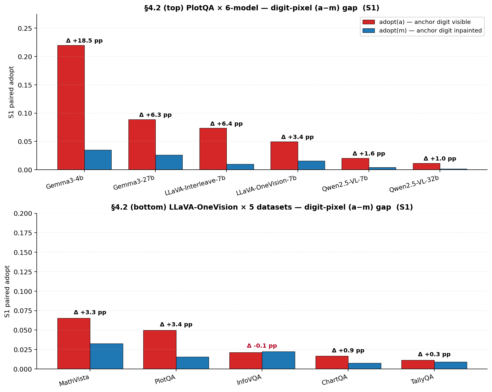
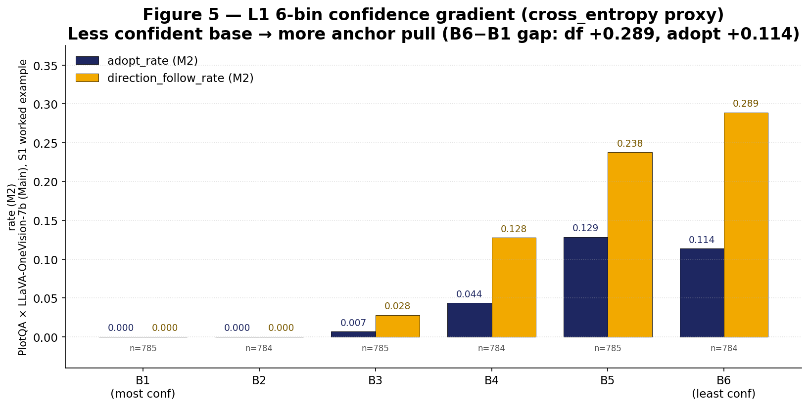
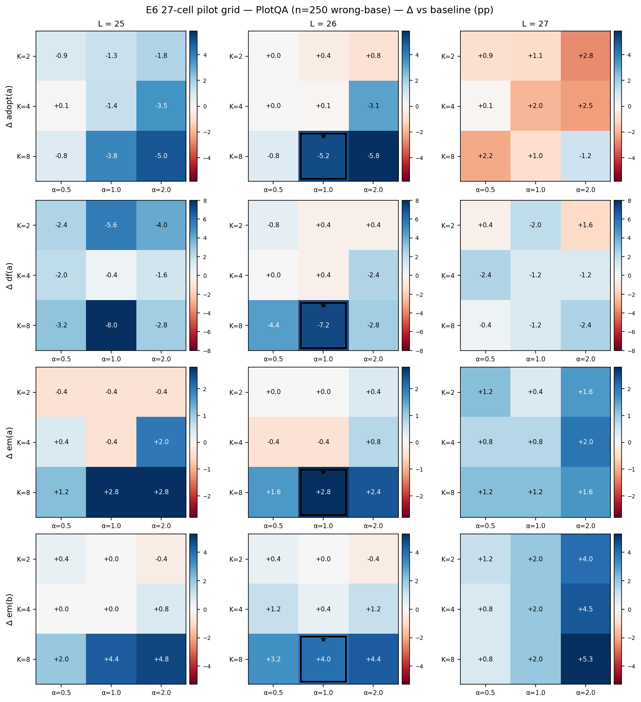
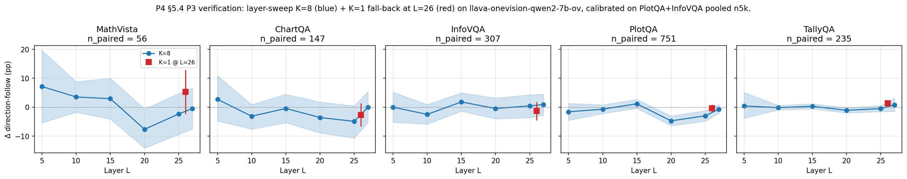
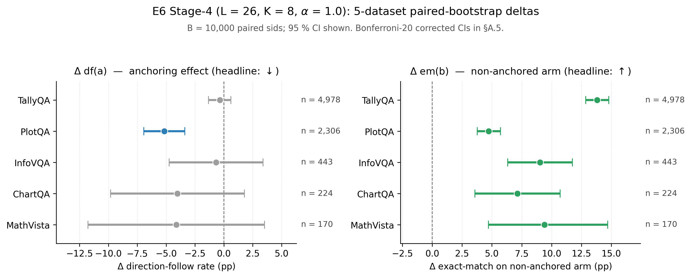
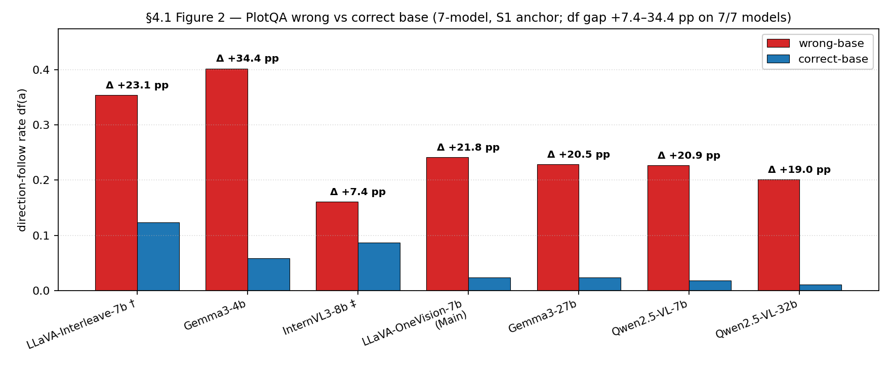
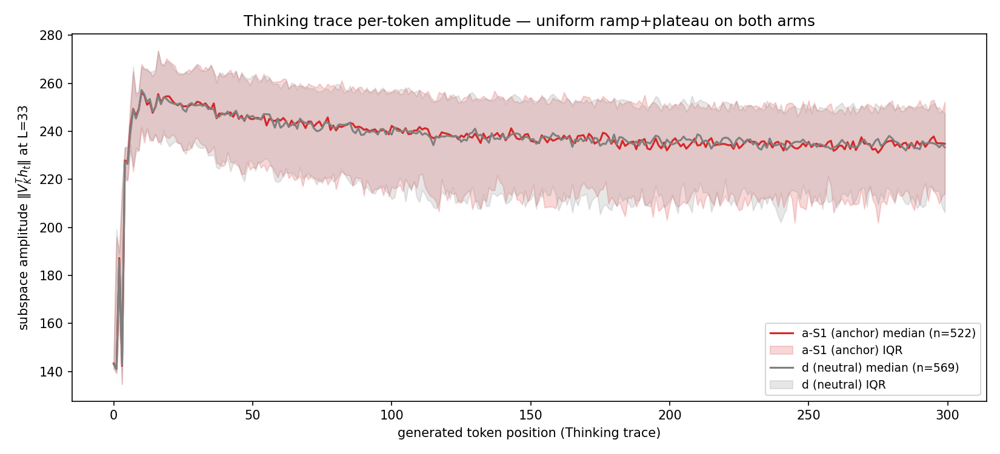

# Pulled by Pixels: Cross-Modal Numerical Anchoring in VLMs

**Authors.** {{Author list, affiliations}}

---

## Abstract

> 목표 분량: ~180 단어. 아래 5개 beat을 한 문단으로 압축.

- **Problem.** VLM에게 질문과 무관한 이미지를 함께 보여줄 때, 그 이미지에 숫자가 그려져 있다면 답이 그 숫자 쪽으로 끌리는가 — *cross-modal numerical anchoring*.
- **Finding 1 (현상).** 6개 open-weight VLM × 5 dataset에서 약 10–40 % 의 응답이 anchor 숫자 쪽으로 *점진적으로* 끌리고, 그 중 일부 (1.7–15.7 %) 는 anchor 를 그대로 베끼기까지 한다. 끌리는 정도는 base 답에 대한 모델 confidence 가 낮을수록 더 크다.
- **Finding 2 (causal gate).** 같은 anchor 이미지에서 숫자 픽셀만 가린 *masked* 짝을 만들어 비교하면 위 끌림이 일반 distractor 수준으로 사라진다 — 즉 anchoring 은 *(보이는 digit) × (모델 uncertainty)* 두 조건의 conjunction.
- **Method.** 본 논문은 anchored 와 masked 짝의 *paired contrast* 를 신호로 삼아 모델 내부의 anchoring representation 을 추정하고, inference 시 이를 제거하는 mitigation 을 제안한다.
- **Result.** 5 dataset 위에서 anchoring 효과 감소 + anchor 가 있는 경우와 없는 경우 모두 정확도 동시 상승, 6 held-out capability benchmark 평균 보존 (+0.41 pp).
- **Implication.** Mechanism 분석은 anchoring signal 이 단일 layer 가 아니라 모델 후반부 여러 layer 에 분산되어 존재함을 보여, vision-modality bias 가 LM 후반부에 *분리 및 제거 가능한 representation 단위* 로 존재해 retraining 이나 prompt-level 방어 없이 inference 시 직접 개입할 수 있음을 시사한다.

---

## 1 Introduction

### 1.1 동기 (Motivation)

- **Hook (model-behavior question).** Multi-image prompt 가 RAG / multi-screenshot Q&A / VLM-as-judge 등에서 일반화되는 가운데 — VLM 은 질문과 무관한 시각 입력을 *무시* 하는가, 아니면 그 정보가 답을 *흔드는가*?
- **Phenomenon 명명.** *Cross-modal numerical anchoring* — 무관한 이미지의 digit pixel이 모델 답을 끌어당긴다.
- **Cognitive grounding.** Anchoring 은 인간 [Tversky and Kahneman, 1974] 과 텍스트 LLM [Jones and Steinhardt, 2022; Echterhoff et al., 2024] 에서 잘 정립된 인지 편향. 그러나 *시각 modality* 위에서 — 즉 visual cue 가 모델의 답을 어떻게 끌어당기는지에 대해서는 체계적 평가가 부재. 위 deployment 시나리오 (RAG retrieval, multi-image Q&A, VLM-as-judge) 에서 무관한 시각 입력 노출이 자연스럽게 발생할 수 있어, 이 빈 칸은 cognitive 호기심을 넘어선 deployment relevance 를 가진다.

### 1.2 본 논문의 발견 (Findings)

> Abstract 의 Finding 1 / Finding 2 를 본문 톤으로 한 단계 풀어서 서술. 4-condition 자극 (b: target only / a: + anchor / m: + masked anchor / d: + neutral distractor) 으로 6 open-weight VLM × 5 dataset 측정.
- **F1 (graded pull).** 약 10–40 % 의 응답이 anchor 쪽으로 점진적으로 끌리고, 그 중 일부 (1.7–15.7 %) 는 anchor 를 그대로 베낀다 — 효과의 질량은 *literal copy* 가 아닌 *점진적 이동* 에 있다.
- **F2 (uncertainty modulation).** 끌리는 정도는 base 답에 대한 모델 confidence 가 낮을수록 크다 (5 dataset × 6 model L1 6-bin 위 단조 monotonic gradient).
- **F3 (digit-pixel causal gate).** Anchor 이미지에서 digit pixel 만 가린 *masked* 짝과 비교하면 끌림이 일반 distractor 수준으로 사라진다 — *digit pixel × uncertainty* 두 조건의 conjunction.
- **F4 (mechanism).** Anchoring 의 internal representation 은 LM 후반부 layer 에 형성된다 — 이 위치는 본 논문 mitigation 의 작용 site 가 된다.

### 1.3 접근과 결과 (Approach & Result)

- *(a − m) paired contrast* 를 calibration 신호로 활용 → 모델 내부의 anchoring representation 을 추정 → inference 시 projection 으로 제거.
- Calibration 은 별도 phase 에서 한 차례만 수행되고, 거기서 얻은 projection 은 이후 모든 inference 에 일괄 적용된다. 배포 단계부터는 입력 이미지에 anchor 가 포함되어 있는지 여부와 무관하게 동일한 projection 이 작동하므로, runtime 에 anchor 를 탐지하거나 라벨링할 필요가 없다 — 그대로 deployable 하다.
- 이 mitigation 을 적용하면 5 dataset 위에서 anchoring 효과가 감소하며, 동시에 anchoring 과 *무관한* 6 개 general capability benchmark (held-out) 의 성능도 손상되지 않는다 (평균 변화 +0.41 pp) — 즉 mitigation 이 모델의 일반 능력을 해치지 않는다.

### 1.4 기여 (Contributions)

- **C1 (Phenomenon).** Cross-modal numerical anchoring 을 5 dataset × 6 open-weight VLM 위에서 정량 보고 — 약 10–40 % 의 응답이 무관한 이미지의 digit 으로 끌리며 (일부는 그대로 베끼고), 끌림은 모델 confidence 에 비례해 graded 되며, anchor 이미지에서 digit pixel 만 가리면 효과가 사라짐. 행동 + causal gate 동시 검증.
- **C2 (Mitigation).** *(a − m) paired contrast* 를 calibration 신호로 활용해 LM 후반부의 anchoring representation 을 한 차례 추정하고, inference 시 모든 입력에 projection 으로 일괄 적용. anchor label 이나 runtime 탐지 불필요. 5 dataset 에서 anchoring 효과 감소 + 6 일반 capability benchmark 평균 +0.41 pp 보존.
- **C3 (Mechanism evidence).** Mechanism 분석으로 (i) anchoring representation 이 LM 후반부 layer 에 위치하고, (ii) 그 layer 안에서도 single direction 으로 reduce 되지 않음을 보여 — §6 mitigation 의 *작용 site* 와 *multi-direction subspace* 설계 모두에 근거를 제공.

---

## 2 Related Work

> 4 subsection, 각 끝 1–2 문장에 본 논문 differentiator woven-in. 별도 positioning subsection 없음.

### 2.1 Anchoring in cognition and text LLMs

{{Tversky-Kahneman 1974, Mussweiler-Strack 1999 (cognitive); Jones-Steinhardt 2022, Echterhoff 2024, Lou-Sun 2024 (LLM anchoring + prompt-level mitigation 실패), Wang 2025a (LRM judging bias 가 reasoning trace 통해 amplified — §4.5 Qwen3-VL Thinking ×12.7 호응), Huang 2025 (synthetic LLM mechanism — text-side mechanism 비교). 끝 1문장: 시각 modality 위 anchoring 미평가.}}

### 2.2 Cognitive bias and behavioral analysis of VLMs

{{VLMBias [Vo, Nguyen 2025] — familiar-subject counting; AIpsych [Liu 2025], CIVET [Rizzoli 2025], Tinted Frames [Fan 2026] — sycophancy / position / framing. 끝 1문장: 본 논문은 cue 가 question subject 와 분리된 *independent rendered-digit* 이미지 + open-ended numeric estimation 으로 두 축 모두에서 상보적.}}

### 2.3 Visual cue manipulation in VLMs

{{Goh 2021 multimodal neurons (mechanism foundation); Wang 2025b NAACL multi-image typographic attack; Gong 2025 FigStep visual jailbreak; Hufe 2025 Dyslexify (encoder-side defense for typographic). 끝 1문장: 본 논문은 클래스 라벨 / prompt 의 이미지화가 아닌 *수치값 단독* cue, 분류 뒤집기 / ASR 이 아닌 *open-numeric baseline-relative shift*; mitigation site 도 encoder 가 아닌 LM residual.}}

### 2.4 Representation-level intervention: activation steering and concept erasure

{{CAA [Panickssery 2024] — paired contrastive activation, single direction; ITI [Li 2023] — attention-head multi-direction (LM-only); LEACE [Belrose 2023] — closed-form linear erasure (rank-1 default); Weng 2024 EMNLP — VLM gender bias의 causal mediation → encoder-side mitigation (mechanism→mitigation chain venue-tier 선례); Chand 2025 "No Free Lunch in LM bias mitigation" — LM × discrete social bias × weight space 위 4-clause 동시 충족 *실패* 보고 (본 mitigation 은 *VLM × continuous numeric × inference activation* cross-axis positive). 끝 1문장: 본 mitigation 은 (i) CAA paired-contrast 패러다임을 *vision-modality (a − m) 인과 통로 분리* 로 확장, (ii) ITI attention-head 가 아닌 *residual stream*, (iii) single-direction (LEACE rank-1 / ActAdd) 의 cross-dataset 실패 위에서 *multi-direction subspace* 채택.}}

---

## 3 Cross-Modal Anchoring: Stimulus and Measurement

> Paradigm 도입. (a − m) paired contrast 는 §3.2 에 별도 격상 — §4 phenomenon, §5 mechanism, §6 mitigation 세 cluster 모두 이 substrate 를 재사용.

### 3.1 4-condition stimulus (b / a / m / d)

{{본 subsection 은 4-condition 자극 (b: target only / a: + anchor / m: + masked anchor / d: + neutral distractor) 의 정의와 각 condition 이 무엇을 isolate 하는지의 설계 의도를 한 단락으로 정리한다. 자극 예시 이미지, prompt template, masked 이미지 생성 방식은 Appendix A.}}

**Preview Figure §3.1 — 4-condition 예시 (TallyQA "How many zebras...", gt=3, anchor=4):**

| b (target only) | a (target + anchor) | m (target + masked) | d (target + neutral) |
|---|---|---|---|
|  |  |  |  |

> Preview 는 자극의 "두 번째 이미지" 만 보여줌 (target image 와 함께 model 에 입력됨). Full 4-condition input grid 는 Appendix A.2.

### 3.2 (a − m) paired contrast — digit-pixel 인과 isolate

{{본 subsection 은 (a − m) paired contrast 의 design 논리를 설명한다. Anchor image 자체는 동일하고 digit pixel 만 다르기 때문에 (a − m) 차이는 digit pixel 의 인과 효과만 isolate 하고, 일반 distraction 효과는 별도 d arm 에서 통제된다. 이 substrate 는 §4 의 digit-pixel causal gate finding 과 §6 의 calibration 신호 양쪽에서 재사용 — paper organizational backbone.}}

> §3.1 의 4-condition preview 에서 anchor 와 masked 가 *디지트 픽셀 이외 모든 변수가 동일* 함을 시각적으로 확인 가능. 별도 figure 불필요.

### 3.3 Anchoring 측정 (metrics)

{{본 subsection 은 anchoring 측정에 쓰는 metric 3 종을 정의한다. Primary 는 *direction-follow* (sign-based, gt-free), secondary 는 *adopt* (literal copy 비율) 과 *exact-match* (정확도). 각 metric 이 본문에서 carry 하는 claim — direction-follow = §4 graded pull headline, adopt = literal capture, exact-match = §6.4 capability — 도 짧게 mapping.}}

**Metric definitions (notation per memory `[[paper-notation-convention]]`).** For each sample `i`, `gt_i` = ground truth, `z_i` = anchor digit value, `p_i^c` = parsed prediction under condition `c ∈ {b, a, m, d}`.

| Metric | Definition | Role |
|---|---|---|
| **Adopt_c** | `#(p^c == z AND pb != z) / #(pb != z) = P[p^c == z \| pb != z]` | Literal copy rate. §4.1 graded-vs-categorical headline. |
| **DF_c** | `P[(p^c − pb)(z − pb) > eps \| \|z − pb\| > eps]` | Primary anchoring metric (sign-based, gt-free). §4 headline + §6 mitigation target. |
| **Exact-match_c** | `#(p^c == gt) / #(numeric pair)` | Capability axis. b-arm = baseline accuracy, a-arm = anchored accuracy, 양 axis 변화로 §6.4 capability preservation 측정. |

**Subsets:** `base-correct = { i | pb_i == gt_i }`, `base-wrong = { i | pb_i != gt_i }`. §4.3 binary projection + §6 mitigation calibration 에서 사용.

> **TODO (DF formula):** Direction-follow 수식이 epsilon-threshold form `P[(pa−pb)(z−pb) > eps | |z−pb| > eps]` 로 finalize 되면, canonical CSV 전체 re-aggregation 후 §4 / §5 / §6 수치 일괄 update. 현재 본문 수치는 old C-form 기준.

### 3.4 Models and datasets (brief)

{{본 subsection 은 main panel 의 6 open-weight VLM 과 5 dataset 을 한 단락으로 소개한다. Model: LLaVA-OneVision-7B (Main), LLaVA-Interleave-7B, Qwen2.5-VL-7B / 32B, Gemma3-4B / 27B. Dataset: TallyQA (counting), ChartQA / PlotQA / InfoVQA (chart-style numeric QA), MathVista (visual math). Filter / sampling / GT range / anchor inventory 디테일은 Appendix B / C.}}

---

## 4 Phenomenon

> 무엇이 일어나는가 → 무엇이 gating 하는가 → 무엇이 modulating 하는가. Effect → causal gate → trigger condition 의 narrative arc.

### 4.1 Anchoring effect: graded pull and literal copy

{{본 subsection 은 6 model × 5 dataset main panel 위에서 anchoring 효과의 *전반적 크기* 와 *cross-panel robustness* 를 제시한다. Direction-follow 약 10–40 %, adopt 1.7–15.7 % 의 range 가 모든 모델 × 모든 dataset cell 에서 nontrivially 양수 임을 main panel table 한 장으로 입증 — 효과의 질량이 literal copy 가 아닌 graded pull 에 있고, 특정 architecture / domain artifact 가 아님.}}

**Preview Figure 1 — Cross-dataset summary (S1 wrong-base).**


> Per-cell df / adopt 수치 (6 model × 5 dataset grid) 는 **Appendix D.1 / D.2** 참조. DF formula update 시 re-aggregation 후 final 수치 확정 — `1.7–15.7 %` adopt range 도 그때 재검증.

### 4.2 Digit-pixel causal gate (via (a − m))

{{본 subsection 은 a / m / d 3-arm 의 anchoring metric 을 한 figure 에 나란히 제시한다. *anchor 추가의 총효과 (a − b)* / *digit-pixel 인과 효과 (a − m)* / *일반 distraction 통제 (d − b)* 의 분리를 시각적으로 보이고, m 과 d 가 거의 같은 수준이고 a 만 떨어진다는 visual 이 핵심 결론 — anchoring 의 인과 통로가 *오직 digit pixel* 임을 empirical 으로 닫는다.}}

**Preview Figure 2 — (a − m) adopt gap (2 panels: 6 model × PlotQA, 5 dataset × OneVision).**


> **TODO (Figure 2 final):** 현재 preview 는 *adopt only* + *a vs m* 2-arm 비교. Final 은 3-arm (a/m/d) × direction-follow + adopt 묶음으로 *m ≈ d, a 만 떨어짐* visual 이 명확하도록 재빌드 필요.

### 4.3 Confidence modulation

{{본 subsection 은 confidence axis 가 anchoring 의 *진짜 modulator* 임을 두 형태로 보인다 — primary 는 L1 6-bin monotonic gradient (continuous, B6 − B1 gap +19.5–23.5 pp on 5 dataset × 6 model = 80 cells), secondary 는 wrong-base vs correct-base binary projection (기존 anchoring literature 호환). 두 형태가 같은 direction 으로 작동. Binary projection 도입은 §6 mitigation 의 wrong-base calibration filter 와 paper-wide 일관성 확보.}}

**Preview Figure 3 — Continuous L1 6-bin gradient (PlotQA × OneVision Main, single cell).**


> Binary projection (wrong-base vs correct-base df) 의 별도 figure 는 **Appendix D.3** 참조 — 본문은 한 줄 mention 으로 처리 ("기존 anchoring literature 의 wrong vs correct binary 와도 같은 direction 으로 작동").

> **TODO (Figure 3 final):** 현재 preview 는 single cell (PlotQA × OneVision). Final 은 5 dataset × 6 model 위 6-bin gradient heatmap or summary bar 로 cross-panel 일관성 시각화.

---

## 5 Mechanism: Locating Anchoring Representation

> *위치* (어느 layer) 와 *차원* (한 layer 안에서 몇 개 방향) 두 측면에서 anchoring representation 의 mechanism 을 측정 — §6 mitigation 의 site 선택과 subspace 설계 두 design choice 의 evidence 를 제공.

### 5.1 Layer-wise probes: late-LM peak

{{본 subsection 은 layer-wise linear probe 로 anchoring representation 이 어느 layer 에 가장 강하게 형성되는지를 측정한다. 결과는 LM 후반부 (peak layer) 에서 가장 강하게 검출되어, §6 mitigation 의 *작용 site* (late LM layer) 의 mechanism evidence 를 제공. 5/5 모델 모두 후반부 peak 가 일관되게 형성되어 cross-model robustness 도 동시에 확인.}}

> **TODO (Appendix table):** Layer × model probe-strength heatmap (5-model panel). 본문에는 cross-model 일관성 한 줄만, full panel data 는 appendix.

### 5.2 K-subspace sweep: multi-direction within a layer

{{본 subsection 은 within-layer single direction 만 제거하는 method 들 이 cross-dataset 에서 anchoring 을 충분히 줄이지 못함을 보인다. 한 layer 안에서도 anchoring representation 이 multi-direction 으로 분산되어 있다는 mechanism evidence — §6 의 *multi-direction subspace* (K>1) 설계의 직접 정당화. 본문 headline 은 K=1 / 2 / 4 / 8 SVD sweep 의 monotonic improvement (positive evidence); LEACE rank-1 / ActAdd 등 alternative single-direction method 들의 convergent failure 는 appendix 에서 보강.}}

**Preview Figure §5.2a — K=2/4/8 progression heatmap (PlotQA × OneVision Main, L ∈ {25, 26, 27}, α ∈ {0.5, 1, 2}, E6 calibration pilot).**


> 4 metric × 3 layer × 3 α × 3 K. L=26, α=1.0 에서 K=2 → K=4 → K=8 progression: adopt(a) Δ -0.4 → -1.4 → -3.8 pp (PlotQA, n=250). K-monotonic improvement 가 multi-direction representation 의 직접 evidence. ★ 표시 cell (L=26, α=1.0, K=8) 이 §6 selected. 전체 5-dataset K sweep 은 §6.2.4 P4 figure (`p4_layer_sweep_delta_df.png`) 와 cross-check.

**Preview Figure §5.2b — K=8 vs K=1 fallback at L=26 across 5 datasets (P4 verification).**


> Blue = K=8 layer sweep (5 layers × 5 datasets), Red = K=1 at L=26. K=1 (red square) 가 K=8 (blue point at L=26) 보다 anchoring 감소 효과 약함 — single-direction 으로는 부족하다는 5-dataset cross-check.

> **TODO (Body figure final):** 위 preview 둘 중 하나로 통합 (또는 5-dataset 평균 K=1/2/4/8 bar chart 신규 빌드).
> **TODO (Appendix):** LEACE rank-1 + ActAdd + K=1 SVD per-dataset 결과 표 (convergent negative evidence).

### 5.3 Multi-layer routing-and-integration (post-hoc characterization)

{{본 subsection 은 single-layer ablation null + late-layer probe peak 의 두 관찰을 *routing-and-integration* framework 로 합성한다 — multi-layer attention pathway 가 anchoring 신호를 *routing* (처리) 하고, late-layer residual 에서 통합 표현으로 *integration* (집계). Anchoring representation 의 전체 구조에 대한 post-hoc characterization 으로, design 의 driver 라기보다 §5.1 / §5.2 finding 을 묶는 통합 narrative.}}

> Cross-architecture partial verification (Qwen3-VL γ-β residual-stream bridge) 은 **Appendix E**.

---

## 6 Mitigation: Calibrated Subspace Projection

> §5 mechanism finding (late-LM site + within-layer multi-direction) 위에 *calibrated subspace projection* mitigation 을 구축. 한 차례 calibration 후 inference 시 anchor label 없이 deployable.

### 6.1 Method (algorithm + (a − m) calibration recipe)

{{본 subsection 은 calibrated subspace projection 의 algorithm 을 정의한다. (a − m) paired stimuli — *calibration pool: PlotQA + InfoVQA pooled (n ≈ 5,000 base-wrong)* — 의 residual stream 차이로부터 K=8 SVD top-direction subspace 를 추출 (calibration), inference 시 LM 후반부 (L=26, OneVision Main) residual 에 projection 으로 제거 (application). Design choice 의 근거 (site = L=26, K=8) 는 §5.1 layer probe + §5.2 K sweep 의 mechanism evidence 위에 구축. Algorithm box 포함.}}

> **TODO (Algorithm box):** Calibration + inference pseudocode (LaTeX algorithm 환경). 한 column 안에 들어가는 5-10 줄.

### 6.2 Cross-dataset anchoring reduction

{{본 subsection 은 5 dataset 위 anchoring 효과 감소를 제시한다. 5 dataset 의 구성:
- **Calibration distribution 내** (within): PlotQA, InfoVQA — §6.1 calibration pool 과 동일 distribution. *In-distribution efficacy* 측정.
- **Calibration distribution 외** (held-out): TallyQA, ChartQA, MathVista — *true cross-dataset generalization* 측정.

Primary metric Δdf(a) (negative = anchoring 감소), secondary Δadopt(a) + Δem(a). Paired bootstrap CI + Bonferroni-20 multiplicity correction. Headline: OneVision Main, L=26, K=8 위 *5/5 dataset Δem(b) sign-clean (Bonferroni ✓)* — non-anchored arm 정확도가 5 dataset 모두에서 sign-positive 한 multiplicity-robust 결과.}}

**Preview Figure 6.2 — Stage-4 paired-bootstrap deltas (E6 cell: L=26, K=8, α=1.0).** Two panels: Δdf(a) anchoring effect (↓) + Δem(b) non-anchored arm capability gain (↑).


**Preview Table 6.2 — Per-dataset paired-bootstrap Δ (95 % CI).** Source: `docs/insights/_data/stage4_final_per_dataset_ci.md` (B = 10,000 paired sids, OneVision Main, L=26 K=8 α=1.0, calibrated on PlotQA+InfoVQA pooled n5k).

| Dataset | n | Δ adopt(a) | Δ df(a) | Δ em(a) | Δ em(b) | scope |
|---|---:|---:|---:|---:|---:|---|
| TallyQA | 4978 | −0.6 [−1.1, +0.0] | −0.3 [−1.3, +0.6] | +6.6 [+5.6, +7.5] | **+13.8** [+12.9, +14.8] | held-out |
| PlotQA | 2306 | **−5.6** [−6.8, −4.4] | **−5.2** [−6.9, −3.4] | +2.4 [+1.5, +3.4] | **+4.7** [+3.8, +5.7] | within |
| InfoVQA | 443 | +0.9 [−0.5, +2.5] | −0.7 [−4.7, +3.4] | +3.4 [+0.5, +6.3] | **+9.0** [+6.3, +11.7] | within |
| ChartQA | 224 | **−3.3** [−6.0, −1.0] | −4.0 [−9.8, +1.8] | +4.0 [+0.0, +8.0] | **+7.1** [+3.6, +10.7] | held-out |
| MathVista | 170 | −1.5 [−6.9, +3.7] | −4.1 [−11.8, +3.5] | +2.9 [−2.4, +8.2] | **+9.4** [+4.7, +14.7] | held-out |
| **mean** | | **−2.0** | **−2.9** | **+3.9** | **+8.8** | |

**Sign-clean count (CI excludes 0)**: Δ adopt(a) 2/5, Δ df(a) 1/5 (PlotQA only, sample-size-bound), Δ em(a) 3/5, **Δ em(b) 5/5** (Bonferroni-20 ✓ 5/5).

### 6.3 Capability preservation

{{본 subsection 은 mitigation 의 capability preservation 을 6 held-out general capability benchmark 위에서 검증한다 — STRICT_FREE_LUNCH protocol, n_total = 10,507. **매크로 평균 Δ = +0.41 pp** (positive). HallusionBench +2.21 pp [+1.14, +3.28] 가 CI excludes zero — *hallucination axis* 에서 statistically significant positive. 나머지 benchmark 는 ±1 pp band 안 — capability 손상 없음.}}

**Preview Table 6.3 — Per-benchmark capability deltas (95 % CI).** Source: `docs/insights/_data/capability_eval_per_benchmark.md`. OneVision Main, L=26 K=8 α=1.0 mitigation applied at inference.

| Benchmark | n | baseline | +mit | Δ (pp) | 95 % CI |
|---|---:|---:|---:|---:|---|
| HallusionBench | 951 | 47.84 | 50.05 | **+2.21** | [+1.14, +3.28] ✓ |
| RealWorldQA | 765 | 69.80 | 71.11 | +1.31 | [−0.27, +2.89] |
| MMStar | 1500 | 61.67 | 61.80 | +0.13 | [−0.77, +1.04] |
| POPE | 5127 | 92.16 | 92.10 | −0.06 | [−0.21, +0.09] |
| MMBench-DEV-EN | 1164 | 82.04 | 81.70 | −0.34 | [−0.82, +0.13] |
| OCRBench | 1000 | 63.40 | 62.60 | −0.80 | [−1.68, +0.08] |
| **Macro** | 10,507 | | | **+0.41** | (STRICT_FREE_LUNCH) |

> **TODO (8-bench extension):** Memory note 의 *E8 8-bench* (n=27,097, +0.31 pp, AMBER + MME 추가) 는 *canonical CSV 에 미반영* — config (`configs/capability_eval_mme_amber.yaml`) 만 있고 결과 CSV 없음. AMBER + MME 실행 + 통합 후 canonical 6-bench → 8-bench update 필요. 현재 본문 수치 (+0.41 pp) 는 6-bench canonical 결과로 Abstract / §1.3 와 일치.

---

## 7 Discussion

### 7.1 Implications (including ecological validity)

{{본 subsection 은 paper 의 행동 + mechanism + mitigation finding 을 *한 narrative* 로 종합하고, *ecological validity* 의 보충 검증 (closed-API VLM-as-judge pilot) 으로 마무리한다. Pilot 결과 (5 judge × 2 dataset × n=200): gpt-4o / gemini-2.5-flash 에서 anchoring 관찰, gpt-5.1 / gemini-2.5-pro / claude 는 robust. Open-weight 인공물 아니며 frontier judge 도 부분적으로 surface — mitigation 의 deployment relevance 보강. 단 *모든* 시스템 영향 받는다고 overclaim 하지 않음.}}

### 7.2 Future work

{{본 subsection 은 §6.2 의 *예상치 못한 finding* (mitigation 이 anchor 없는 입력에 대해서도 정확도 상승, Δem(b) 5/5 dataset positive, mean +8.8 pp) 에 대한 가장 likely 한 해석을 제시하고 후속 작업을 정의한다. 해석: (a − m) subspace 가 *anchor-specific 외 broader distraction direction* 까지 capture — anchor 가 distraction 의 한 instance 이고, paired contrast 가 더 일반적인 distraction handling 을 incidentally 학습. §6.3 의 hallucination-axis positive transfer (HallusionBench +2.21 pp) 가 이 해석 support (hallucination 도 일종의 *visual distraction 처리 실패*). Mechanism 적 검증 — 본 mitigation 의 generality 와 다른 vision-modality bias 로의 확장 가능성 — 이 핵심 future work.}}

---

## 8 Conclusion

{{한 문단 요약: 무엇을 했고, 무엇을 보였고, 왜 중요한가}}

---

## Limitations

> EMNLP 필수 섹션. 페이지 제한 *밖*. Honest, specific, non-defensive.
> 데이터/모델/일반화/통계/재현성 한계를 항목별로.

- {{Limitation 1}}
- {{Limitation 2}}
- {{Limitation 3}}

---

## Ethics Statement

> EMNLP 필수 (해당 시) / 권장 (그 외). 페이지 제한 밖.

- **Dataset licenses.** 사용한 5 evaluation dataset (TallyQA, ChartQA, PlotQA, InfographicVQA, MathVista) 및 6 held-out capability benchmark (HallusionBench, RealWorldQA, MMStar, POPE, MMBench-DEV-EN, OCRBench) 는 모두 공개 academic dataset. {{각 license 명시 — Apache 2.0 / MIT / CC-BY / 등.}}
- **Closed-API usage.** §7.1 ecological validity 의 closed-API VLM-as-judge pilot (5 judge × 2 dataset × n=200) 은 ~$XX 비용 소요. Closed-API access 가 제한된 사용자는 본 pilot 직접 reproduce 어려움 — open-weight main panel 결과는 누구나 reproduce 가능.
- **Potential misuse.** 본 mitigation 은 anchoring 을 *줄이는* 방향 design. Inverse projection 으로 anchoring 을 *증폭* 할 가능성 존재 (trivial 변경) — 그러나 본 paper 의 bias 측정/완화 contribution 의 net positive 가 이 risk 를 정당화.
- **Compute budget.** OneVision Main 의 mitigation calibration + 5-dataset evaluation + 6-benchmark capability eval 합산 ~ {{XX}} GPU hours (NVIDIA A100). γ-β bridge (Qwen3-VL, Appendix E) 추가 ~ {{XX}} hours.
- **AI assistant disclosure.** 본 paper 의 *실험 코드 작성* 과 *한국어 ↔ 영어 번역* 에 Anthropic Claude 를 보조 도구로 사용. 모든 실험 설계 / 결과 / 분석 / 해석 / writing 의 *지적 책임* 은 저자에게 있음.

---

## Acknowledgments

> Optional. 익명화 단계에서는 비워둘 것.

{{}}

---

## References

> BibTeX는 별도 `.bib` 파일에서 관리. 여기는 placeholder.

{{References}}

---

# Appendix

> 페이지 제한 밖. 본문에서 참조한 보충 자료.

## A Stimulus & prompt details

### A.1 Prompt template

모든 6개 모델, 모든 dataset, 모든 4-condition 에 대해 *동일한* system + user template 사용 (모델별 변동 없음). 이미지 슬롯 개수만 condition 에 따라 1 (b) / 2 (a, m, d) 로 변동.

**System:**
```
You are a visual question answering system.
Return valid JSON only in the form {"result": <number>}.
Use a numeric JSON value for <number>, not a string.
Do not output any other keys, words, explanation, or markdown.
If uncertain, still output the single most likely number in that JSON format.
```

**User template:**
```
Answer the question using the provided image(s).
Return JSON only in the form {"result": <number>}.
Question: {question}
```

Sampling: `temperature=0.0`, `top_p=1.0`, `max_new_tokens=16`.

### A.2 4-condition 자극 예시

Figure A.1 — 동일 question 위 4-condition 자극의 실제 입력 이미지 + 모델 답. 본 예시는 demo site (https://namam3gy.github.io/vlm_anchroing/) 의 첫 번째 샘플 (TallyQA, `2448100_24481_stratified`).

**Question:** *How many zebras are there standing in the water?*
**Ground truth:** 3
**Anchor value:** 4

각 condition 의 input 은 *target image + 두 번째 image (a/m/d 의 경우)* — 모델은 두 이미지를 하나의 prompt 에 동시에 받음.

| Condition | Input image(s) | Llava-OneVision-7B (Main) 답 |
|---|---|---|
| **b** (target only) |  | **3** ✓ |
| **a** (target + anchor) |   | **4** ← anchor 그대로 |
| **m** (target + masked anchor) |   | **3** ✓ (회복) |
| **d** (target + neutral distractor) |   | **3** ✓ |

> 이 한 sample 이 *(a − m) paired contrast* 의 직관을 그대로 보여준다 — anchor 이미지가 들어가면 답이 anchor (4) 로 끌리고, *동일한 anchor 이미지에서 digit 만 가린* m 으로 바꾸면 답이 base (3) 로 회복. Neutral distractor (d) 는 영향 없음. 6-model 전체의 같은 sample 위 답은 demo site 참조.

### A.3 Masked 자극 생성

Anchor 이미지의 digit bounding box 를 OpenCV `INPAINT_TELEA` [Telea, 2004] 로 채워 `m` 이미지 생성. Mask 외 영역은 원본 그대로 보존되어, *paired contrast (a − m)* 가 digit pixel 효과만 isolate.

---

## B Dataset details

| Dataset | Split | Source | Filter | Eligible samples (n) | GT range | GT distribution |
|---|---|---|---|---|---|---|
| ChartQA | test | full split (2,500) | numeric GT, range [0, 1000] | **705** | 0–1000 | small / round 값 skew |
| PlotQA | test | seed=42 stratified subset of 1,228,313 (1,000/bin × 5 GT bins (0,8] (8,20] (20,100] (100,1k] (1k,10k]) | range [0, 10000] | **5,000** | 0–10000 | bins 균등 (sampled by design) |
| InfoVQA | val | fetch-time numeric-only subset of 1,147 | range [0, 10000] | **1,147** | 0–10000 | natural, mild right-skew |
| MathVista | testmini | full split (1,000) | `answer_type=integer`, range [0, 1000] | **385** | 0–1000 | mixed (도형 counting + 산술) |
| TallyQA | test | full split (38,589) | numeric GT, range [0, 8] | **38,245** | 0–8 (counting) | strongly skewed small (1–4 dominant) |

- *Eligible samples (n)* = filter 통과한 sample 수, 모든 모델 공통. 이 pool 위에서 4-condition (b/a/m/d) 자극이 구성된다.
- 모든 dataset 에 공통으로 `require_single_numeric_gt=true` — GT 후보가 모두 동일 numeric value 인 sample 만 채택. `answer_range` cutoff 는 anchor inventory (Appendix C) 와 정합되도록 설정.

---

## C Anchor value 선정 (per dataset)

**Inventory.** 128 개의 pre-rendered single-/multi-digit 이미지 (`inputs/irrelevant_number/{value}.png`). Value 분포는 dense-low / sparse-high:

| 구간 | 간격 | Values | 개수 |
|---|---|---|---|
| 0 – 10 | 1 | 0, 1, 2, …, 10 | 11 |
| 15 – 100 | 5 | 15, 20, 25, …, 95, 100 | 18 |
| 200 – 10,000 | 100 | 200, 300, 400, …, 9900, 10000 | 99 |
| **합계** | | | **128** |

이 분포는 GT 가 작은 dataset (TallyQA, MathVista counting) 에서 close-distance anchor 가 풍부하고, GT 가 큰 dataset (PlotQA, InfoVQA) 에서도 100 단위로 plausible anchor 를 제공하도록 설계.

**Per-question stratification.** 각 question 의 GT 와 inventory 의 모든 candidate 사이 거리 |a − gt| 를 계산. 거리 stratum 별로 매칭되는 candidate 중 RNG 로 하나를 추출 — 한 question 당 stratum 수만큼의 anchor 가 sampling 됨.

**거리 stratum scheme 두 종류:**
- **absolute**: 고정 경계 [0,1], [2,5], [6,30], [31,300], [301,∞]. GT 범위가 좁은 dataset (TallyQA) 용.
- **relative**: 경계 hi 가 `max(absolute_floor, fraction × |gt|)` 로 GT 크기에 따라 스케일. fractions [10 %, 30 %, 100 %, 300 %, ∞]. Wide-GT dataset 용.
- **relative_s1**: relative scheme 의 *첫 stratum 만* 사용 (단일 close-distance: |a − gt| ≤ max(1, 0.10·gt)).

**Main 6-model panel 의 per-dataset 설정:**

| Dataset | Scheme | Stratum 수 | Effective range |
|---|---|---|---|
| TallyQA | absolute | [[0, 5]] (single) | \|a − gt\| ≤ 5 (GT 가 0–8 이므로 거의 모든 plausible anchor) |
| ChartQA | relative_s1 | 1 | \|a − gt\| ≤ max(1, 0.10·gt) |
| MathVista | relative_s1 | 1 | 동일 |
| PlotQA | relative_s1 | 1 | 동일 |
| InfoVQA | relative_s1 | 1 | 동일 |

→ **Main panel 은 close-distance single-stratum 만 사용** — anchor 가 GT 와 plausible 한 이웃 거리에 있는 cohort 위에서 효과를 측정 (anchoring 의 *worst-case* slot). 5-stratum full schedule 은 distance-decay 분석을 위한 OneVision-only extension (§{{section}}) 으로 별도 보고.

---

## D Per-cell main panel results + binary projection

> 본문 §4.1 의 cross-dataset summary figure (Figure 1) 와 §4.3 의 6-bin gradient figure (Figure 3) 를 *수치 / 보조 figure* 로 보강. 본문 page-budget 절약 목적.

### D.1 Direction-follow per cell — df(a) % across 6 models × 5 datasets

| Model | TallyQA | ChartQA | MathVista | PlotQA | InfographicVQA |
|---|---|---|---|---|---|
| OneVision-7B (Main) | 9.9 | 18.9 | 20.5 | 20.6 | 19.0 |
| Interleave-7B | 12.7 | 20.0 | 26.6 | 29.5 | 24.4 |
| Qwen2.5-VL-7B | 8.5 | 18.7 | 16.2 | 17.4 | 12.3 |
| Qwen2.5-VL-32B | 10.9 | 20.3 | 18.4 | 16.3 | 15.6 |
| Gemma3-4B | 17.2 | 34.6 | 41.3 | 39.5 | 32.4 |
| Gemma3-27B | 15.2 | 24.0 | 33.2 | 22.7 | 35.0 |

### D.2 Adopt per cell — adopt(a) % (literal copy rate)

| Model | TallyQA | ChartQA | MathVista | PlotQA | InfographicVQA |
|---|---|---|---|---|---|
| OneVision-7B (Main) | 3.2 | 3.3 | 8.4 | 9.0 | 2.0 |
| Interleave-7B | 5.0 | 3.2 | 6.5 | 8.2 | 6.1 |
| Qwen2.5-VL-7B | 3.0 | 3.5 | 2.6 | 2.4 | 2.5 |
| Qwen2.5-VL-32B | 3.8 | 4.3 | 12.8 | 2.3 | 9.8 |
| Gemma3-4B | 6.2 | 8.8 | 30.1 | 18.4 | 13.3 |
| Gemma3-27B | 5.9 | 7.0 | 23.0 | 9.9 | 16.3 |

> **TODO (D.1 / D.2 final):** 현재 canonical CSV (`main_panel_5dataset_per_cell.csv`, M2 / C-form) 기준. DF formula update 시 re-aggregation 후 final 수치 확정.

### D.3 Binary projection — wrong-base vs correct-base df(a)

**Preview Figure D.3 — PlotQA × 6 models (single-dataset preview).**


> 본문 §4.3 의 continuous L1 6-bin gradient (Figure 3) 의 *binary projection* 보조. Wrong-base 가 correct-base 보다 일관되게 높은 df(a) — 기존 anchoring literature (wrong vs correct) 의 framing 과 호환 + §6 mitigation 의 wrong-base calibration filter 의 사전 정당화.

> **TODO (D.3 final):** 현재 single dataset (PlotQA × 6 model). Final 은 5 dataset 평균 또는 dataset-stratified panel + adopt 도 포함.

---

## E Cross-architecture verification: γ-β residual-stream bridge (Qwen3-VL)

> §5.3 routing-and-integration framework 의 partial cross-architecture verification. Main panel 밖 architecture (Qwen3-VL) 위 *방향성 prediction* 만 검증.

**Setup.** Qwen3-VL 의 Thinking (γ) 와 Non-thinking (β) mode 의 같은 입력에 대한 layer-별 residual stream 차이 (γ − β) 의 SVD subspace 추출. 이 subspace 를 layer-projection 으로 적용 → anchoring 변화 (within-Thinking, anchor-specific) 측정. 데이터: re-calibrated **3-pool (TallyQA + PlotQA + InfoVQA, n_wrong=3,017)** V_K subspace, 7 layers × 6 K (K ∈ {1, 2, 4, 8, 12, 16}) × 2 stat (mean / max) = **84 cells**, paired sids 522, Bonferroni-corrected α = 0.000595 (vs primary 0.05).

### E.1 Sign-reversal across layers (K=1, 2, 4, 8, 16)

**Table E.1 — within-Thinking anchor-specific Δ across 7 layers, 5 K values (mean stat).** Source: `docs/insights/_data/gamma_beta_bridge_lk_sweep.csv`.

| Layer | K=1 | K=2 | K=4 | K=8 | K=16 | direction (cross-K) |
|---|---:|---:|---:|---:|---:|---|
| 14 | −0.041 ✓ | −0.039 ✓ | −0.047 | −0.049 ✓ | −0.052 | mid negative (5/5 consistent) |
| **20** | **−0.152 ✓** | **−0.127 ✓** | **−0.192 ✓** | **−0.111 ✓** | **−0.058** | **mid BACKFIRE (5/5 consistent)** |
| 25 | +0.213 ✓ | +0.117 | +0.160 | +0.188 | +0.183 | late positive (5/5 consistent) |
| 29 | +0.446 ✓ | +0.391 | +0.357 | +0.418 | +0.363 | late positive (5/5 consistent) |
| 30 | +0.477 ✓ | +0.379 | +0.291 | +0.413 | +0.327 | late positive (5/5 consistent) |
| 33 | +0.284 ✓ | +0.088 | −0.106 | +0.057 | +0.253 | late mostly positive (K=4 dip noise) |
| 34 | +0.707 | +0.781 | +0.992 | +0.828 | +1.259 | late positive (CI wide, magnitude ↑ with K) |

✓ = Bonferroni-corrected CI excludes zero (α=0.000595 for 84 cells). 미✓ cells 도 거의 모두 primary 95 % CI excludes zero.

**Headline Bonferroni-survivor** (84 cells 중 14 cells Bonferroni-clean): **L=30, K=2, max stat +0.866 [+0.412, +1.330]** (Bonferroni ✓).

**Framework prediction 과의 일치.** Mid-stack (L=14, 20) negative + late-stack (L=25–34) positive 의 sign reversal 이 K=1, K=8, K=16 *모두* 에서 consistent — framework 의 *late = integration site (positive), mid = routing (backfire when disrupted)* directional prediction 이 cross-K-range 로 robust 하게 verified.

### E.2 Supplementary characterization

**Preview Figure E.2a — Per-token amplitude trajectory during Thinking generation.**


> Thinking trace 동안 subspace amplitude 가 uniform ramp+plateau, a-S1 (anchor) 과 d (neutral) 가 같은 trajectory — anchor-specificity 가 *L=33 paired-Δ* 측정 layer 의 within-Thinking signal 자체에 있음을 확인 (supplementary).

### E.3 Note — K curve 가 §5.2 와 다른 이유

Table E.1 에서 K=1 이 K=8 보다 강한 cell 이 있음 (예: L=30 K=1 +0.477 vs K=8 +0.413). 이는 §5.2 의 "K=8 우세, multi-direction 필요" 와 *상충하지 않음* — 두 sweep 의 *subspace 자체가 다른 구성*:

| | §5.2 K sweep | E.1 K sweep |
|---|---|---|
| Subspace 출처 | (a − m) paired contrast | (γ − β) Thinking bridge |
| Capture | anchoring-specific only | reasoning-mode shift (broader) |
| Spectral structure | anchoring 의 multi-direction → K 늘수록 더 많은 variance 흡수 | Thinking shift 의 dominant principal direction → K=1 만으로 대부분 capture |

→ K curve 차이는 *subspace spectrum* 차이지 anchoring 의 본질적 dimensionality 차이 아님. Appendix E 의 K-range column 은 *directional* prediction 의 K-robustness 검증용이지 K 선택의 정당화 아님 (그건 §5.2 + §6.2 에서 carry).

### E.4 Scope

본 verification 의 목적은 OneVision Main 위에서 합성된 routing-and-integration framework 의 *cross-architecture directional 일관성* 을 별도 architecture (Qwen3-VL) 의 self-calibration bridge 위에서 보강하는 것. *Magnitude transfer* (예: late-stack effect size 가 architecture 사이에서 동일) 는 claim 아님 — direction 만 cross-architecture verified.

> **TODO (Figure E.3):** Table E.1 의 cross-K sign-reversal 을 layer × K 2D heatmap 또는 forest plot 으로 시각화. 84 cells 전체 또는 mean stat 만. `docs/insights/_data/gamma_beta_bridge_lk_sweep.csv` 에서 빌드.

---

## F Reproducibility Checklist

> EMNLP 권장 — 본문 claim 의 evidence 와 코드/데이터 release 정보 정리.

- **Code release.** {{repo link / anonymized link for double-blind submission}}. 모든 experiment driver script (`scripts/run_experiment.py`), analysis notebook (`notebooks/`), mitigation calibration pipeline (`scripts/calibrate_subspace.py`), capability eval harness 포함.
- **Data release.** Per-condition predictions (`outputs/{experiment}/{model}/predictions.{jsonl,csv}`) + summary aggregates (`docs/insights/_data/*.csv`) release. Stimulus inventory (anchor digit images, masked variants, neutral distractors) 는 `inputs/irrelevant_number/`, `inputs/irrelevant_number_masked/`, `inputs/irrelevant_neutral/` 에 cached.
- **Seeds.** 모든 random sampling 의 seed 명시 — stimulus 생성 (FLUX `--seed 42`), anchor stratification (per-question RNG `seed=42`), bootstrap CI (`B=10,000`, `seed=20260510`), JSON parse fallback.
- **Hardware.** NVIDIA A100 80 GB × {{N}} GPUs.
- **Compute budget.** Total ~ {{XX}} GPU-hours (breakdown: main 6-model × 5-dataset inference ~ {{X}} h, mitigation calibration ~ {{X}} h, 6-bench capability eval ~ {{X}} h, γ-β bridge sweep ~ {{X}} h).
- **Statistical protocol.** Paired bootstrap CI (B=10,000, paired sample-instance id resampling), Bonferroni-20 multiplicity correction for 5 dataset × 4 metric family (§6.2), Bonferroni-corrected α=0.000595 for 84 cells (Appendix E).
- **Canonical evidence pointer table** (본문 claim ↔ underlying CSV):

| Claim location | Source CSV / md |
|---|---|
| §4 main panel (df, adopt, em per cell) | `docs/insights/_data/main_panel_5dataset_per_cell.csv` |
| §4.3 L1 6-bin confidence gradient | `docs/insights/_data/L1_proxy_monotonicity_6bin.csv` |
| §5.2 K-subspace sweep (OneVision) | {{TODO — 5-dataset K sweep CSV 신규 generate 필요}} |
| §6.2 stage-4 paired-bootstrap CI | `docs/insights/_data/stage4_final_per_dataset_ci.{csv,md}` |
| §6.3 per-benchmark capability | `docs/insights/_data/capability_eval_per_benchmark.{csv,md}` |
| Appendix D.1/D.2 per-cell tables | 동일 `main_panel_5dataset_per_cell.csv` |
| Appendix E γ-β bridge L×K sweep | `docs/insights/_data/gamma_beta_bridge_lk_sweep.{csv,md}` |
