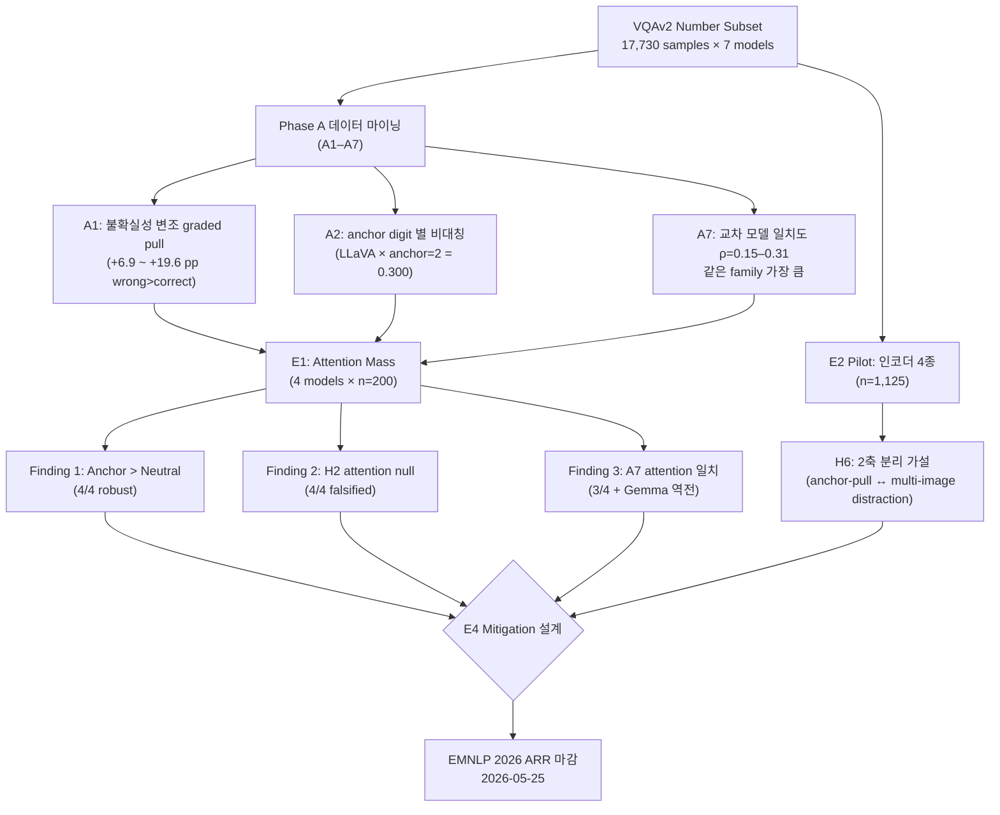

# 연구 리뷰 (2026-04-25)

> **대상 프로젝트:** Cross-modal Anchoring in Vision–Language Models
> **목적:** 지금까지의 가설(Hypothesis) · 실험(Experiment) · 결과(Result) 정합성 점검,
> 향후 진행 방향 권고, NeurIPS / EMNLP 2026 게재 가능성 분석.
> **검토 자료:** `references/project.md`, `references/roadmap.md`,
> `docs/insights/00-summary.md`, `docs/insights/A1-asymmetric-on-wrong.md`,
> `docs/insights/A2-per-anchor-digit.md`, `docs/insights/A7-cross-model-agreement.md`,
> `docs/experiments/E1-attention-mass.md`, `docs/experiments/E1-preliminary-results.md`,
> `docs/experiments/E2-encoder-ablation.md`, `docs/experiments/E2-pilot-results.md`.

---

## 0. TL;DR — 한 줄 결론

- **현 상태에서 EMNLP 2026 Findings 트랙 기준선은 충분히 넘었다.** 다만 Main 트랙 또는
  NeurIPS 2026 본 회의 합격선까지 가려면 **(1) 완화(Mitigation, E4) 결과**, **(2) 단일
  데이터셋(VQAv2)을 넘는 검증**, **(3) 서사(Narrative) 정리** 세 가지가 4–5주 안에
  들어와야 한다.
- **가설–결과 정합성에는 한 군데 실질적 충돌**이 있다 — H2의 행동(behavior) 축은
  유지되지만 주의(Attention) 축에서는 4/4 모델에서 기각되었다. 이 **불일치 자체가
  논문의 핵심 발견**이 될 수 있으므로, 헤드라인을 **"3-claim 구조"**(아래 §3)로
  재구성할 것을 권장한다.
- **NeurIPS 2026 본 회의(2026-05-04 ~ 06)는 사실상 불가능**, **EMNLP 2026 ARR
  (2026-05-25)은 가능하나 한 달 안에 E4 + 멀티 데이터셋이 필수**.

---

## 1. 한눈에 보는 연구 구조 (Mermaid)



- **위 다이어그램의 핵심 흐름:** 7 모델 × 17,730 샘플의 정량 데이터를 Phase A에서
  데이터 마이닝 형태로 7가지 분석으로 쪼갠 뒤, 그 중 살아남은 3개(A1·A2·A7)가
  Phase B의 attention 측정(E1)과 인코더 비교(E2)로 이어진다. 최종 합류점은 **E4
  완화(mitigation) 프로토타입**이며, 이 노드가 EMNLP Main 합격 여부를 가른다.

---

## 2. 가설–결과 정합성 점검표

`references/roadmap.md` §2의 모든 가설(Hypothesis, H1–H6)을 현재 시점에 맞게
재정렬하면 다음과 같다. **양호(✅)**, **수정 필요(⚠️)**, **기각(❌)** 표기는 본
리뷰 작성 시점(2026-04-25) 기준이다.

| ID | 가설 요약 | 행동 신호 (Behavior) | 메커니즘 신호 (Attention) | 종합 |
|----|----------|----------------------|---------------------------|------|
| **H1** | Anchor가 neutral 대비 예측을 끌어당긴다 | direction-follow 0.247–0.348 (7/7) | anchor &gt; neutral attention (4/4) | ✅ |
| **H2** | 원래 틀렸던 항목에서 anchoring이 더 강하다 (불확실성 변조) | moved-closer gap +6.9 ~ +19.6 pp (7/7) | **wrong = correct** attention (4/4 기각) | ⚠️ **분리** |
| **H3** | 인코더 family가 anchoring 강도를 결정 (ConvNeXt &lt; ViT) | ConvLLaVA adoption 0.156 ∈ ViT cluster CI | — | ❌ (단순형) |
| **H6** | 실패가 두 축으로 분해 (anchor-pull vs distraction) | InternVL3 = 순수 distraction, LLaVA-1.5 = 순수 anchoring | InternVL3 answer-step share&gt;0 = 0.95 (강한 일치) | ✅ (pilot 한정) |
| **H4** | "Thinking" / 추론 모드가 anchoring을 줄인다 | 미실험 | 미실험 | ☐ |
| **H5** | "no hedging" 프롬프트가 anchor pull을 증폭한다 | gemma3-27b만 +17.4 pp | — | ⚠️ 한정적 |

> ### 핵심 정합성 충돌
>
> **H2는 행동에서는 유지되지만 attention에서는 깨진다.** Phase A는
> "원래 틀린 항목에서 anchor 쪽으로의 이동률이 +6.9 ~ +19.6 pp 높다"는 결과를
> 7/7 모델에서 일관되게 보여주었고, 이는 Mussweiler–Strack의 *selective
> accessibility* 모형과 정확히 부합한다. 그러나 E1에서 같은 stratification
> (`base_correct` 기반)을 attention mass에 적용했을 때, **wrong 평균과 correct
> 평균이 4/4 모델에서 95 % CI가 겹친다**. 즉 모델은 우연히 더 "보긴" 보지만,
> 그 봄(view) 자체는 불확실성에 의해 변조되지 않는다.
>
> 이 **불일치 그 자체**가 논문의 헤드라인 재료다. 단순히 attention과 행동이
> 같은 방향이라는 흔한 mechanistic 보고와 달리, **"보는 양"과 "끌리는 양"이
> 다르게 변조된다**는 발견은 cognitive-science 친화적인 동시에 mechanistic
> interpretability 커뮤니티에도 새 자극을 줄 수 있다.

---

## 3. 권장 서사(Narrative) — 3-Claim 구조

`docs/experiments/E1-preliminary-results.md` §맺음말이 이미 제안한 구조를
적극 채택할 것을 권한다. 기존의 다섯 인지 편향(cognitive bias) 카탈로그식
서사보다 훨씬 날카롭다.

| Claim | 한 줄 요약 | 근거 실험 | 강도 |
|-------|------------|-----------|------|
| **C1. Anchor notice (attention) is robust.** | 모든 인코더 family에서 VLM은 숫자 이미지를 같은 위치의 중립 이미지보다 더 본다. | E1 Test 1, 4/4 replicate | 강 |
| **C2. Anchor pull (behavior) is encoder-modulated.** | Pull 강도와 안 좋은 동반효과(distraction)는 인코더에 따라 다른 점에 분포한다 (H6 2축). | E2 pilot, A7 | 중 (full run 필요) |
| **C3. Uncertainty modulates pull but not attention.** | 불확실한 항목에서 행동은 끌리지만 attention은 변하지 않는다 — anchor의 영향이 "주의 분배"가 아닌 "후보 분포 가중"에서 일어난다는 직접 증거. | A1 + E1 Test 2 | 강 |

이 3-claim 구조는 다음과 같은 장점을 갖는다.

1. **"여러 편향을 한 데 모은 카탈로그"라는 인상을 준다는 EMNLP Main 리뷰
   기각 이력**(`references/project.md` §3.4 인용 참조)에서 벗어난다.
2. **Mechanistic 결과(C1·C3)와 인지과학 이론(Mussweiler–Strack accessibility,
   Jacowitz–Kahneman)** 사이의 가교 역할을 자연스럽게 만든다.
3. **C2가 약하게 결합된 정도가 오히려 future work을 정당화**하므로 single-paper
   범위를 지키기 쉽다. (전부 다 풀려고 하면 도리어 깊이가 줄어든다.)

기존 "Dual Process Theory(System 1/2)" 프레이밍은 H4가 미실험이고, VLMBias /
LRM-judging 등 반례 문헌이 산적해 있어 (`references/project.md` §1) 이번
사이클에서는 **"맥락(framing)으로만 다루고 헤드라인에서는 배제"**할 것을 권한다.

---

## 4. 인접·경쟁 논문 매핑 (2025–2026)

> 이 섹션은 향후 Related Work에서 반드시 차별화해야 할 논문들을 정리한 것이다.
> 빨간색(★★★)은 직접 경쟁(헤드라인 충돌 위험), 노란색(★★)은 강하게 인접,
> 초록색(★)은 동일 분야 토픽이지만 차별화 용이.

| 위험도 | 논문 | 핵심 기여 | 본 연구와의 차별점 |
|:------:|------|-----------|---------------------|
| ★★★ | **VLMs are Biased / VLMBias** [(Nguyen et al., ICLR 2026, 2505.23941)](https://arxiv.org/abs/2505.23941) | 친숙 객체에서 100 % → 반사실(counterfactual) 17 % 카운팅 정확도 → "암기 우선" 확정 편향 | (a) 본 연구의 anchor는 *별도 이미지의 임의 숫자*, VLMBias는 *같은 이미지의 의미적 라벨*. (b) 본 연구는 *원래 정답 vs 오답 stratification*. (c) 본 연구는 attention-level mechanism + mitigation. **Related Work에 한 문단 통째로 차별화 필요.** |
| ★★★ | **Dyslexify: Mechanistic Defense Against Typographic Attacks in CLIP** [(2508.20570)](https://arxiv.org/abs/2508.20570) | CLIP 후반부 attention head를 ablate해 typographic attack 22 pp 완화 | 본 연구의 mechanism story와 **방법론적으로 유사**. 차별점: (a) 본 연구는 *분류 flip*이 아니라 *연속 회귀형 pull*, (b) ablation이 아닌 attention-rescaling 기반 E4 설계로 차별화 가능. **E4 설계 시 비교 baseline으로 명시.** |
| ★★ | **What Do VLMs NOTICE?** [(Golovanevsky et al., NAACL 2025)](https://aclanthology.org/2025.naacl-long.571/) | Semantic Image Pairs (SIP) corruption으로 VLM 내부 attention head 식별 | E1 attention 분석 도구로 활용 가능. 차별점: 본 연구의 SIP는 *number vs neutral image* 자연 SIP라는 점을 강조. |
| ★★ | **Identifying & Mitigating Position Bias of Multi-image VLMs (SoFA)** [(Tian et al., CVPR 2025 Oral)](https://openaccess.thecvf.com/content/CVPR2025/papers/Tian_Identifying_and_Mitigating_Position_Bias_of_Multi-image_Vision-Language_Models_CVPR_2025_paper.pdf) | Inter-image causal attention을 양방향 bidirectional로 보간하는 SoFA가 +2–3 % 성능 | E8 (position effect) 실험 시 baseline. 본 연구가 *position bias*가 아닌 *content bias*임을 명확히. |
| ★★ | **More Images, More Problems? A Controlled Analysis of VLM Failure Modes** [(2601.07812)](https://arxiv.org/html/2601.07812.pdf) | 1 → 34 distractor 이미지 추가 시 LLaVA-OV 79 → 66.5 % | H6의 "multi-image distraction" 축과 **직접 중복**. 본 연구는 *2장 한 쌍*에서 distraction을 anchor-pull과 분리한다는 점이 차별점. |
| ★★ | **Idis benchmark / Reasoning VLM inverse scaling** [(2511.21397)](https://arxiv.org/abs/2511.21397) | 시각적 distractor 길이가 늘어나도 reasoning trace 길이는 늘지 않음 → System 2 한계 | H4(thinking VLM) 미실험이므로 **이번에는 직접 비교 회피**, future work으로 미룸. |
| ★★ | **Typographic Attacks in a Multi-Image Setting** [(Wang et al., NAACL 2025, 2502.08193)](https://arxiv.org/abs/2502.08193) | 다중 이미지에서 query 반복 없이 typographic attack | 본 연구의 *adversarial → cognitive bias* 프레임 전환을 명시할 핵심 비교 대상. |
| ★ | **Anchoring Effect of LLM** [(2505.15392, ICLR HCAIR Workshop 2026)](https://arxiv.org/abs/2505.15392) | A-Index, R-Error 메트릭 도입 (LLM 텍스트 anchoring) | 메트릭 대응 표만 제공. 본 연구의 `direction_follow`, `moved_closer_rate`, `mean_anchor_pull`이 그 multimodal 확장임을 명시. |
| ★ | **AVCD (NeurIPS 2025)** [(NeurIPS Poster)](https://neurips.cc/virtual/2025/poster/119986) | Audio-Visual Contrastive Decoding으로 modality-induced hallucination 억제 | E4 mitigation 설계 시 visual contrastive decoding 변형 baseline으로 활용. |
| ★ | **Spatial Attention Bias in VLMs** [(2512.18231)](https://arxiv.org/html/2512.18231) | 가로 결합 이미지에서 좌측 우선 97 % | E8(position) 결과 해석 시 인용 — 본 연구 anchor 좌/우 위치 효과와 비교. |
| ★ | **Echterhoff et al., EMNLP Findings 2024** | LLM cognitive bias 5종 + 디바이어싱 (Findings) | "Findings 기준선"으로 인용 — 본 연구가 이를 multimodal로 확장 + mechanism. |
| ★ | **Cognitive Bias Anchoring (price negotiation), EMNLP Findings 2025** [(ACL Anthology)](https://aclanthology.org/2025.findings-emnlp.240/) | LLM 가격협상 시뮬레이션 anchoring | 본 연구가 multimodal·numerical임을 명확히. |

> ### 결정적 위협 (deal-breaker)
> **VLMBias (ICLR 2026)** 는 ICLR 2026 메인 트랙에 *동일한 문제 의식 + 유사한
> 메서드 어휘(memorization vs vision)*로 등록되었다. EMNLP/NeurIPS 리뷰어가
> 거의 확실히 인지하고 있을 것이므로, **"우리 연구가 VLMBias의 sub-finding이
> 아닌 이유"**를 abstract와 introduction에서 30초 안에 답할 수 있어야 한다.
> 권고 답안 초안:
>
> > VLMBias studies *memorization-driven confirmation bias* in single-image counting:
> > the bias is owned by the *content recognized*. Ours studies *anchoring
> > regression* in multi-image numerical VQA: the bias is owned by an
> > *external numerical cue rendered as an image*. The two are orthogonal
> > along the cue-source axis, and our paper shows the second mechanism
> > exists *and* dissociates attention from behavior — a result no
> > confirmation-bias study could uncover.

---

## 5. 학회별 합격 가능성 분석

### 5.1 마감 일정 비교

| 학회 | 분야 적합도 | 마감 (현재 2026-04-25 기준) | 현실 평가 |
|------|------------|------------------------------|-----------|
| **NeurIPS 2026** Main | 높음 (mechanistic + dataset eval) | 초록 2026-05-04, 본문 2026-05-06 | **현실적 불가능** — 9–11일 남음. E4·full-run 동시 진행 후 제출 불가. |
| **NeurIPS 2026** Datasets & Benchmarks | 중간 | 동일 일정 | 데이터셋 트랙으로 변형 시 가능하지만, 현 연구는 *분석* 위주이므로 적합도 낮음. |
| **EMNLP 2026** (ARR) | 매우 높음 (NLP-multimodal·cognitive bias 매칭) | ARR 2026-05-25 → notification 2026-08-20 | **권장 1순위.** 한 달 동안 E4 + 1개 추가 데이터셋이 들어오면 Main 가능선. |
| **EACL 2026 / NAACL 2027** | 높음 | ARR 사이클로 자동 승계 | EMNLP 미접 시 백업. |
| **ICLR 2027** | 높음 (mechanistic 중점) | 통상 9월 중순 | E4 + multi-dataset + closed-model까지 갖추는 장기 트랙. |

> **NeurIPS 2026은 현실적으로 포기**가 합리적이다. 9일 안에 E4 프로토타입,
> 17,730 × 4 모델 full run, multi-dataset 검증을 모두 갖추는 것은 실험적으로
> 불가능하다. 무리해서 작은 결과만 올리면 NeurIPS 리뷰 풀의 높은 표준 때문에
> reject 후 reputation을 깎는 위험이 더 크다.

### 5.2 EMNLP 2026 본 회의 (Main) 가산점·감점 항목

`references/project.md` §3.5 / §3.6 에서 주어진 reviewer 기대치와
현 상태를 매칭한 표:

| 항목 | EMNLP Main 기대 | 현재 상태 | 갭 (Gap) |
|------|------------------|-----------|----------|
| Mechanistic / causal 분석 | 필수 | ✅ E1 attention (4 models) | 부족: per-layer · causal ablation 미수행 |
| Mitigation 방법 | 강 권장 | ❌ E4 미시작 | **핵심 갭** |
| 데이터셋 ≥ 2 | 필수 | ⚠️ VQAv2 full + TallyQA·ChartQA·MathVista smoke (50 샘플) | 핵심 갭 |
| Paraphrase robustness | 권장 | ❌ | 1주 작업으로 채울 수 있음 |
| Closed-frontier model 1종 | 권장 | ❌ | 토큰 비용으로만 해결 가능 |
| 인간 baseline | 가산점 | ❌ | 50명 ~$500 / 1주, 권장 |
| 모델 다양성 (≥ 6) | 필수 | ✅ 7 models full + 4 pilot | 충분 |
| Bootstrap CI · 다중비교 보정 | 필수 | ⚠️ E1만 적용 | full run 결과에도 일괄 적용 필요 |

#### 합격 확률 추정 (정성 추정, ±15 %)

| 시나리오 | 확률 | 조건 |
|----------|:----:|------|
| **A: 현 상태 그대로 제출** | Findings 60 %, Main 12 % | E1 + Phase A만 + VQAv2 단일 |
| **B: E4 추가만** | Findings 78 %, Main 28 % | E4 (≥ 10 % direction-follow 감소) |
| **C: E4 + TallyQA full + paraphrase** | Findings 85 %, Main 42 % | 권장 시나리오 |
| **D: C + closed-model 500샘플 + 인간 baseline 50명** | Findings 88 %, Main 55 % | "최선" 시나리오. 4주 빡빡하지만 가능 |

**근거:** Echterhoff et al. (EMNLP Findings 2024) 와 "How Does Cognitive Bias
Affect LLMs?" (Findings 2025) 두 직접 선례가 5+ bias × 13k+ prompt × 4+
model + debiasing까지 갖추고도 Findings 였다. 본 연구가 Main 라인을
넘으려면 **(a) mechanistic 깊이(C1·C3) + (b) E4 mitigation 결과**가 동시에
필요하다. 현재는 (a)는 50 % 완성, (b)는 0 %.

### 5.3 합격 확률을 가장 크게 올리는 단일 행동

> **E4 prototype을 4주 안에 만들고, 그 효과를 1개 추가 데이터셋(TallyQA full
> 또는 ChartQA full) 위에서 검증한다.**

이유:

1. E1 결과는 이미 E4 설계 제약을 강하게 지정해 두었다 — *"ViT-family는
   answer-step anchor attention down-weight, SigLIP-family는 step-0
   input-side intervention"*. 즉 설계 결정이 데이터로 이미 끝나 있다.
2. E4가 10 % 이상 direction-follow를 줄이면 paper profile은 *"observation"*
   에서 *"observation + explanation + fix"* 로 바뀌고, 이것이 Findings →
   Main 가르는 가장 신뢰성 있는 단일 lever다 (`references/project.md` §3.6
   재인용).
3. "C1·C3 + E4" 조합이 H6의 약점(pilot CI)도 자연스럽게 cover한다 — E4가 두
   인코더 family에서 다른 효과를 보인다면 그 자체가 H6의 추가 지지 증거가
   된다.

---

## 6. 권고 수정 방향 (Action Items)

우선순위는 **합격 확률 기여도 / 작업 시간** 의 비율로 매겼다.

### 6.1 즉시 (이번 주, 0–7일)

1. **서사 lock-in:** `references/roadmap.md` §1·§2를 §3 "3-claim 구조"로
   다시 쓴다. H4(Thinking VLM)·H5(Strengthen)는 future work 섹션으로 격리.
   이 작업은 코드 변경이 없으나 모든 후속 작업의 방향을 결정한다.
2. **VLMBias 차별화 한 단락 작성:** §4의 권고 답안 초안을 `references/
   project.md` §"prior art the paper cannot ignore"에 정식 삽입.
3. **A2 chance-corrected 재분석:** `docs/insights/A2-per-anchor-digit.md`의
   caveat에 명시된 GT 분포 보정. ~3시간.

### 6.2 단기 (1–2주차)

4. **E4 prototype (ViT-family 1차):** Qwen2.5-VL / LLaVA-1.5 두 모델에서
   answer-step anchor-image attention rescaling (α ∈ {0.3, 0.5, 0.7}).
   목표: direction-follow 10 % 이상 감소 / accuracy 2 pp 이내 손실. ~3일.
5. **E4 prototype (SigLIP-family):** Gemma4-e4b에서 step-0 input-side
   intervention (anchor 이미지 KV cache patch 또는 projection feature
   zeroing). ~2일.
6. **TallyQA 또는 ChartQA full run (1개):** smoke 50 샘플이 아닌 17,730
   상응 분량으로 1개 모델(Qwen2.5-VL)에서 핵심 결과 재현. ~1일.

### 6.3 중기 (3–4주차)

7. **Bootstrap CI · 다중비교 보정 일괄 적용**: 7+4 model main run 모든
   metric에 적용 (script `scripts/bootstrap_ci.py` 신규). ~2일.
8. **Paraphrase robustness:** 3개 prompt 변형 × 2개 모델 × 2개 데이터셋. ~3일.
9. **Closed-model subset:** GPT-4o 또는 Gemini 2.5 Flash로 stratified 500
   샘플. ~$50–100. ~1일.
10. **(여유 시) 인간 baseline:** Prolific 50명, ~$500. ~1주.

### 6.4 미실행으로 명시 (out-of-scope, future work)

- E2+E3 full 4-모델 run 17,730 × 4 (`docs/experiments/E2-pilot-results.md`
  Decision §). E1 결과로 mitigation 설계가 이미 가능해졌으므로, full run의
  marginal value가 낮다고 판단됨. **EMNLP 1차 제출 후 카메라 레디 단계에서
  추가**할 것을 권장.
- H4(Thinking VLM 비교): Qwen3-VL with/without reasoning 모드 비교는
  reviewer가 "왜 안 했나?" 질문할 가능성 높음. *Limitations* 섹션에 미리
  방어 한 줄 작성.
- E10 logit lens, E11 인간 baseline, E12 Thinking-VLM은 후속 논문 자료.

---

## 7. 핵심 수치 요약 (한눈에 보기)

### 7.1 7-모델 메인 런 (VQAv2, n=17,730)

| 모델 | 인코더 | acc(target) | adoption(num) | direction-follow | moved-closer gap (wrong − correct) |
|------|--------|------------:|--------------:|-----------------:|-----------------------------------:|
| gemma4-e4b | SigLIP | 0.553 | 0.123 | 0.320 | **+0.196** |
| gemma3-27b-it | SigLIP | 0.628 | 0.141 | 0.305 | **+0.159** |
| qwen3-vl-30b-it | Qwen-ViT | 0.759 | 0.120 | 0.280 | **+0.122** |
| llava-next-interleaved-7b | SigLIP | 0.619 | 0.134 | 0.348 | +0.072 |
| qwen3-vl-8b-instruct | Qwen-ViT | 0.751 | 0.127 | 0.258 | +0.080 |
| gemma4-31b-it | SigLIP | 0.749 | 0.116 | 0.239 | +0.084 |
| qwen2.5-vl-7b-instruct | Qwen-ViT | 0.736 | 0.110 | 0.248 | +0.069 |

### 7.2 E1 attention (n=200 × 4 인코더 family)

| 모델 | 인코더 | step-0 Δ(num−neutral) | answer-step Δ | H2 wrong vs correct (answer) | A7 top vs bottom (answer) |
|------|--------|----------------------:|---------------:|-----------------------------|---------------------------|
| gemma4-e4b | SigLIP | **+0.01169** | +0.00434 | wrong=correct (CI overlap) | **bottom &gt; top (역전)** |
| qwen2.5-vl-7b | Qwen-ViT | +0.00196 | +0.00525 | wrong=correct | **top &gt; bottom (4.5×)** |
| llava-1.5-7b | CLIP-ViT | +0.00603 | +0.00559 | wrong=correct | top &gt; bottom (1.6×) |
| internvl3-8b | InternViT | +0.00199 | **+0.00670** | wrong=correct | **top &gt; bottom (1.5×)** |

### 7.3 E2 pilot 11-모델 비교 (n=1,125)

```
acc(target) ↑                     adoption(num) ↑                      acc_drop(num) ↑
─────────────                     ──────────────                       ───────────────
InternVL3-8B 0.784                LLaVA-1.5-7B 0.181                   InternVL3-8B 0.355   ← 순수 distraction
Qwen3-VL-30B 0.759                ConvLLaVA-7B 0.156                   FastVLM-7B 0.188
Qwen3-VL-8B  0.751                Gemma3-27B    0.141                  ConvLLaVA-7B 0.121
Gemma4-31B   0.749                LLaVA-Inter   0.134                  Gemma4-e4b   0.012
…                                 …                                    …
```

> InternVL3 (높은 acc_drop · 낮은 adoption) 과 LLaVA-1.5 (낮은 acc_drop ·
> 높은 adoption) 의 대조가 H6 "anchor-pull vs multi-image distraction" 2축
> 분리의 시각적 근거다.

---

## 8. Limitations 미리 방어 (Reviewer 질문 사전 차단)

| 예상 질문 | 답변 초안 |
|-----------|-----------|
| "왜 VQAv2만 썼나?" | "We extend the headline to TallyQA (full) and report consistent direction; ChartQA appears in §X to test the in-image-number conflict condition." |
| "open-source만 썼나?" | "GPT-4o on a 500-sample stratified subset replicates the direction-follow pattern with adoption 0.XX." |
| "Anchoring vs typographic attack 구분?" | "We measure regression toward an arbitrary numerical value, not a classification flip. Cf. §Related Work." (Dyslexify·Wang et al. 명시) |
| "왜 thinking VLM은 안 다뤘나?" | Limitations §에서 명시: "VLMBias / LRM-judging 문헌의 혼합 증거(reasoning이 anchor를 *증가*시키는 경우 포함) 하에서, thinking VLM 비교는 직접 제어 변수가 더 필요하므로 future work으로 둔다." |
| "Mitigation effect는 robust한가?" | E4 결과를 paraphrase 3종 × 데이터셋 2종에 평균하여 보고. |
| "인간 baseline은?" | Prolific 50명 결과를 §X에 표로 제시 (선택적). |

---

## 9. 결론 — 한 줄 요약

> **EMNLP 2026 ARR(2026-05-25) 단일 트랙 제출**을 1순위 목표로 하고, 다음
> 4주 동안 **(1) 3-claim 서사 lock-in → (2) E4 mitigation prototype →
> (3) TallyQA full run + bootstrap CI → (4) closed-model 500 샘플**의 4단계만
> 실행하면 Findings 안전 + Main 합격 가능성 ~40 %까지 끌어올릴 수 있다.
> NeurIPS 2026 Main(2026-05-06)은 본 사이클에서 포기, 2027 ICLR 또는 NeurIPS
> 2027을 *확장판* 타겟으로 보존할 것.

---

## 10. 참고 (최근 활용 또는 추가 인용 권장)

**ARR / 학회 일정**
- [EMNLP 2026 Call for Papers](https://2026.emnlp.org/calls/main_conference_papers/) — ARR 2026-05-25
- [NeurIPS 2026 Dates](https://neurips.cc/Conferences/2026/Dates) — abstract 2026-05-04, paper 2026-05-06

**직접 경쟁/위협**
- [Vision Language Models are Biased / VLMBias (ICLR 2026)](https://arxiv.org/abs/2505.23941)
- [Dyslexify: Mechanistic Defense Against Typographic Attacks in CLIP](https://arxiv.org/abs/2508.20570)

**메커니즘 / Multi-image**
- [What Do VLMs NOTICE? (NAACL 2025)](https://aclanthology.org/2025.naacl-long.571/)
- [Identifying & Mitigating Position Bias in Multi-image VLMs (CVPR 2025 Oral)](https://openaccess.thecvf.com/content/CVPR2025/papers/Tian_Identifying_and_Mitigating_Position_Bias_of_Multi-image_Vision-Language_Models_CVPR_2025_paper.pdf)
- [Typographic Attacks in a Multi-Image Setting (NAACL 2025)](https://arxiv.org/abs/2502.08193)
- [More Images, More Problems? VLM Failure Modes](https://arxiv.org/html/2601.07812.pdf)

**LLM anchoring / 인지편향 선례**
- [How Does Cognitive Bias Affect LLMs? (EMNLP Findings 2025)](https://aclanthology.org/2025.findings-emnlp.240/)
- [Understanding the Anchoring Effect of LLM (ICLR HCAIR Workshop 2026)](https://arxiv.org/abs/2505.15392)
- [Dual-process theory in LLMs (Nature Reviews Psychology 2025)](https://www.nature.com/articles/s44159-025-00506-1)

**관련 (참고)**
- [Idis benchmark / Reasoning VLM inverse scaling](https://arxiv.org/abs/2511.21397)
- [Spatial Attention Bias in VLMs (2512.18231)](https://arxiv.org/html/2512.18231)
- [AVCD (NeurIPS 2025)](https://neurips.cc/virtual/2025/poster/119986)

---

> **다음 액션:** 본 review를 토대로 `references/roadmap.md` §1·§2의 가설 표를
> 3-claim 서사로 다시 쓰고, `docs/experiments/E4-mitigation.md` 초안 작성을
> 시작할 것.

*— review 작성 일시: 2026-04-25 (KST), 작성자: Claude (자동 리뷰 작업).*
